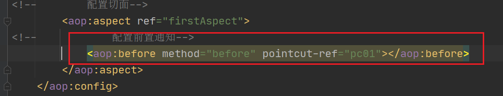
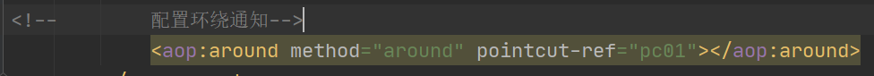
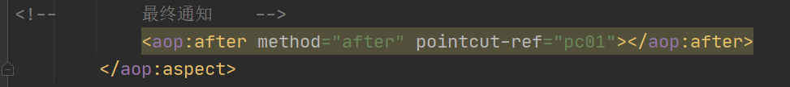

# AOP

## 1 什么是AOP

AOP:面向切面编程，可以在层与层之间增加一个可编程的切面，用来将功能性代码提取到切面中进行统一的处理，有助于实现高内聚的特性。

## 2 AOP的作用

- 记录日志
- 性能统计
- 事务处理
- 权限控制
- 异常处理

## 3 AOP的好处

- 更好的代码复用性
- 高内聚
- 系统容易扩展

## 4 AOP的实现原理

AOP优先使用JDK动态代理，如果这个类没有实现接口，那么再采用CGLIB动态代理

- JDK动态代理
  - 接口 + 实现类 获得这个实现类的代理对象
- cglib动态代理
  - 对没有实现接口的类产生代理对象 生成这个类的子类

## 5 AOP的专业术语

- 连接点
  - 层与层之间调用的过程就称之为连接点。
- 切入点表达式
  - 筛选哪些连接点需要升级为切入点的表达式，分为粗粒度和细粒度
- 切入点
  - 在连接点的基础上，增加上切入规则，选择出需要进行增强的连接点，就是切入点
- 切面
  - 就是当spring拦截下切入点后，将这些切入点交给处理类进行功能的增强的类，就称之为切面类。
- 通知
  - 在spring底层的代理拦截下切入点后，将切入点交给切面类，切面类中就要有处理这些切入点的方法，这些方法就称之为通知。
  - 针对切入点执行的过程，通知分为不同的类型，不同的类型会有不同的执行时机。
- 目标对象
  - 就是真正希望被访问的对象。
- 织入(了解)
  - 指通过动态代理，切面等织入在两层之间的过程。

## 6 AOP的使用

- 创建项目
- 导入依赖

```xml
<dependencies>
        <dependency>
            <groupId>org.springframework</groupId>
            <artifactId>spring-context</artifactId>
            <version>5.1.9.RELEASE</version>
        </dependency>
        <!-- https://mvnrepository.com/artifact/org.aspectj/aspectjweaver -->
        <dependency>
            <groupId>org.aspectj</groupId>
            <artifactId>aspectjweaver</artifactId>
            <version>1.9.3</version>
        </dependency>
    </dependencies>
```

- 定义User类

```java
package com.shangma.entity;

/**
 * @author: ShangMa
 * @className: User
 * @description:
 * @date: 2023/3/24 10:12
 * @since: 11
 */
public class User {
    
    private int id;
    
    private String name;

    public int getId() {
        return id;
    }

    public void setId(int id) {
        this.id = id;
    }

    public String getName() {
        return name;
    }

    public void setName(String name) {
        this.name = name;
    }

    @Override
    public String toString() {
        return "User{" +
                "id=" + id +
                ", name='" + name + '\'' +
                '}';
    }
}

```


- 创建applicationContext.xml

```xml
<!--    开启包扫描-->
    <context:component-scan base-package="com.shangma"></context:component-scan>
```

- 定义UserService接口

```java
package com.shangma.service;

import com.shangma.entity.User;

/**
 * @author: ShangMa
 * @className: UserService
 * @description:
 * @date: 2023/3/24 10:13
 * @since: 11
 */
public interface UserService {

    /**
     * 注册用户
     */
    void registUser(User user);

    /**
     * 更新用户
     */
    void updateUser(User user);

    /**
     * 删除用户
     */
    void deleteUser(User user);

    /**
     * 查询用户
     */
    void findUser(User user);
}

```

- UserService接口的实现类

```java
package com.shangma.service.impl;

import com.shangma.entity.User;
import com.shangma.service.UserService;
import org.springframework.stereotype.Service;

/**
 * @author: ShangMa
 * @className: UserServiceImpl
 * @description:
 * @date: 2023/3/24 10:15
 * @since: 11
 */
@Service
public class UserServiceImpl implements UserService {


    @Override
    public void registUser(User user) {
        System.out.println("注册用户" + user);
    }

    @Override
    public void updateUser(User user) {
        System.out.println("更新用户" + user);
    }

    @Override
    public void deleteUser(User user) {
        System.out.println("删除用户" + user);
    }

    @Override
    public void findUser(User user) {
        System.out.println("查询用户" + user);
    }
}
```

- UserController类

```java
package com.shangma.web;

import com.shangma.entity.User;
import com.shangma.service.UserService;
import org.springframework.beans.factory.annotation.Autowired;
import org.springframework.stereotype.Controller;

/**
 * @author: ShangMa
 * @className: UserController
 * @description:
 * @date: 2023/3/24 10:16
 * @since: 11
 */
@Controller
public class UserController {

    @Autowired
    private UserService userService;

    public void registUser(User user){
        userService.registUser(user);
    }

    public void updateUser(User user){
        userService.updateUser(user);
    }

    public void deleteUser(User user){
        userService.deleteUser(user);
    }

    public void findUser(User user){
        userService.findUser(user);
    }
}

```

- 定义一个切面类,在切面类中提供一个方法

```java
package com.shangma.aspect;

import org.springframework.stereotype.Component;

/**
 * @author: ShangMa
 * @className: FirstAspect
 * @description:
 * @date: 2023/3/24 10:21
 * @since: 11
 */
// 切面类
@Component
public class FirstAspect {
        
    // 通知
    public void before(){
        System.out.println("before方法执行了...");
    }
}

```

- 在applicationContext.xml中进行配置

```xml
<!--    配置aop-->
    <aop:config>
<!--        配置切入点
    expression:切入点表达式
    id:切入点表达式的唯一标识
-->
        <aop:pointcut id="pc01" expression="within(com.shangma.service.impl.UserServiceImpl)"/>
<!--        配置切面-->
        <aop:aspect ref="firstAspect">
<!--            配置通知-->
            <aop:before method="before" pointcut-ref="pc01"></aop:before>
        </aop:aspect>
    </aop:config>
```

## 7 切入点表达式

切入点表达式分为粗粒度(within)和细粒度(execution)

### 7.1 within表达式

通过类名进行匹配，是粗粒度的表达式，最多精确到类。

- 情况一:

格式:within(包名.类名)

表示:这个类中的所有的连接点都会被表达式识别，成为切入点。

eg：within(com.shangma.service.impl.UserServiceImpl)


- 情况二:

在within表达式中可以使用*号匹配符，匹配指定包下的所有的类。

注意:只匹配当前包，不匹配子孙包。

eg:within(com.shangma.serivice.impl.*)

- 情况三

在within表达式中也可以用*号匹配符，匹配包

eg:    匹配service包下的任意一级目录下的所有的类

```
within(com.shangma.service.*.*)
```

- 情况四

在within表达式中也可以用..*匹配符，匹配指定包下及其子孙包下的所有的类。

eg:  service包下的所有的类

```
within(com.shangma.service..*)
```


情况三只能是service包下所有的一级目录的类

情况四是service包下所有的目录下的类

### 7.2 execution表达式

细粒度的切入点表达式，可以以方法为单位定义切入点规则

语法: execution( 返回值类型  包名.类名.方法名(参数类型,参数类型...))


例子1:

```
execution(void com.shangma.service.impl.UserServiceImpl.findUser(com.shangma.entity.User))
```

该切入点规则表示，切出指定包下指定类下指定名称指定参数指定返回值的方法


例子2:

```
execution(* com.shangma.service.impl.*.findUser(com.shangma.entity.User))
```

该切入点规则表示，切出指定包下的所有的类的findUser方法，要求参数是User，但是返回值不限


例子3:

```
execution(* com.shangma.service..*.findUser(com.shangma.entity.User))
```

该切入点规则表示，切出指定包及其子孙包下所有的类中的findUser方法，要求参数是User，并且返回值类型不限


例子4：

```
execution(* com.shangma.service..*.query*())
```

该切入点规则表示，切出指定包及其子孙包下的所有的类的以query开头的方法，要求无参，返回值类型不限


例子5

```
execution(* com.shangma.service..*.query*(..))
```

该切入点规则表示，切出指定包及其子孙包下的所有的类的以query开头的方法，参数类型不限，返回值类型不限

## 8 Spring的5大通知类型

### 8.1 分类

- 前置通知
  - 目标方法执行之前执行的通知
- 后置通知
  - 目标方法执行之后执行的通知
- 环绕通知
  - 目标方法执行前和后都会执行
- 最终通知
  - 目标方法不管出不出异常，都会执行
- 异常通知
  - 目标方法出现异常时执行

### 8.2 前置通知

前置通知就是在目标方法执行之前执行的通知

前置通知可以选择性的接收JoinPoint参数，Spring会自动给JoinPoint参数赋值

使用方式

创建切面类，添加方法


```java
public class FirstAspect {

    // 通知
    public void before(JoinPoint joinPoint){
        // 获取目标对象
        Object target = joinPoint.getTarget();
        System.out.println(target.getClass());
        // 获取方法签名对象
        MethodSignature signature = (MethodSignature) joinPoint.getSignature();
        // 获取方法对象
        Method method = signature.getMethod();
        System.out.println(method.getName());
        // 获取方法的返回值类型
        System.out.println(signature.getReturnType());
        // 获取方法的异常类型
        System.out.println(signature.getExceptionTypes().length);
        // 获取方法的参数类型
        System.out.println(signature.getParameterTypes().length);
        System.out.println("before方法执行了...");
    }
}
```

- 在applicationContext.xml中配置前置通知



### 8.3 后置通知

在目标方法**执行完成**之后执行的通知

后置通知可以获取到目标方法的返回值

如果目标方法执行中途出现异常，那么后置通知就不会再执行了

后置通知中也可以接收JoinPoint参数，API和前置通知中的一样

如果要使用JoinPoint参数，必须保证JoinPoint参数在参数列表的第一位

提供方法

```java
public void afterReturning(JoinPoint joinPoint,Object msg){
        System.out.println("后置通知执行了..." + msg);
    }
```


配置方式

```xml
<!--            配置后置通知-->
            <aop:after-returning method="afterReturning" pointcut-ref="pc01" returning="msg"></aop:after-returning>
```


### 8.4 环绕通知

在目标方法执行之前和之后都可以执行额外代码的通知。

环绕通知必须显式的调用目标方法，否则目标方法不会执行。

这个显式调用时是通过ProceedingJoinPoint来实现的，可以在环绕通知中接收一个此类型，spring会自动给这个类型赋值。

环绕通知需要返回返回值，否则真正调用者将拿不到返回值，只能得到一个null。

只有环绕通知可以接收ProceedingJoinPoint，其他的通知都只能接收JoinPoint


- 提供方法

```java
public Object around(ProceedingJoinPoint proceedingJoinPoint) throws Throwable {
        System.out.println("环绕通知执行前...");
        // 调用目标方法
        Object obj = proceedingJoinPoint.proceed();
        System.out.println("环绕通知执行后...");
        return obj;
    }
```

- 配置



### 8.5 最终通知

在目标方法执行之后执行的通知。

后置通知如果目标方法执行过程中出现异常，就不会再执行了。最终通知是无论是否有异常，都会执行。

最终通知由于不能保证方法正常结束，所以不能获取返回值。


提供方法

```java
public void after(JoinPoint joinPoint){
        System.out.println("最终通知...");
    }
```

进行配置



### 8.6 异常通知

在目标方法出现异常时执行的通知

异常通知中可以获取到出现的异常，但是如果有JoinPoint参数，要保证JoinPoint参数是在参数列表的第一位

- 定义方法

```java
public void afterThrowing(Throwable e){

        System.out.println("异常通知执行了..." + e.getMessage());
    }
}
```

- 进行配置

```xml
<!--            异常通知-->
            <aop:after-throwing method="afterThrowing" pointcut-ref="pc01" throwing="e"></aop:after-throwing>
```


## 9 注解方式使用AOP

- 在applicationContext.xml中添加AOP注解方式开启

```xml
<!--    开启注解方式使用AOP-->
    <aop:aspectj-autoproxy></aop:aspectj-autoproxy>
```

- 定义切面类，添加注解即可

```java
@Component
@Aspect//这个注解修饰的类就是切面类
public class SecondAspect {

    @Pointcut("execution(* com.shangma.service..*.*(..))")
    public void pc(){}

    // 需要传入切入点表达式
    @Before("pc()")
    public void before(){
        System.out.println("前置通知");
    }

    @Around("pc()")
    public Object around(ProceedingJoinPoint proceedingJoinPoint) throws Throwable {
        System.out.println("环绕通知前...");
        Object proceed = proceedingJoinPoint.proceed();
        System.out.println("环绕通知后...");
        return proceed;
    }

    @AfterReturning(value = "pc()",returning = "msg")
    public void afterReturning(Object msg){
        System.out.println("后置通知" + msg);
    }

    @After("pc()")
    public void after(){
        System.out.println("最终通知...");
    }

    @AfterThrowing(value = "pc()",throwing = "e")
    public void afterThrowing(Throwable e){
        System.out.println("异常通知..." + e.getMessage());
    }
}
```

## 10 AOP练习

- 统计所有业务方法执行的时间
- 权限控制
  - 使用AOP技术来实现
  - 自定义注解实现
  - 假设有三个角色(cust、user、admin),游客只可以注册用户，用户可以注册、查询和修改用户，管理员额外可以删除用户。


