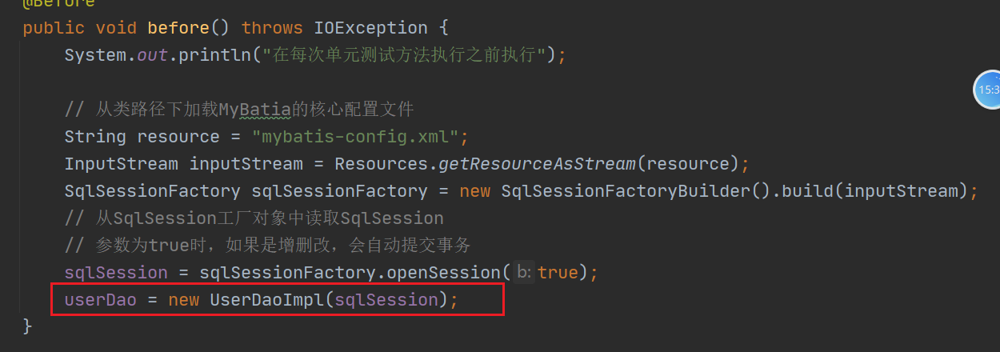

# MyBatis

# 1 Java项目基本三层结构


# 2 MyBatis的介绍 

库: 是对原有技术的一种封装 ，让程序员操作更加简单而已

框架:是一整套的技术解决方案 vue

- MyBatis原来是apache的一个开源项目叫iBatis。2010年代码迁移到了google code上面，并且改名Mybatis。现在已经迁移到了github上。
- MyBatis 是一款优秀的**持久层**框架，它支持自定义 SQL、存储过程以及高级映射。MyBatis 免除了几乎所有的 JDBC 代码以及设置参数和获取结果集的工作。MyBatis 可以通过简单的 XML 或注解来配置和映射原始类型、接口和 Java POJO（Plain Old Java Objects，普通老式 Java 对象）为数据库中的记录。
- 优点:
  - 减少代码量
  - 基于sql语法，比较灵活
  - 能了解底层工作过程，调试方便
  - sql语句封装在配置文件中，便于统一管理和维护。降低了程序的耦合性。


# 3 MyBatis的使用

- 创建项目
- 导入依赖

```xml
    <dependencies>
        <!-- https://mvnrepository.com/artifact/org.mybatis/mybatis -->
        <dependency>
            <groupId>org.mybatis</groupId>
            <artifactId>mybatis</artifactId>
            <version>3.5.4</version>
        </dependency>

        <dependency>
            <groupId>mysql</groupId>
            <artifactId>mysql-connector-java</artifactId>
            <version>8.0.28</version>
        </dependency>
    </dependencies>
```

- 创建实体类


```java
package com.shangma.entity;


public class User {

  private long id;
  private String username;
  private java.util.Date birthday;
  private String sex;
  private String address;


  public long getId() {
    return id;
  }

  public void setId(long id) {
    this.id = id;
  }


  public String getUsername() {
    return username;
  }

  public void setUsername(String username) {
    this.username = username;
  }


  public java.util.Date getBirthday() {
    return birthday;
  }

  public void setBirthday(java.util.Date birthday) {
    this.birthday = birthday;
  }


  public String getSex() {
    return sex;
  }

  public void setSex(String sex) {
    this.sex = sex;
  }


  public String getAddress() {
    return address;
  }

  public void setAddress(String address) {
    this.address = address;
  }


  @Override
  public String toString() {
    return "User{" +
            "id=" + id +
            ", username='" + username + '\'' +
            ", birthday=" + birthday +
            ", sex='" + sex + '\'' +
            ", address='" + address + '\'' +
            '}';
  }
}
```

- 创建MyBatis的核心配置文件

```xml
<?xml version="1.0" encoding="UTF-8" ?>
<!DOCTYPE configuration
        PUBLIC "-//mybatis.org//DTD Config 3.0//EN"
        "https://mybatis.org/dtd/mybatis-3-config.dtd">

<!--mybatis核心配置文件-->
<configuration>
    <settings>
<!--        开启MyBatis的日志-->
        <setting name="logImpl" value="STDOUT_LOGGING"/>
    </settings>
    <environments default="development">
        <environment id="development">
            <transactionManager type="JDBC"/>
            <dataSource type="POOLED">
                <property name="driver" value="com.mysql.cj.jdbc.Driver"/>
                <property name="url" value="jdbc:mysql:///mybatis?serverTimezone=Asia/Shanghai"/>
                <property name="username" value="root"/>
                <property name="password" value="root"/>
            </dataSource>
        </environment>
    </environments>
    <mappers>
        <mapper resource="com/shangma/mapper/UserDao.xml"></mapper>
<!--        <mapper resource="E:\workspace\two\mybatis-day01\src\main\java\com\shangma\mapper\UserDao.xml"></mapper>-->
    </mappers>
</configuration>
```

- 创建mapper映射文件

```xml
<?xml version="1.0" encoding="UTF-8" ?>
<!DOCTYPE mapper
        PUBLIC "-//mybatis.org//DTD Mapper 3.0//EN"
        "https://mybatis.org/dtd/mybatis-3-mapper.dtd">
<!--namespace 命名空间  对于sql的操作进行分类化管理 有点像包管理-->
<mapper namespace="shangma">
<!--    在mapper.xml中编写sql语句，进行增删改查-->

<!--
        select      <select>
        insert      <insert>
        update      <update>
        delete      <delete>
-->
<!--    根据id查询用户
  select * from user where id = ?
  id属性:要求在一个namespace当中唯一  是当前sql语句的标识
  parameterType: 表示sql语句需要的java参数类型
  resultType: 表示查询后的返回值的java类型
  #{dfd}  表示占位符   传过来什么 id就等于什么   如果是基本数据类型 这个值可以随便写
-->
    <select id="findUserById" parameterType="int" resultType="com.shangma.entity.User">
        select * from user where id = #{sdfsdfds}
    </select>

<!--    添加用户-->
    <insert id="addUser" parameterType="com.shangma.entity.User">
        insert into user (username,birthday,sex,address) values(#{username},#{birthday},#{sex},#{address})
    </insert>

<!--    更新用户-->
    <update id="updateUser" parameterType="com.shangma.entity.User">
        update user set username=#{username},birthday=#{birthday},sex=#{sex},address=#{address} where id = #{id}
    </update>

<!--    根据id删除-->
    <delete id="deleteUserById" parameterType="int">
        delete from user where id = #{id}
    </delete>

<!--    模糊查询
  返回值   List<User>
  resultType的返回值类型如果是List,那么这里还是写集合的泛型类型
  #{} :获取类型的值  是什么类型就获取到什么类型
  ${} :获取类型的值  如果是字符串类型，那么会以没有""的形式拼接到sql语句中  一般用于列名的拼接  order by age
-->
    <select id="searchUser" parameterType="string" resultType="com.shangma.entity.User">
        select * from user where username like '%${value}%'
    </select>
</mapper>
```

- 编写测试类

```java
package com.shangma.test;

import com.shangma.entity.User;
import org.apache.ibatis.io.Resources;
import org.apache.ibatis.session.SqlSession;
import org.apache.ibatis.session.SqlSessionFactory;
import org.apache.ibatis.session.SqlSessionFactoryBuilder;
import org.junit.Test;

import java.io.IOException;
import java.io.InputStream;
import java.util.Date;
import java.util.List;

/**
 * @author: ShangMa
 * @className: TestDemo
 * @description:
 * @date: 2023/3/20 11:01
 * @since: 11
 */
public class TestDemo {

    @Test
    public void test01() throws IOException {
        // 从类路径下加载MyBatia的核心配置文件
        String resource = "mybatis-config.xml";
        InputStream inputStream = Resources.getResourceAsStream(resource);
        SqlSessionFactory sqlSessionFactory = new SqlSessionFactoryBuilder().build(inputStream);
        // 从SqlSession工厂对象中读取SqlSession
        SqlSession sqlSession = sqlSessionFactory.openSession();
        // sqlSession对象用来进行增删改查方法的调用
        // 参数一:传入mapper.xml中的 namespace.id值
        // 参数二：sql语句需要的参数
        User user = sqlSession.selectOne("shangma.findUserById", 24);
        System.out.println(user);

        // 关闭资源
        sqlSession.close();
    }

    @Test
    public void test02() throws IOException {
        // 从类路径下加载MyBatia的核心配置文件
        String resource = "mybatis-config.xml";
        InputStream inputStream = Resources.getResourceAsStream(resource);
        SqlSessionFactory sqlSessionFactory = new SqlSessionFactoryBuilder().build(inputStream);
        // 从SqlSession工厂对象中读取SqlSession
        SqlSession sqlSession = sqlSessionFactory.openSession();
        User user = new User();
        user.setUsername("张无忌");
        user.setAddress("冰火岛");
        user.setBirthday(new Date());
        user.setSex("男");
        sqlSession.insert("shangma.addUser",user);
        // 提交事务
        sqlSession.commit();

        // 关闭资源
        sqlSession.close();
    }

    @Test
    public void test3() throws IOException {
        // 从类路径下加载MyBatia的核心配置文件
        String resource = "mybatis-config.xml";
        InputStream inputStream = Resources.getResourceAsStream(resource);
        SqlSessionFactory sqlSessionFactory = new SqlSessionFactoryBuilder().build(inputStream);
        // 从SqlSession工厂对象中读取SqlSession
        SqlSession sqlSession = sqlSessionFactory.openSession();
        User user = new User();
        user.setId(26);
        user.setUsername("小昭");
        user.setAddress("阿富汗");
        user.setSex("女");
        user.setBirthday(new Date());
        sqlSession.update("shangma.updateUser",user);
        // 提交事务
        sqlSession.commit();


        // 关闭资源
        sqlSession.close();
    }

    @Test
    public void test04() throws IOException {
        // 从类路径下加载MyBatia的核心配置文件
        String resource = "mybatis-config.xml";
        InputStream inputStream = Resources.getResourceAsStream(resource);
        SqlSessionFactory sqlSessionFactory = new SqlSessionFactoryBuilder().build(inputStream);
        // 从SqlSession工厂对象中读取SqlSession
        SqlSession sqlSession = sqlSessionFactory.openSession();
        sqlSession.delete("shangma.deleteUserById",22);
        // 提交事务
        sqlSession.commit();

        // 关闭资源
        sqlSession.close();
    }

    @Test
    public void searchUser() throws IOException {
        // 从类路径下加载MyBatia的核心配置文件
        String resource = "mybatis-config.xml";
        InputStream inputStream = Resources.getResourceAsStream(resource);
        SqlSessionFactory sqlSessionFactory = new SqlSessionFactoryBuilder().build(inputStream);
        // 从SqlSession工厂对象中读取SqlSession
        SqlSession sqlSession = sqlSessionFactory.openSession();
        List<User> users = sqlSession.selectList("shangma.searchUser", "张");
        System.out.println(users);

        // 关闭资源
        sqlSession.close();
    }
}

```

- 添加数据时返回主键


# 4 MyBatis简单的封装

- 思路：通过@Before 和 @After注解 把创建对象的方法放入@Before注解的方法中，把关闭资源的内容放入@After注解的方法中

如果真的想用dao层，那么需要把SqlSession对象传入dao层，就可以使用了

- 提供UserDao接口

```java
package com.shangma.dao;

import com.shangma.entity.User;

/**
 * @author: ShangMa
 * @className: UserDao
 * @description:
 * @date: 2023/3/20 14:59
 * @since: 11
 */
public interface UserDao {

    // 根据id查询
    User findUserById(Integer id);
    // 添加用户
    void addUser(User user);
}

```

- 提供UserDaoImpl实现类

```java
package com.shangma.dao.impl;

import com.shangma.dao.UserDao;
import com.shangma.entity.User;
import org.apache.ibatis.session.SqlSession;

/**
 * @author: ShangMa
 * @className: UserDaoImpl
 * @description:
 * @date: 2023/3/20 15:00
 * @since: 11
 */
public class UserDaoImpl implements UserDao {

    private SqlSession sqlSession;

    public UserDaoImpl(SqlSession sqlSession){
        this.sqlSession = sqlSession;
    }
    @Override
    public User findUserById(Integer id) {
        return sqlSession.selectOne("shangma.findUserById",id);
    }

    @Override
    public void addUser(User user) {
        sqlSession.insert("shangma.addUser",user);
    }
}

```

- 测试



# 5 MyBatis的mapper开发(重点)

Mapper代码的方式，主要是为了解决不写dao实现类，程序员只需要编写mapper接口就可以使用了。但是需要满足书写的规范。

## 5.1 mapper的代码书写规范

- mapper接口的完整路径要和xml文件中的namespace一致
- mapper接口中的方法名要和xml文件中select update insert delete标签的id值一致
- mapper接口中方法参数类型要和xml文件中select update insert delete标签中的parameterType一致
- mapper接口中返回值要和xml文件中select update insert delete标签中的resultType或者resultMap一致


## 5.2 mapper接口的使用

- 定义接口

```java
package com.shangma.mapper;

import com.shangma.entity.User;

import java.util.List;

/**
 * @author: ShangMa
 * @className: UserMapper
 * @description:
 * @date: 2023/3/20 15:13
 * @since: 11
 */
public interface UserMapper {

    // 查询所有
    List<User> selectAll();

    // 根据id查询
    User selectById(Integer id);

    // 添加用户
    void saveUser(User user);
}

```

- 定义UserMapper.xml

```xml
<?xml version="1.0" encoding="UTF-8" ?>
<!DOCTYPE mapper
        PUBLIC "-//mybatis.org//DTD Mapper 3.0//EN"
        "https://mybatis.org/dtd/mybatis-3-mapper.dtd">
<mapper namespace="com.shangma.mapper.UserMapper">

<!--    查询所有-->
    <select id="selectAll" resultType="com.shangma.entity.User">
        select * from user
    </select>

<!--    根据id查询-->
    <select id="selectById" parameterType="int" resultType="com.shangma.entity.User">
        select * from user where id = #{id}
    </select>

<!--    添加用户-->
    <insert id="saveUser" parameterType="com.shangma.entity.User">
<!--        添加数据时返回主键-->
        <selectKey keyProperty="id" order="AFTER" resultType="int">
            select last_insert_id()
        </selectKey>
        insert into user(username,sex,birthday,address) values(#{username},#{sex},#{birthday},#{address})
    </insert>
</mapper>
```

- 获取接口的代理对象测试


```java
    @Test
    public void test06(){
        // 查询所有
//        List<User> users = userMapper.selectAll();
//        users.forEach(user -> System.out.println(user));


        // 根据id查询
//        User user = userMapper.selectById(33);
//        System.out.println(user);

        User user = new User();
        user.setUsername("虚竹");
        user.setAddress("少林寺");
        user.setBirthday(new Date());
        user.setSex("男");
        userMapper.saveUser(user);
    }
```

# 6 MyBatis核心配置文件

## 6.1 MyBatis的配置文件命名

- sqlMapperConfig.xml
- mybatis-config.xml

## 6.2 抽取数据源

- 在类路径下面创建jdbc.properties文件

```properties
jdbc.driverClassName=com.mysql.cj.jdbc.Driver
jdbc.url=jdbc:mysql:///mybatis?serverTimezone=Asia/Shanghai
jdbc.username=root
jdbc.password=root
```

- 在配置文件中加载外部文件


- 给数据源赋值

```xml
<!--    default:来选择需要使用的环境的id-->
<environments default="development">
<!--
    在实际开发中，可能会有多套环境
    id:环境的唯一标识
-->
    <environment id="development">
<!--     transactionManager  mybatis的事务交给JDBC进行管理   -->
        <transactionManager type="JDBC"/>
<!--        dataSource:数据源
            type:POOLED  要使用POOLED这个连接池进行数据源的管理
            UNPOOLED   不使用连接池
-->
        <dataSource type="POOLED">
            <property name="driver" value="${jdbc.driverClassName}"/>
            <property name="url" value="${jdbc.url}"/>
            <property name="username" value="${jdbc.username}"/>
            <property name="password" value="${jdbc.password}"/>
        </dataSource>
    </environment>
```

## 6.3 别名标签

```xml
<!--    别名标签-->
    <typeAliases>
<!--        给type类型起一个alias的别名  别名是不区分大小写的-->
<!--        <typeAlias type="com.shangma.entity.User" alias="user"></typeAlias>-->
<!--        把entity包下的所有的实体类起别名，别名就是类名-->
        <package name="com.shangma.entity"/>
    </typeAliases>
```

## 6.4 开启日志

```xml
    <settings>
        <!--        开启MyBatis的日志-->
        <setting name="logImpl" value="STDOUT_LOGGING"/>
    </settings>
```

## 6.5 mapper映射

- resouce属性

```xml
<!--    resource属性就是类路径下的映射文件(xml) 需要使用/来分割文件夹-->
    <mapper resource="com/shangma/mapper/UserDao.xml"></mapper>
```

- url属性

```xml
<!--    这个属性的值 表示xml的绝对路径  用的比较少-->
    <mapper url="E:\workspace\two\mybatis-day01\src\main\resources\com\shangma\mapper\UserDao.xml"></mapper>
```

- class属性

```xml
<!--   class属性表示mapper接口的完整路径  用 . 隔开
    注意点：接口名称要和mapper文件名一致  并且在同一个目录下
-->
 <mapper class="com.shangma.mapper.UserMapper"></mapper>
```

- package属性(开发中的用法)

```xml
<!--    直接把mapper包作为映射
        注意点：接口名称要和mapper文件名一致  并且在同一个目录下
-->
    <package name="com.shangma.mapper"/>
```

# 7 MyBatis的映射文件

## 7.1 namespace

​	就是命名空间，一般都是mapper接口的全路径类名

## 7.2 id

就是select update delete insert标签的唯一标识，一般都是mapper接口中的方法名

## 7.3 parameterType

- 基本数据类型
  - 可以使用系统提供的别名，查看TypeAliasRegistry类
- 引用数据类型
  - 可以自己起别名，如果没有起别名，必须使用全路径类名
- 嵌套类型
  - 取值时可以用.一直嵌套下去 
  - #{user.dog.dogName}
- map类型
  - #{key} 来获取map中的value

注意:parameterType可以省略!!

## 7.4 resultType

返回值类型

注意:返回单个实体类和实体类集合时，mapper映射文件中的resultType的类型是一样的，都是集合的泛型类型。

这种单独resultType的方式的前提条件是实体类中的属性和表中的列名是一致的，这时数据才会封装到实体类中


如果列名使用的是a_column，而实体类中的属性名是 aColumn写法，那么可以开启驼峰命名

在核心配置文件中添加以下配置

```xml
<!--        开启驼峰命名-->
        <setting name="mapUnderscoreToCamelCase" value="true"/>
```


## 7.5 resultMap

如果完全对应不上，比如列名是abc,实体类属性名是userAddress，这时需要使用手动结果映射集resultMap

```xml
    <resultMap id="resultid" type="user">
<!--
property:实体类中的属性名
column:数据库表中的列名
注意:在这个场景下，列名和属性名能够对应上的就不需要再次手动映射
如果是主键，不要使用result标签
-->
        <id property="userId" column="uid"></id>
        <result property="userAddress" column="abc"></result>
    </resultMap>
    <select id="selectById"  resultMap="resultid">
        select * from user where uid = #{id}
    </select>
```


完整代码

```xml
<?xml version="1.0" encoding="UTF-8" ?>
<!DOCTYPE mapper
        PUBLIC "-//mybatis.org//DTD Mapper 3.0//EN"
        "https://mybatis.org/dtd/mybatis-3-mapper.dtd">
<!--命名空间  一般都是和mapper接口的全路径名相同-->
<mapper namespace="com.shangma.mapper.UserMapper">

<!--    查询所有-->
    <select id="selectAll" resultType="user">
        select * from user
    </select>

<!--    根据id查询
    parameterType:参数类型
    可以取值的类型有
    基本数据类型  int类型可以使用java.lang.Integer 因为这里的int就是java.lang.Integer的别名


    实体类
    可以自己起别名，如果没有起别名，需要写上全路径名
    #{}的取值:是从实体类对应对象中的属性中去取值    #{username} 从user对象中获取username的值  user.getUserName()


    包装类(嵌套类)
    #{user.sex}  可以一直点下去


    Map
    #{} 中放入的是map的key
         value = #{key}
-->
<!--
    resultMap:手动结果映射集
    id:resultMap的唯一标识
    type:要手动映射的类型
-->
    <resultMap id="resultid" type="user">
<!--
property:实体类中的属性名
column:数据库表中的列名
注意:在这个场景下，列名和属性名能够对应上的就不需要再次手动映射
如果是主键，不要使用result标签
-->
        <id property="userId" column="uid"></id>
        <result property="userAddress" column="abc"></result>
    </resultMap>
    <select id="selectById"  resultMap="resultid">
        select * from user where uid = #{id}
    </select>

<!--    添加用户-->
    <insert id="saveUser">
<!--        添加数据时返回主键-->
        <selectKey keyProperty="id" order="AFTER" resultType="int">
            select last_insert_id()
        </selectKey>
        insert into user(username,sex,birthday,address) values(#{username},#{sex},#{birthday},#{address})
    </insert>

    <select id="searchUser"  resultType="user">
        select * from user where sex=#{user.sex} and username like '%${like}%'
    </select>

<!--     #{} 中放入的是map的key
         value = #{key}
-->
    <select id="searchUser1" resultType="user">
        select * from user where sex=#{sex} and username like '%${firstName}%'
    </select>
</mapper>
```

# 8 动态Sql标签

## 8.1 select

主要使用if标签进行判断，where标签进行去除and关键字

在UserMapper接口中添加方法

```java
// 根据条件查询用户
    List<User> findUsers(User user);
```

在UserMapper.xml中添加语句

```xml
    <select id="findUsers" resultType="user">
        select * from user
        <where>
         <if test="username != null and username != ''">
              and username = #{username}
         </if>
        <if test="sex != null and sex != ''">
            and sex = #{sex}
        </if>
        <if test="address != null and address != ''">
            and address = #{address}
        </if>
        <if test="birthday != null">
            and birthday = #{birthday}
        </if>
        </where>
    </select>
```

## 8.2 update

set标签可以移除掉多余的 ,


接口中

```java
    // 根据条件更新用户
    void updateUser(User user);
```

UserMapper.xml中

```xml
<!--    根据条件更新用户
        update user set username = #{username}, sex=#{sex}...
-->
    <update id="updateUser" parameterType="user">
        update user
        <set>
        <if test="username != null and username != ''">
            username = #{username},
        </if>
        <if test="sex != null and sex != ''">
            sex = #{sex},
        </if>
        <if test="address != null and address != ''">
            address = #{address},
        </if>
        <if test="birthday != null">
            birthday = #{birthday}
        </if>
        </set>
        where id = #{id}
    </update>
```

## 8.3 insert

使用trim标签来拼接小括号和移除掉多余的,


UserMapper接口中

```java
    // 添加用户
    void addUser(User user);
```

UserMapper.xml中
```xml
<!--    添加用户
    insert into user (username,sex,address) values (#{username},#{sex},#{address})
-->
    <insert id="addUser">
        insert into user
        <trim prefix="(" suffix=")" suffixOverrides=",">
            <if test="username != null and username != ''">
                username,
            </if>
            <if test="address != null and address != ''">
                address,
            </if>
            <if test="sex != null and sex != ''">
                sex,
            </if>
            <if test="birthday != null">
                birthday
            </if>
        </trim>
        values
        <trim prefix="(" suffix=")" suffixOverrides=",">
            <if test="username != null and username !=''">
                #{username},
            </if>
            <if test="address != null and address != ''">
                #{address},
            </if>
            <if test="sex != null and sex != ''">
                #{sex},
            </if>
            <if test="birthday != null">
                #{birthday}
            </if>
        </trim>
    </insert>
```

## 8.4 delete

使用foreach标签进行批量删除


UserMapper接口中

```java
    // 批量删除用户
    void deleteUsers(List<Integer> ids);
```

UserMapper.xml中

```xml
<!--    批量删除用户
    delete from user where id in (3,6,8)

    collection: 需要遍历的集合类型
    open:左边的符号
    close:右边的符号
    separator:中间的分隔符
    item:每一个数据的名称

-->
    <delete id="deleteUsers" parameterType="list">
        delete from user where id in
        <foreach collection="list" open="(" close=")" separator="," item="id">
            #{id}
        </foreach>
    </delete>
```

# 9 mybatis的多表查询

## 9.1 多表设计回顾

在**关系型数据库**中以**表**来代表现实中的事物。表中的一条记录代表一条数据，表和表之间的关系来代表现实事物之间的关系。

表和表之间的关系通过外键来关联。在一张表中保存**另一张表的主键**作为**外键**。

- 多表设计

  - 一对一

  

  - 一对多

  

  - 多对多

  

  ## 9.2 多表查询回顾

  


## 9.3 mybatis多表查询

总共提供了4张表,user是用户表,cart是购物车表，cartitem是购物车项的表,good是商品表

一个用户有一个购物车             一对一

一个购物车有多个购物车项      一对多

一个购物车项对应一个商品     一对一

一个用户可以勾选多个商品，一个商品也可以被多个用户勾选      多对多


需求1:查询用户以及他的购物车信息

- 在UserMapper接口中提供方法

```java
    // 查询用户和购物车信息
    List<User> selectUserAndUserCart();
```

- 在UserMapper.xml中提供查询语句

```xml
    <resultMap id="userandcart" type="user">
        <id property="id" column="id"></id>
        <result property="username" column="username"></result>
        <result property="birthday" column="birthday"></result>
        <result property="address" column="address"></result>
        <result property="sex" column="sex"></result>
<!--
  property:属性名
  javaType:需要手动映射的类型 如果没有起别名 那么需要使用全路径名
-->
        <association property="cart" javaType="com.shangma.entity.Cart">
            <id property="cartId" column="cartId"></id>
            <result property="userId" column="userId"></result>
            <result property="totalnum" column="totalnum"></result>
            <result property="totalmoney" column="totalmoney"></result>
        </association>
    </resultMap>

<!--    查询用户和购物车信息-->
    <select id="selectUserAndUserCart" resultMap="userandcart">
        select * from user u,cart c where u.id = c.userId
    </select>
```


需求2:查询 购物车 的 购物车项

- 创建CartMapper接口

```java
package com.shangma.mapper;

import com.shangma.entity.Cart;

import java.util.List;

/**
 * @author: ShangMa
 * @className: CartMapper
 * @description:
 * @date: 2023/3/21 15:36
 * @since: 11
 */
public interface CartMapper {

    // 查询购物车的项
    List<Cart> selectCartAndCartitem();
}

```

- 创建CartMapper.xml文件

```xml
<?xml version="1.0" encoding="UTF-8" ?>
<!DOCTYPE mapper
        PUBLIC "-//mybatis.org//DTD Mapper 3.0//EN"
        "https://mybatis.org/dtd/mybatis-3-mapper.dtd">
<mapper namespace="com.shangma.mapper.CartMapper">
    <resultMap id="cartandcartitem" type="cart">
        <id property="cartId" column="cartId"></id>
        <result property="userId" column="userId"></result>
        <result property="totalnum" column="totalnum"></result>
        <result property="totalmoney" column="totalmoney"></result>
        <collection property="cartitems" ofType="cartitem">
            <id property="cartItemId" column="cartItemId"></id>
            <result property="cartId" column="cartId"></result>
            <result property="pid" column="pid"></result>
            <result property="pnum" column="pnum"></result>
            <result property="pmoney" column="pmoney"></result>
        </collection>
    </resultMap>
    <!--查询购物车的项-->
    <select id="selectCartAndCartitem" resultMap="cartandcartitem">
        select * from cart c,cartitem ci where c.cartId = ci.cartId
    </select>
</mapper>
```


需求3:查询用户的商品

- UserMapper接口中添加方法

```java
    // 查询用户的商品
    List<User> selectUserAndGood();
```

- UserMapper.xml中添加

```xml
    <resultMap id="userandgood" type="user">
        <id property="id" column="id"></id>
        <result property="username" column="username"></result>
        <result property="birthday" column="birthday"></result>
        <result property="address" column="address"></result>
        <result property="sex" column="sex"></result>
        <association property="cart" javaType="cart">
            <id property="cartId" column="cartId"></id>
            <result property="userId" column="userId"></result>
            <result property="totalnum" column="totalnum"></result>
            <result property="totalmoney" column="totalmoney"></result>
            <collection property="cartitems" ofType="cartitem">
                <id property="cartItemId" column="cartItemId"></id>
                <result property="cartId" column="cartId"></result>
                <result property="pid" column="pid"></result>
                <result property="pnum" column="pnum"></result>
                <result property="pmoney" column="pmoney"></result>
                <association property="good" javaType="good">
                    <id property="pid" column="pid"></id>
                    <result property="pname" column="pname"></result>
                    <result property="price" column="price"></result>
                    <result property="pimg" column="pimg"></result>
                    <result property="pdesc" column="pdesc"></result>
                </association>
            </collection>
        </association>
    </resultMap>

<!--查询用户的商品-->
    <select id="selectUserAndGood" resultMap="userandgood">
        select * from user u,cart c,cartitem ci,good g
        where
        u.id = c.userId
        and
        c.cartId = ci.cartId
        and
        ci.pid = g.pid
    </select>
```

# 10 mybatis的延迟加载

延迟加载又称之为懒加载,表示在关联查询中，当使用关联的数据时再去加载，如果使用不到，就不要加载。

延迟加载的好处:可以提高数据库的性能和效率

resultMap中的association和collection标签具有延迟加载的功能。

mybatis默认没有开启延迟加载。需要手动开启。

- 开启延迟加载

```xml
<!--        开启延迟加载-->
        <setting name="lazyLoadingEnabled" value="true"/>
```

- UserMapper中提供方法

```java
// 使用懒加载的方式查询用户和购物车信息
    List<User> selectUserAndUserCartByLazyLoad();
```

- CartMapper中提供方法

```java
// 通过id查询购物车
    Cart selectCartById(int userId);
```

- CartMapper.xml中提供根据id查询的方法

```xml
<select id="selectCartById" resultType="cart">
        select * from cart where userId = #{id}
    </select>
```

- UserMapper.xml中提供延迟加载功能

```xml
<!--    select:需要执行的方法  一定要写全路径名
        在association标签中的column表示的是select中的方法执行需要的参数是下面sql语句中执行结果的列名的值
-->
    <resultMap id="lazyMap" type="user">
        <id property="id" column="id"></id>
        <result property="username" column="username"></result>
        <result property="birthday" column="birthday"></result>
        <result property="address" column="address"></result>
        <result property="sex" column="sex"></result>
        <association property="cart" javaType="cart" select="com.shangma.mapper.CartMapper.selectCartById" column="id"></association>
    </resultMap>
<!--    使用懒加载方式查询用户和购物车信息-->
    <select id="selectUserAndUserCartByLazyLoad" resultMap="lazyMap">
        select * from user
    </select>
```

# 11 mybatis的缓存

## 11.1 缓存介绍

缓存就是把热门数据第一次从数据库中查询出来后放入到内存的容器中，以后的查询都不经过数据库，而是直接从缓存容器中获取。

缓存的优点：

- 减轻数据库压力
- 提高读写速度
- 提高用户体验

缓存的缺点：

- 数据可能不是最新的

解决方案：

- 当执行DML操作时，清空缓存
- 隔一段时间清空缓存
- 先把数据放入缓存，再隔一段时间存入数据库


## 11.2 mybatis的一级缓存

MyBatis中分为一级缓存和二级缓存

一级缓存默认已经开启了，属于事务级别(同一个sqlSession)的缓存

实现方式:用一个map作为缓存的容器.key:查询语句  条件  元信息  value:查询的结果

一级缓存没有失效时间，但是有生命周期。当执行DML操作时，缓存会失效。

```java
    // 验证一级缓存
    @Test
    public void test10(){
        UserMapper mapper1 = sqlSession.getMapper(UserMapper.class);
        System.out.println(mapper1.findUserById(37));

        UserMapper mapper2 = sqlSession.getMapper(UserMapper.class);
        System.out.println(mapper2.findUserById(37));

        UserMapper mapper3 = sqlSession.getMapper(UserMapper.class);
        System.out.println(mapper3.findUserById(37));
    }
```

## 11.3 mybatis的二级缓存

mybatis的二级缓存需要在mapper级别手动开启。

mybatis的二级缓存时sqlSessionFactory级别的，或者说是mapper接口或者说是namespace级别的。

当使用查询时，查询结果会存入对应的namespace中

当所属的namespace使用增删改，会清空该namespace中的缓存

二级缓存可能存入内存，也可能存入硬盘.所以对应的实体类需要实现Serializable接口


如果是insert update delete语句中,那么flushCache的值是true。

如果是select语句中，那么flushCache的值默认是false

```java
// 验证二级缓存
    @Test
    public void test11(){
        SqlSession sqlSession = sqlSessionFactory.openSession(true);
        SqlSession sqlSession1 = sqlSessionFactory.openSession(true);
        SqlSession sqlSession2 = sqlSessionFactory.openSession(true);

        UserMapper mapper = sqlSession.getMapper(UserMapper.class);
        System.out.println(mapper.findUserById(37));
        sqlSession.close();

        UserMapper mapper1 = sqlSession1.getMapper(UserMapper.class);
        System.out.println(mapper1.findUserById(37));
        sqlSession1.close();

        UserMapper mapper2 = sqlSession2.getMapper(UserMapper.class);
        System.out.println(mapper2.findUserById(37));
        sqlSession2.close();
    }
```


# 12 mybatis注解开发

```java
package com.shangma.mapper;

import com.shangma.entity.User;
import org.apache.ibatis.annotations.Delete;
import org.apache.ibatis.annotations.Insert;
import org.apache.ibatis.annotations.Select;
import org.apache.ibatis.annotations.Update;

import java.util.List;

/**
 * @author: ShangMa
 * @className: AnnoMapper
 * @description:
 * @date: 2023/3/21 17:44
 * @since: 11 annotation
 */
public interface AnnoMapper {
    // 查询所有
    @Select("select * from user")
    List<User> findAll();
    
    // 根据id查询
    @Select("select * from user where id = #{id}")
    User findUserById();
    
    // 添加用户
    @Insert("insert into user (username,address,sex,birthday) values(#{username},#{address},#{sex},#{birthday})")
    void addUser(User user);
    
    // 更新用户
    @Update("update user set username = #{username},sex = #{sex},address = #{address},birthday=#{birthday} where id = #{id}")
    void updateUser(User user);
    
    // 根据id删除用户
    @Delete("delete from user where id = #{id}")
    void deleteUserById(int id);
}

```


