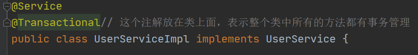

# SSM整合

将Spring、SpringMVC、MyBatis框架整合在一个项目中使用

## 1 SSM整合环境搭建

- 新建web工程

- 导入依赖

  - mybatis
  - mysql驱动包
  - druid(可选)  
  - aspectjweaver
  - spring-webmvc
  - jackson
  - jdbc
  - tx
  - mybatis-spring整合包
  
  ```xml
      <dependencies>
          <dependency>
              <groupId>org.springframework</groupId>
              <artifactId>spring-webmvc</artifactId>
              <version>5.1.9.RELEASE</version>
          </dependency>
  
          <dependency>
              <groupId>org.aspectj</groupId>
              <artifactId>aspectjweaver</artifactId>
              <version>1.9.3</version>
          </dependency>
  
          <dependency>
              <groupId>mysql</groupId>
              <artifactId>mysql-connector-java</artifactId>
              <version>8.0.28</version>
          </dependency>
  
          <dependency>
              <groupId>org.mybatis</groupId>
              <artifactId>mybatis</artifactId>
              <version>3.5.4</version>
          </dependency>
  
          <dependency>
              <groupId>com.alibaba</groupId>
              <artifactId>druid</artifactId>
              <version>1.2.8</version>
          </dependency>
  
          <dependency>
              <groupId>com.fasterxml.jackson.core</groupId>
              <artifactId>jackson-databind</artifactId>
              <version>2.11.4</version>
          </dependency>
  
          <dependency>
              <groupId>com.fasterxml.jackson.datatype</groupId>
              <artifactId>jackson-datatype-jsr310</artifactId>
              <version>2.11.4</version>
          </dependency>
  
          <dependency>
              <groupId>org.springframework</groupId>
              <artifactId>spring-jdbc</artifactId>
              <version>5.1.9.RELEASE</version>
          </dependency>
          
          <!-- https://mvnrepository.com/artifact/org.mybatis/mybatis-spring -->
  <dependency>
      <groupId>org.mybatis</groupId>
      <artifactId>mybatis-spring</artifactId>
      <version>2.0.7</version>
  </dependency>
  
      </dependencies>
  ```

## 2 Spring和MyBatis整合

目标是将mybatis-config.xml中的所有配置移到applicationContext.xml中

```xml
<?xml version="1.0" encoding="UTF-8"?>
<beans xmlns="http://www.springframework.org/schema/beans"
       xmlns:xsi="http://www.w3.org/2001/XMLSchema-instance"
       xmlns:context="http://www.springframework.org/schema/context"
       xmlns:aop="http://www.springframework.org/schema/aop" xmlns:tx="http://www.springframework.org/schema/tx"
       xsi:schemaLocation="http://www.springframework.org/schema/beans http://www.springframework.org/schema/beans/spring-beans.xsd http://www.springframework.org/schema/context https://www.springframework.org/schema/context/spring-context.xsd http://www.springframework.org/schema/aop https://www.springframework.org/schema/aop/spring-aop.xsd http://www.springframework.org/schema/tx http://www.springframework.org/schema/tx/spring-tx.xsd">

<!--    开启包扫描-->
    <context:component-scan base-package="com.shangma">
        <context:exclude-filter type="annotation" expression="org.springframework.stereotype.Controller"/>
    </context:component-scan>


<!--    加载外部文件-->
    <context:property-placeholder location="classpath:jdbc.properties"></context:property-placeholder>

<!--配置数据源-->
    <bean id="dataSource" class="com.alibaba.druid.pool.DruidDataSource">
        <property name="driverClassName" value="${jdbc.driverClassName}"/>
        <property name="url" value="${jdbc.url}"/>
        <property name="username" value="${jdbc.username}"/>
        <property name="password" value="${jdbc.password}"/>
    </bean>

<!--    配置SqlSessionFactory 加载mybatis的配置文件-->
    <bean class="org.mybatis.spring.SqlSessionFactoryBean">
        <property name="dataSource" ref="dataSource"></property>
<!--        mybatis核心配置文件位置-->
<!--        <property name="configLocation" value="classpath:mybatis-config.xml"></property>-->
<!--        别名包-->
        <property name="typeAliasesPackage" value="com.shangma.entity"></property>
        <property name="configuration">
            <bean class="org.apache.ibatis.session.Configuration">
<!--                开启日志-->
                <property name="logImpl" value="org.apache.ibatis.logging.stdout.StdOutImpl"></property>
<!--            开启驼峰命名-->
                <property name="mapUnderscoreToCamelCase" value="true"></property>
            </bean>
        </property>
    </bean>

<!--    加载mybatis的映射文件-->
    <bean class="org.mybatis.spring.mapper.MapperScannerConfigurer">
        <property name="basePackage" value="com.shangma.mapper"></property>
    </bean>


<!--事务管理器-->
    <bean id="transactionManager" class="org.springframework.jdbc.datasource.DataSourceTransactionManager">
        <property name="dataSource" ref="dataSource"></property>
    </bean>
<!--    开启事务驱动-->
    <tx:annotation-driven transaction-manager="transactionManager"></tx:annotation-driven>
</beans>
```

## 3 Spring和SpringMVC整合


- 创建springmvc.xml

```xml
<?xml version="1.0" encoding="UTF-8"?>
<beans xmlns="http://www.springframework.org/schema/beans"
       xmlns:xsi="http://www.w3.org/2001/XMLSchema-instance"
       xmlns:context="http://www.springframework.org/schema/context"
       xmlns:mvc="http://www.springframework.org/schema/mvc"
       xsi:schemaLocation="http://www.springframework.org/schema/beans http://www.springframework.org/schema/beans/spring-beans.xsd http://www.springframework.org/schema/context https://www.springframework.org/schema/context/spring-context.xsd http://www.springframework.org/schema/mvc https://www.springframework.org/schema/mvc/spring-mvc.xsd">

<!--    开启包扫描-->
    <context:component-scan base-package="com.shangma.web">
        <context:include-filter type="annotation" expression="org.springframework.stereotype.Controller"/>
    </context:component-scan>
<!--    配置MVC注解驱动-->
    <mvc:annotation-driven/>
<!--    静态资源放行(如果是前后端分离，可以省略静态资源放行)-->
    <mvc:default-servlet-handler/>
<!--    视图解析器(如果没有用到jsp，那么可以省略视图解析器)-->
<!--    <bean class="org.springframework.web.servlet.view.InternalResourceViewResolver">-->
<!--        <property name="prefix" value="/WEB-INF/"></property>-->
<!--        <property name="suffix" value=".jsp"></property>-->
<!--    </bean>-->
</beans>
```

## 4 加载配置文件

在web.xml中加载

```xml
<?xml version="1.0" encoding="UTF-8"?>
<web-app xmlns="http://xmlns.jcp.org/xml/ns/javaee"
         xmlns:xsi="http://www.w3.org/2001/XMLSchema-instance"
         xsi:schemaLocation="http://xmlns.jcp.org/xml/ns/javaee http://xmlns.jcp.org/xml/ns/javaee/web-app_4_0.xsd"
         version="4.0">
    
<!--    给监听器配置初始化参数，当服务器启动时加载applicationContext.xml-->
    <context-param>
        <param-name>contextConfigLocation</param-name>
        <param-value>classpath:applicationContext.xml</param-value>
    </context-param>
    
    <listener>
        <listener-class>org.springframework.web.context.ContextLoaderListener</listener-class>
    </listener>
    
    
<!--    配置前端控制器 加载springmvc.xml-->
    <servlet>
        <servlet-name>dispatcherServlet</servlet-name>
        <servlet-class>org.springframework.web.servlet.DispatcherServlet</servlet-class>
        <init-param>
            <param-name>contextConfigLocation</param-name>
            <param-value>classpath:springmvc.xml</param-value>
        </init-param>
        <load-on-startup>1</load-on-startup>
    </servlet>
    
    <servlet-mapping>
        <servlet-name>dispatcherServlet</servlet-name>
        <url-pattern>/</url-pattern>
    </servlet-mapping>
    
    
<!--    post请求中文乱码处理-->
    <filter>
        <filter-name>characterEncodingFilter</filter-name>
        <filter-class>org.springframework.web.filter.CharacterEncodingFilter</filter-class>
        <init-param>
            <param-name>encoding</param-name>
            <param-value>utf-8</param-value>
        </init-param>
    </filter>
    <filter-mapping>
        <filter-name>characterEncodingFilter</filter-name>
        <url-pattern>/*</url-pattern>
    </filter-mapping>
</web-app>
```

配置tomcat，启动测试

## 5 Spring的声明式事务

首先要保证包扫描的正确性

在springmvc.xml中
```xml
<!--    开启包扫描-->
    <context:component-scan base-package="com.shangma.web">
        <context:include-filter type="annotation" expression="org.springframework.stereotype.Controller"/>
    </context:component-scan>
```

在applicationContext.xml中

```xml
<!--    开启包扫描-->
    <context:component-scan base-package="com.shangma">
        <context:exclude-filter type="annotation" expression="org.springframework.stereotype.Controller"/>
    </context:component-scan>
```

然后在service层中需要事务管理的方法上面添加注解@Transactional ,这个方法就有了事务管理

```java
	@Override
    @Transactional //用在方法上面，表示这个方法已经有了事务管理
    public void deleteUserById(Integer id) {
        userMapper.deleteUserById(id);
        int i = 1 / 0;
    }
```

@Transactional可以用在类上面，表示整个类中所有的方法都有事务管理



@Transactional可以支持某一个方法没有事务管理

```java
@Override
    @Transactional(propagation = Propagation.NOT_SUPPORTED)//这个方法不需要事务管理
    public List<User> findAll() {
        return userMapper.findAll();
    }
```

@Transactional可以规定哪些异常回滚，哪些异常不回滚

```java
    @Override
//    @Transactional //用在方法上面，表示这个方法已经有了事务管理
    // rollbackFor 对于哪些异常以及子类异常回滚
    // noRollbackFor 对于哪些异常以及子类异常不回滚
    // 以下写法表示除了SQLException异常外，对于所有的错误和异常都回滚
    @Transactional(rollbackFor = Throwable.class,noRollbackFor = SQLException.class)
    public void deleteUserById(Integer id) {
        userMapper.deleteUserById(id);
        int i = 1 / 0;
    }
```

## 6 Spring对于单元测试的支持

导入依赖

```xml
		<dependency>
            <groupId>org.springframework</groupId>
            <artifactId>spring-test</artifactId>
            <version>5.1.9.RELEASE</version>
        </dependency>
        <dependency>
            <groupId>junit</groupId>
            <artifactId>junit</artifactId>
            <version>4.12</version>
            <scope>test</scope>
        </dependency>
```

编写测试类

```java
package com.shangma.test;

import com.shangma.service.UserService;
import org.junit.Test;
import org.junit.runner.RunWith;
import org.springframework.beans.factory.annotation.Autowired;
import org.springframework.test.context.ContextConfiguration;
import org.springframework.test.context.junit4.SpringJUnit4ClassRunner;
import org.springframework.test.context.junit4.SpringRunner;

/**
 * @author: ShangMa
 * @className: TestDemo
 * @description:
 * @date: 2023/3/29 11:40
 * @since: 11
 */

// SpringRunner继承SpringJUnit4ClassRunner,并没有扩展新的功能，所有两者的使用效果是一样的
@RunWith(SpringRunner.class)
//@RunWith(SpringJUnit4ClassRunner.class)
@ContextConfiguration("classpath:applicationContext.xml")// 加载spring的核心配置文件
public class TestDemo {

    @Autowired
    private UserService userService;

    @Test
    public void test01(){
        System.out.println(userService.findAll());
    }
}
```

## 7 SSM整合中的父子容器

当服务器启动时，会执行ContextLoaderListener监听器中的contextInitialized,当服务器关闭时会执行contextDestroyed方法。

一旦服务器启动相当于执行了以下方法

```java
WebApplicationContext context;
ServletContext sc;

// 1.实例化容器对象
context = new XmlWebApplicationContext();
// 2.容器对象持有ServletContext对象
context.setServletContext(sc);
// 3.得到web.xml中配置的名为contextConfigLocation的值
String location = sc.getInitParamater("contextConfigLocation");
context.setConfigLocation(location);
// 4.加载xml文件，初始化容器中的beanFactory
context.refresh();
// 5. ServletContext中也持有XmlWebApplicationContext对象
sc.setAttribute("WebApplicationContext.ROOT",context);
```


DispatcherServlet的父类FrameworkServlet中的initServletBean方法会在服务器启动时执行。

以下代码是从ServletContext中获取一个webApplicationContext,那么ServletContext在监听器中设置了一个对应applicationContext.xml的容器，而且ServletContext在整个项目中只有一个，所以这里获取的就是applicationContext.xml文件对应的容器,这里源码里面获取的key和上面设置的key是一样的。都是WebApplicationContext.ROOT

```
WebApplicationContext rootContext = WebApplicationContextUtils.getWebApplicationContext(this.getServletContext());
```


DispatcherServlet源码的大概逻辑相当于以下代码：

```java
private WebApplicationContext wac;
ServletContext sc;

// 1.从ServletContext对象中获取key为 WebApplicationContext.ROOT的容器对象
WebApplicationContext root = sc.getAttribute("WebApplicationContext.ROOT");
// 2.实例化XMLWebApplicatioContext对象
wac = new XmlWebApplicationContext();
// 3.持有ContextLoaderListenner监听器中创建的父容器的引用
wac.setParent(root);
// 4.得到初始化参数并且赋值给容器
String location = sc.getInitParamter("contextConfigLocation");//classpath:springmvc.xml
wac.setConfigLocation(location);
// 5.容器对象持有ServletContext
wac.setServletContext(sc);
// 6.刷新容器
wac.refresh();
```


总结:springmvc.xml对应的容器是子容器,applicationContext.xml对应的容器是父容器。

子容器持有父容器。

子容器中的bean可以获取父容器中的bean，父容器中的bean不能获取子容器的bean。


