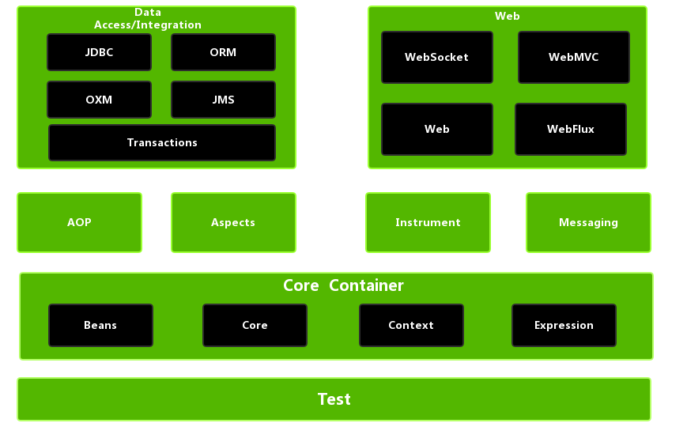
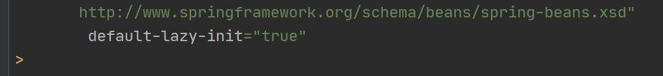
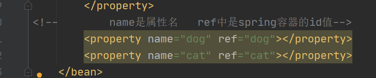

# Spring

## 1 注解补充

注解:给系统看的内容。

系统提供了很多好用的注解:@WebServlet、@Test、@Before、@After、@Override..

- 自定义注解

```java
package com.shangma.anno;

/**
 * @author: ShangMa
 * @className: FirstAnno
 * @description:
 * @date: 2023/3/22 9:50
 * @since: 11
 */
public @interface FirstAnno {
    // 在注解中定义变量，默认被static final修饰
    int i = 10;

    // 在注解中定义变量
    String str();
    double d();
//    // 注解中只能放入String、Class<>、基本数据类型、注解、枚举以及它们的一维数组
////    Object obj();
//    // 如果一维数组中只有一个元素，那么可以省略大括号
    int[] arr();
//    // 设置c的默认值为 a
    char c() default 'a';

    // 如果注解传值时只有一个内容，并且名字时value，那么在传入的时候可以省略value=
    String value();
    
}

```

- 元注解

元注解就是给注解进行修饰的注解

```java
/**
 * 元注解:给注解注解的注解
 */
@Target({ElementType.METHOD,ElementType.TYPE}) // 限定注解的使用位置
@Retention(RetentionPolicy.RUNTIME) // 限定注解的存活范围
@Documented    //表示被注解的类的文档中会产生相应的注解
@Inherited  // 表示被注解的类的子类也会被注解
```


- 反射注解

```java
package com.shangma.test;

import java.lang.annotation.Retention;
import java.lang.annotation.RetentionPolicy;

/**
 * @author: ShangMa
 * @className: TestDemo2
 * @description:
 * @date: 2023/3/22 10:25
 * @since: 11
 */
public class TestDemo2 {

    public static void main(String[] args) {
        System.out.println("没有遵守交通规则,闯了红灯。");
        // 判断Police类上面有没有对应的注解
        if (Police.class.isAnnotationPresent(Level.class)){
            // 获取注解的值
            Level level = Police.class.getAnnotation(Level.class);

            String value = level.value();
            if ("民警".equals(value)){
                System.out.println("教育一番");
            }else if ("刑警".equals(value)){
                System.out.println("枪毙10分钟。。。");
            }
        }else {
            System.out.println("假警察，报警110.。。");
        }
    }
}

// 限定注解的存活范围
@Retention(RetentionPolicy.RUNTIME)
@interface Level{
    String value();
}

@Level("刑警")
class Police{

}

```

## 2 Spring的概述

### 2.1 什么是Spring

Spring直译过来就是春天。

Spring框架是由于软件开发中复杂性而创建的，是一个轻量级的控制反转(iOC)和面向切面开发(AOP)的容器框架。

目的:解决企业应用开发的复杂性。

应用范围:任何java应用。

Spring之父是Rod Johnson

### 2.2 Spring的好处

- 高内聚低耦合
- AOP编程的支持
- 声明式事务的支持
- 方便程序的测试
- 方便集成各种优秀的框架
- 降低javaEE API的使用难度

### 2.3 Spring体系结构图

Spring是对于web层 业务层 持久层都有支持 是一个大管家



## 3 Spring的控制反转(IOC)

所谓的IOC称之为控制反转，简单来说就是将**对象的创建**以及对象的**生命周期管理的过程**交给**spring框架**来进行处理。从此在开发中不再需要关注这些细节，而是在需要时由spring框架提供处理，这样的机制称之为控制反转。


### 3.1 控制反转的演示

- 创建maven项目
- 导入依赖

```xml
<dependencies>
        <dependency>
            <groupId>org.springframework</groupId>
            <artifactId>spring-context</artifactId>
            <version>5.1.9.RELEASE</version>
        </dependency>
    </dependencies>
```

- 创建实体类

```java
package com.shangma.entity;

/**
 * @author: ShangMa
 * @className: Person
 * @description:
 * @date: 2023/3/22 11:22
 * @since: 11
 */
public class Person {

    public Person(){
        System.out.println("对象被创建了...");
    }

    public void eat(){
        System.out.println("人人都要吃东西...");
    }
}

```

- 创建applicationContext.xml

```xml
    <bean id="person" class="com.shangma.entity.Person"></bean>
```

- 测试

```java
@Test
    public void test01(){
        // 从类路径下面加载Spring的配置文件
        ApplicationContext applicationContext = new ClassPathXmlApplicationContext("applicationContext.xml");
       
        // 从spring容器中获取对象  Person p = map.get("person");
        Person person = (Person) applicationContext.getBean("person");
        // 调用方法
        person.eat();
    }
```


### 3.2 IOC的启动原理

在初始化一个SPring容器时，Spring会解析指定的xml文件,当解析到其中的bean标签时，会根据该标签中的class属性指定的类的全路径名，通过反射创建该类的对象，并将该对象存入内置的map中进行管理。其中key就是该标签的id值，value就是该对象。

之后当通过getBean方法来从容器中获取对象时，其实就是根据传入的条件在内置的map中寻找是否有匹配的键值，如果有则将该键值中保存的对象返回，如果没有匹配到则抛出异常。

由此可以推测:

- 默认情况下，多次获取同一个bean，得到的是同一个对象。
- 同一个标签下不允许配置多个同id的标签,如果配置则启动抛出异常
- 即使是同一个类，如果配置过多个标签具有不同的id，每个id都会在内置的map中有一个键值对，其中的值是这个类创建的不同对象

```java
      在spring底层有一个map容器
        Class clz =  Class.forName("com.shangma.entity.Person");
        Person p = clz.newInstance();
        map.put("person",p);
```


### 3.3 IOC获取对象的方式

- 传入id值

```java
Person person = (Person) applicationContext.getBean("person");
```


- 传入class类型

```java
// getBean(Class) 传入类型，直接获取对象，不需要强制类型转换，但是当有多个类型时会抛出异常
        Person bean = applicationContext.getBean(Person.class);
```


- 传入id和class类型

```java
// getBean("",Class) 传入id和类型 ，不需要强转
        Person person1 = applicationContext.getBean("person", Person.class);
```

### 3.4 Spring创建对象的方式

#### 3.4.1 通过类的无参构造方法创建对象

这种方式要求类中必须提供**无参构造**

```
Class c = Class.forName("类的全路径名");
Object obj = c.newInstance();//这个方法调用的是无参构造
```

#### 3.4.2 通过静态工厂创建对象

很多时候，我们面对的类是无法通过无参构造创建的。比如有些类就没有无参构造。

定义静态工厂类

```java
package com.shangma.factory;

import java.util.Calendar;

/**
 * @author: ShangMa
 * @className: CalendarStaticFactory
 * @description:
 * @date: 2023/3/22 14:54
 * @since: 11
 */
public class CalendarStaticFactory {

    // 使用静态工厂模式创建对象
    public static Calendar getCalendar(){
        return Calendar.getInstance();
    }
}

```

在applicationContext.xml中进行配置

```xml
<!--    静态工厂模式创建对象-->
    <bean id="calendarStaticFactory" class="com.shangma.factory.CalendarStaticFactory" factory-method="getCalendar"></bean>
```

测试

```java
// 加载spring容器
        ApplicationContext applicationContext = new ClassPathXmlApplicationContext("applicationContext.xml");
        Calendar calendar = (java.util.Calendar) applicationContext.getBean("calendarStaticFactory");
        System.out.println(calendar);
```

#### 3.4.3 通过实例工厂创建对象

创建实例工厂类

```java
package com.shangma.factory;

import java.util.Calendar;

/**
 * @author: ShangMa
 * @className: CalendarStaticFactory
 * @description:
 * @date: 2023/3/22 14:54
 * @since: 11
 */
public class CalendarStaticFactory {

    // 使用静态工厂模式创建对象
    public static Calendar getCalendar(){
        return Calendar.getInstance();
    }
}

```

在applicationContext.xml中进行配置

```xml
<!--通过实例工厂模式创建对象-->
    <bean id="calendarObjectFactory" class="com.shangma.factory.CalendarObjectFactory"></bean>
    <bean id="calendar" factory-bean="calendarObjectFactory" factory-method="getInstance"></bean>
```

测试

```java
    @Test
    public void test02(){
        // 加载spring容器
        ApplicationContext applicationContext = new ClassPathXmlApplicationContext("applicationContext.xml");
        Calendar calendar = (java.util.Calendar) applicationContext.getBean("calendar");
        System.out.println(calendar);
    }
```

#### 3.4.4 Spring内置工厂创建对象

SPring内置了工厂接口，也可以通过实现这个接口来开发Spring工厂

```java
package com.shangma.factory;

import org.springframework.beans.factory.FactoryBean;

import java.util.Calendar;

/**
 * @author: ShangMa
 * @className: CalendarSpringFactory
 * @description:
 * @date: 2023/3/22 15:14
 * @since: 11
 */
public class CalendarSpringFactory implements FactoryBean<Calendar> {


    /**
     * 使用工厂接口产生的对象
     */
    @Override
    public Calendar getObject() throws Exception {
        return Calendar.getInstance();
    }

    /**
     * 获取工厂接口产生的对象的类型
     */
    @Override
    public Class<?> getObjectType() {
        return Calendar.class;
    }


    /**
     * 这个方法默认在接口中已经实现了
     * 默认的返回值是true
     *
     * 是否是单例模式
     * 返回true就是单例模式，返回false不是单例模式
      *
     */
    @Override
    public boolean isSingleton() {
        return true;
    }
}

```

在applicationContext.xml中进行配置

```xml
<!--    通过spring工厂创建对象-->
    <bean id="calendarSpringFactory" class="com.shangma.factory.CalendarSpringFactory"></bean>
```

### 3.5 单例和多例

Spring容器管理的对象在默认情况下是单例的。也就是说，一个bean只会创建一个对象存入map中，之后无论获取多少次，都返回同一个对象。

单例模式减少了对象的创建，从而减少了内存的消耗。

```xml
        scope:取值有prototype和singleton两个
        prototype：多例
        singleton: 单例
-->
    <bean id="person" class="com.shangma.entity.Person" scope="prototype"></bean>
```

#### 3.5.1 对象在单例模式下的生命周期

对象在单例模式下，Spring容器启动时会解析xml发现bean标签后，直接创建对象存入map容器中保存。此后无论调用多少次getBean()方法获取的都是bean从map中返回的同一个对象。此对象被spring容器持有，直到容器退出时，随着容器的退出而被销毁


#### 3.5.2 对象在多例模式下的生命周期

对象在多例模式下，Spring容器启动时解析xml发现该bean标签后，只是将该bean进行管理，并不会创建对象。此后每次调用getBean方法获取对象时，spring都是重新创建新的对象。每次返回都是一个新的对象，这些对象spring容器并不会持有，什么时候销毁取决于程序员自己什么时候销毁。

### 3.6 懒加载机制

懒加载机制就是可以规定指定的bean不在启动时立刻创建，而是在后续第一次使用到时才创建，从而减轻在启动过程中对时间和内存的消耗。

懒加载机制只在单例模式下有意义，多例模式下设置懒加载没有任何意义。


局部设置懒加载

```xml
<bean id="person1" class="com.shangma.entity.Person" lazy-init="true"></bean>
```

全局设置懒加载




如果局部和全局都设置了懒加载，那么采用就近原则。局部的优先级更高。

### 3.7 配置初始化和销毁方法

定义OrderDao类

```java
package com.shangma.dao;

import org.springframework.core.annotation.Order;

/**
 * @author: ShangMa
 * @className: OrderDao
 * @description:
 * @date: 2023/3/22 15:57
 * @since: 11
 */
public class OrderDao {

    public OrderDao(){
        System.out.println("无参构造执行了...");
    }


    public void init(){
        System.out.println("连接数据库...");
    }

    public void addOrder(){
        System.out.println("添加订单");
    }

    public void destory(){
        System.out.println("断开连接");
    }
}

```

在applicatonContext.xml中进行配置

```xml
<!--    配置OrderDao-->
    <bean id="orderDao" class="com.shangma.dao.OrderDao" init-method="init" destroy-method="destory"></bean>
```

测试

```java
@Test
    public void test03(){
        // 加载Spring容器
        ClassPathXmlApplicationContext applicationContext = new ClassPathXmlApplicationContext("applicationContext.xml");
        OrderDao orderDao = applicationContext.getBean(OrderDao.class);
        orderDao.addOrder();
        // 销毁容器
        applicationContext.close();
    }
```

### 3.8 依赖注入(DI)

所谓的IOC称之为控制反转，简单来说就是将**对象的创建**以及对象的**生命周期管理的过程**交给**spring框架**来进行处理。从此在开发中不再需要关注这些细节，而是在需要时由spring框架提供处理，这样的机制称之为控制反转。而在创建对象的过程中spring可以依据配置信息对**对象的属性进行设置值**，这个过程称之为依赖注入，就是DI.

#### 3.8.1 set方法注入

##### 3.8.1.1 JDK内置类型注入

定义Hero类

```java
package com.shangma.entity;

import java.util.*;

/**
 * @author: ShangMa
 * @className: Hero
 * @description:
 * @date: 2023/3/22 16:10
 * @since: 11
 */
public class Hero {
    private int id;

    private String name;

    // 数组
    private int[] array;

    // list
    private List<String> list;

    // set
    private Set<String> set;

    // map
    private Map<String,String> map;

    // properties
    private Properties properties;


    public int getId() {
        return id;
    }

    public void setId(int id) {
        this.id = id;
    }

    public String getName() {
        return name;
    }

    public void setName(String name) {
        this.name = name;
    }

    public int[] getArray() {
        return array;
    }

    public void setArray(int[] array) {
        this.array = array;
    }

    public List<String> getList() {
        return list;
    }

    public void setList(List<String> list) {
        this.list = list;
    }

    public Set<String> getSet() {
        return set;
    }

    public void setSet(Set<String> set) {
        this.set = set;
    }

    public Map<String, String> getMap() {
        return map;
    }

    public void setMap(Map<String, String> map) {
        this.map = map;
    }

    public Properties getProperties() {
        return properties;
    }

    public void setProperties(Properties properties) {
        this.properties = properties;
    }

    @Override
    public String toString() {
        return "Hero{" +
                "id=" + id +
                ", name='" + name + '\'' +
                ", array=" + Arrays.toString(array) +
                ", list=" + list +
                ", set=" + set +
                ", map=" + map +
                ", properties=" + properties +
     
                '}';
    }
}

```

在applicationContext.xml中进行配置

```xml
<!--配置Hero-->
    <bean id="hero" class="com.shangma.entity.Hero">
        <property name="id" value="10"></property>
        <property name="name" value="鲁班七号"></property>
        <property name="array">
            <array>
                <value>1</value>
                <value>2</value>
                <value>3</value>
            </array>
        </property>
        <property name="list">
            <list>
                <value>冰之寒霜</value>
                <value>火之高兴</value>
                <value>加血</value>
            </list>
        </property>
        <property name="set">
            <set>
                <value>上单</value>
                <value>中单</value>
                <value>下单</value>
                <value>gank</value>
                <value>打野</value>
            </set>
        </property>
        <property name="map">
            <map> 
                <entry key="郭德纲" value="于谦"></entry>
                <entry key="赵本山" value="范伟"></entry>
                <entry key="吴亦凡" value="都没住"></entry>
                <entry key="pgone" value="李小璐"></entry>
            </map>
        </property>
        <property name="properties">
            <props>
                <prop key="马伊利">文章</prop>
                <prop key="王宝强">马蓉</prop>
                <prop key="陈佩斯">朱时茂</prop>
            </props>
        </property>
    </bean>
```


##### 3.8.1.2 自定义类型注入

创建Dog类

```java
package com.shangma.entity;

/**
 * @author: ShangMa
 * @className: Dog
 * @description:
 * @date: 2023/3/22 16:27
 * @since: 11
 */
public class Dog {
    private String name;

    private int age;

    public String getName() {
        return name;
    }

    public void setName(String name) {
        this.name = name;
    }

    public int getAge() {
        return age;
    }

    public void setAge(int age) {
        this.age = age;
    }

    @Override
    public String toString() {
        return "Dog{" +
                "name='" + name + '\'' +
                ", age=" + age +
                '}';
    }
}

```

创建Cat类

```java
package com.shangma.entity;

/**
 * @author: ShangMa
 * @className: Cat
 * @description:
 * @date: 2023/3/22 16:28
 * @since: 11
 */
public class Cat {

    private String name;

    private int age;

    public String getName() {
        return name;
    }

    public void setName(String name) {
        this.name = name;
    }

    public int getAge() {
        return age;
    }

    public void setAge(int age) {
        this.age = age;
    }

    @Override
    public String toString() {
        return "Cat{" +
                "name='" + name + '\'' +
                ", age=" + age +
                '}';
    }
}

```

在applicationContext.xml中进行配置




##### 3.8.1.3 自动装配

先创建Teacher类

```java
package com.shangma.entity;

/**
 * @author: ShangMa
 * @className: Teacher
 * @description:
 * @date: 2023/3/22 16:48
 * @since: 11
 */
public class Teacher {

    private int id;

    private String name;

    private Student student;

    public int getId() {
        return id;
    }

    public void setId(int id) {
        this.id = id;
    }

    public String getName() {
        return name;
    }

    public void setName(String name) {
        this.name = name;
    }

    public Student getStudent() {
        return student;
    }

    public void setStudent(Student student) {
        this.student = student;
    }

    @Override
    public String toString() {
        return "Teacher{" +
                "id=" + id +
                ", name='" + name + '\'' +
                ", student=" + student +
                '}';
    }
}

```

再创建Student类

```java
package com.shangma.entity;

/**
 * @author: ShangMa
 * @className: Student
 * @description:
 * @date: 2023/3/22 16:49
 * @since: 11
 */
public class Student {

    private String name;

    public String getName() {
        return name;
    }

    public void setName(String name) {
        this.name = name;
    }

    @Override
    public String toString() {
        return "Student{" +
                "name='" + name + '\'' +
                '}';
    }
}

```

在applicationContext中进行配置

```xml
<!--
autowire:自动装配
    byName:根据对象需要输入的属性的名字，在spring容器中找对应id的<bean>标签，如果找到，那么将该
    <bean>标签赋值给当前的属性

    byType:根据对象需要注入的属性的类型，在spring容器中找对应类型的<bean>标签，如果找到，那么将该
    <bean>标签赋值给当前的属性

    byType方式会根据类型进行匹配，可能匹配到多个相同的类型的<bean>,此时会抛出异常
    而byName是根据名称去找对应的id，id在一个容器中只能有一个。所以推荐使用byName方式
-->
    <bean id="teacher" class="com.shangma.entity.Teacher" autowire="byName">
        <property name="id" value="18"></property>
        <property name="name" value="冲田老师"></property>
    </bean>
    <bean id="student" class="com.shangma.entity.Student">
        <property name="name" value="田学生"></property>
    </bean>
```


##### 3.8.1.4 P命名空间注入

```xml
    <bean id="teacher1" class="com.shangma.entity.Teacher" p:id="19" p:name="冲学生" p:student-ref="student"></bean>
```


#### 3.8.2 构造方法注入

提供Animal类

```java
package com.shangma.entity;

/**
 * @author: ShangMa
 * @className: Animal
 * @description:
 * @date: 2023/3/22 17:08
 * @since: 11
 */
public class Animal {

    private int id;

    private String name;

    private Dog dog;

    @Override
    public String toString() {
        return "Animal{" +
                "id=" + id +
                ", name='" + name + '\'' +
                ", dog=" + dog +
                '}';
    }

    public Animal(int id, String name, Dog dog) {
        this.id = id;
        this.name = name;
        this.dog = dog;
    }
}

```

在applicationContext.xml中通过构造方法进行配置

```xml
<!--
    构造方法注入
    index:构造方法的参数的索引 从0开始
    name:构造方法参数的名称  index和name可以只选择一个  如果同时选择，要保证能对应上
    type:构造方法参数的类型(可以省略)
    value:构造方法参数的值，用来指定基本的值类型
    ref:构造方法参数的值，用来指定自定义的类型
-->
    <bean id="animal" class="com.shangma.entity.Animal">
        <constructor-arg index="0" value="10"></constructor-arg>
        <constructor-arg name="name" value="海豹" type="java.lang.String"></constructor-arg>
        <constructor-arg name="dog" ref="dog"></constructor-arg>
    </bean>
```

测试

### 3.9 注解方式使用IOC(重点)

#### 3.9.1 IOC

- 需要导入aop的包

```xml
<dependency>
            <groupId>org.springframework</groupId>
            <artifactId>spring-context</artifactId>
            <version>5.1.9.RELEASE</version>
        </dependency>
```

- 在applicationContext中开启包扫描

```xml
<!--    开启包扫描  检查包中是否有对应的加入容器的注解-->
    <context:component-scan base-package="com.shangma"></context:component-scan>
```

- 使用IOC

```java
// 默认id就是类名首字母小写  如果类名的第二个字母是大写，那么首字母就不再小写
    // 在注解中的value值就是对应的id值
@Component("abc") // <bean id="person" class="com.shangma.entity.Person"></bean>
public class Person {

    public void sleep(){
        System.out.println("人都要睡觉");
    }
}
```

- 测试

```java
 // 加载spring容器
        ApplicationContext applicationContext = new ClassPathXmlApplicationContext("applicationContext.xml");
        // 获取对象
        Person person = (Person) applicationContext.getBean("person");
        person.sleep();
```

#### 3.9.2 DI

##### 3.9.2.1 注解方式注入jdk内置支持的类型

@Value可以直接赋值，**不需要set方法或者构造方法**


引入外部文件的两种方式

- xml

```xml
<!--    引入类路径下的文件-->
    <context:property-placeholder location="persondata.properties"></context:property-placeholder>
```

- 注解

```java
@PropertySource("classpath:persondata.properties")
```


#### JDK内置类型赋值(了解)

```java
package com.shangma.entity;

import org.springframework.beans.factory.annotation.Value;
import org.springframework.context.annotation.PropertySource;
import org.springframework.stereotype.Component;

import java.util.List;
import java.util.Map;
import java.util.Properties;
import java.util.Set;

/**
 * @author: ShangMa
 * @className: Student
 * @description:
 * @date: 2023/3/23 10:09
 * @since: 11
 */
@Component
@PropertySource("classpath:persondata.properties")
public class Student {
    @Value("${name}")
    private String name;
    @Value("${age}")
    private int age;

    @Value("#{@list}")
    private List<String> list;
    @Value("#{@set}")
    private Set<String> set;
    @Value("#{@map}")
    private Map<String,String> map;
    @Value("#{@properties}")
    private Properties properties;

    @Override
    public String toString() {
        return "Student{" +
                "name='" + name + '\'' +
                ", age=" + age +
                ", list=" + list +
                ", set=" + set +
                ", map=" + map +
                ", properties=" + properties +
                '}';
    }
}
```


#### 3.9.2.2 自定义类型(重点)

```java
    // 会先根据类型，寻找spring容器中是否有对应类型的对象，如果有就注入成功，如果没有，会根据
    // 参数名称去spring容器中寻找是否有对应id的对象，如果有就注入，如果没有抛出异常.
    // 相当于是先byType,再byName
    // Autowired如果注解的是接口，那么会先寻找相同的类型，再寻找id值。如果还是找不到，会寻找容器中是否有接口的实现类
    // 如果有就匹配成功，如果没有匹配失败。
    @Autowired
    @Qualifier("dog1") //指定去容器中寻找对应的id值。
    private Dog dog;

    @Resource(name = "cat1") // 先byName,再byType  name值表示要寻找指定的id
```


#### 3.8.2.3 其他注解

- 单例 多例

```java
@Scope(ConfigurableBeanFactory.SCOPE_PROTOTYPE) //设置多例
```


- 懒加载

```java
@Lazy
```


- 初始化和销毁方法

```java
@PostConstruct
@PreDestroy
```

- 配置类

```java
@Configuration// 这个注解用在类上面，表示这个类就是spring的一个核心配置类，用于替换applicationContext.xml
public class MyConfig {

    @Bean //这个注解用在方法上面，表示要将返回值的对象存入spring容器中
    public Children getChildren(){
        Children children = new Children();
        children.setAge(6);
        children.setName("小孩");
        return children;
    }
}
```


### 3.10 IOC的实际应用

见代码


