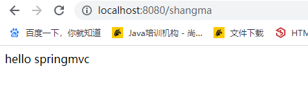
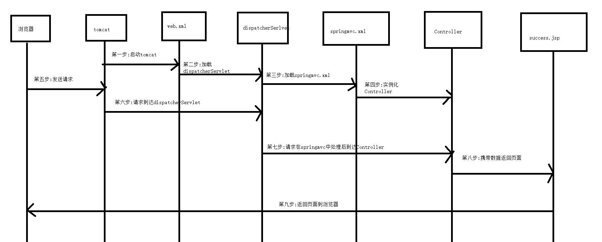
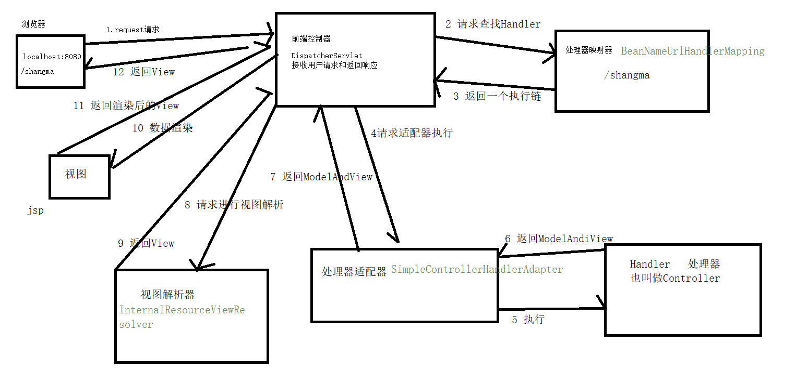
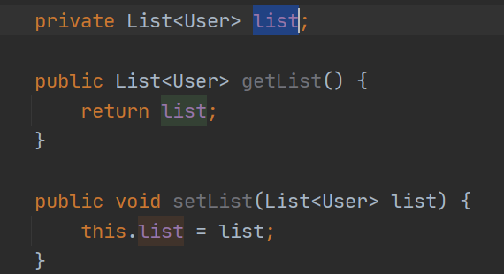
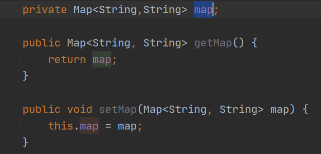
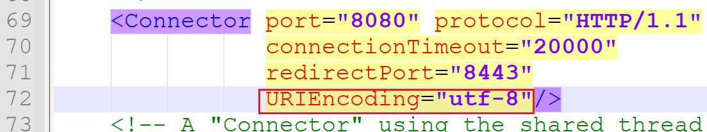
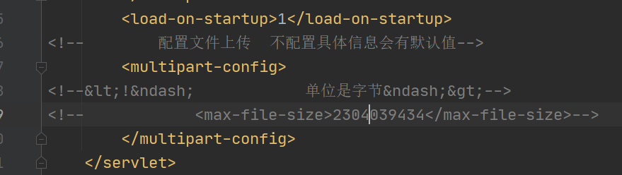
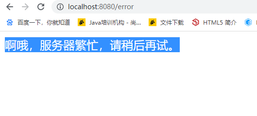
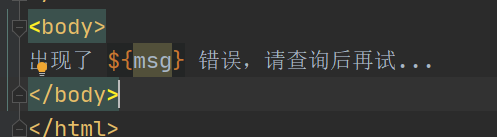
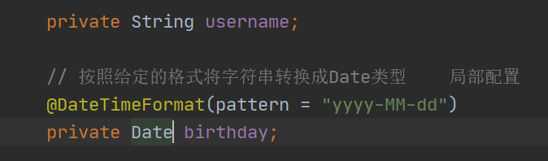

# SpringMVC

## 1 什么是MVC

MVC是23种常见设计模式之一  

M:  model   数据   实体类对象  javabean     保存数据

V:   view  界面     html css    就是我们jsp和html用来展示数据

C:   controller 控制器    servlet  主要处理用户交互的部分

## 2 SpringMVC的概述 

Spring Web MVC是基于servlet API构建的原始web框架，并从一开始就集成到了spring框架中。正式命名 Spring WEB MVC来源其一个spring-webmvc的jar包，通常称之为springmvc。

springmvc是对servlet的封装，避免繁琐的获取表单参数，避免多余的servlet，避免过多的json转换代码等等。。。

## 3 SpringMVC的基本使用

- 创建项目
- 导入依赖包

```xml
<dependencies>
        <dependency>
            <groupId>org.springframework</groupId>
            <artifactId>spring-webmvc</artifactId>
            <version>5.1.9.RELEASE</version>
        </dependency>
        <dependency>
            <groupId>javax.servlet</groupId>
            <artifactId>javax.servlet-api</artifactId>
            <version>4.0.1</version>
        </dependency>
    </dependencies>
```

- 创建controller

```java
package com.shangma.web;

import org.springframework.web.servlet.ModelAndView;
import org.springframework.web.servlet.mvc.Controller;

import javax.servlet.http.HttpServletRequest;
import javax.servlet.http.HttpServletResponse;

/**
 * @author: ShangMa
 * @className: MyController
 * @description:
 * @date: 2023/3/27 10:32
 * @since: 11
 */
public class MyController implements Controller {
    @Override
    public ModelAndView handleRequest(HttpServletRequest httpServletRequest, HttpServletResponse httpServletResponse) throws Exception {
        // 创建ModelAndView
        ModelAndView modelAndView = new ModelAndView();
        modelAndView.addObject("msg","hello springmvc");
        modelAndView.setViewName("success");
        return null;
    }
}

```

- 改造项目为web项目
- 编写jsp页面

```jsp
<%@ page contentType="text/html;charset=UTF-8" language="java" %>
<html>
<head>
    <title>success</title>
</head>
<body>
    ${msg}
</body>
</html>

```

- 编写springmvc.xml

```xml
<?xml version="1.0" encoding="UTF-8"?>
<beans xmlns="http://www.springframework.org/schema/beans"
       xmlns:xsi="http://www.w3.org/2001/XMLSchema-instance"
       xsi:schemaLocation="http://www.springframework.org/schema/beans http://www.springframework.org/schema/beans/spring-beans.xsd">

<!--    配置处理器映射器-->
    <bean class="org.springframework.web.servlet.handler.BeanNameUrlHandlerMapping"></bean>
<!--    配置处理器适配器-->
    <bean class="org.springframework.web.servlet.mvc.SimpleControllerHandlerAdapter"></bean>
<!--    配置视图解析器-->
    <bean class="org.springframework.web.servlet.view.InternalResourceViewResolver">
        <property name="prefix" value="/WEB-INF/pages/"></property>
        <property name="suffix" value=".jsp"></property>
    </bean>
<!--    把控制器放入容器中-->
    <bean name="/shangma" class="com.shangma.web.MyController"></bean>
</beans>
```

- 编写web.xml

```xml
<?xml version="1.0" encoding="UTF-8"?>
<web-app xmlns="http://xmlns.jcp.org/xml/ns/javaee"
         xmlns:xsi="http://www.w3.org/2001/XMLSchema-instance"
         xsi:schemaLocation="http://xmlns.jcp.org/xml/ns/javaee http://xmlns.jcp.org/xml/ns/javaee/web-app_4_0.xsd"
         version="4.0">

<!--    配置前端控制器-->
    <servlet>
        <servlet-name>dispatcherServlet</servlet-name>
        <servlet-class>org.springframework.web.servlet.DispatcherServlet</servlet-class>
<!--        配置初始化参数 加载springmvc.xml-->
        <init-param>
            <param-name>contextConfigLocation</param-name>
            <param-value>classpath:springmvc.xml</param-value>
        </init-param>
    </servlet>

    <servlet-mapping>
        <servlet-name>dispatcherServlet</servlet-name>
        <url-pattern>/</url-pattern>
    </servlet-mapping>
</web-app>
```

- 配置tomcat进行测试



## 4 SpringMVC执行流程




## 5 SpringMVC的内部流程

SpringMVC中的组件:

- 前端控制器
  - 主要用于分配转发请求
- 处理器映射器
  - 保存映射关系
- 处理器适配器
  - 寻找处理器
- 处理器
  - 执行代码，处理具体的请求
- 视图解析器
  - 保存视图的前缀和后缀，获取视图的完整路径



##   6 SpringMVC请求方式注解

- @RequestMapping
- @GetMapping
- @PostMapping
- @PutMapping
- @DeleteMapping

```java
/**
     * @GetMapping   只能支持get请求
     * @PostMapping  只能支持post请求
     * @PutMapping   只能支持put请求
     * @DeleteMapping 只能支持delete请求
     */
     
     /*
    @ReqeustMapping注解可以放在方法上面，也可以放在类上面
    放在类上面代表父路径

    value和path都表示请求的路径
    method:表示支持的请求方式   常见的有get post put delete
    params:必须包含的请求中的参数
    headers:必须包含的请求头
    produces:请求的来源
    */
```

## 7 SpringMVC参数的封装

### 7.1 普通参数类型

创建index.jsp

```jsp
<h2>普通参数类型</h2>
<form action="/fun1">
    用户名: <input type="text" name="username"> <br>
    <input type="submit" value="提交">
</form>
```

SecondController

```java
@Controller
public class SecondController {

    @GetMapping("fun1")
    // 只要表单中的name属性 也就是请求参数中的key和后端方法的参数名相同，那么就会自动赋值
    // 如果表单中的name属性和后端请求参数名对应不上，那么可以使用@RequestParam注解进行手动映射
    public ModelAndView fun1(@RequestParam("username") String abc){
        System.out.println(abc);

        ModelAndView modelAndView = new ModelAndView();
        modelAndView.addObject("msg","success.....");
        modelAndView.setViewName("success");
        return modelAndView;
    }
}
```

### 7.2 数组类型

index.jsp

```jsp
<h2>数组类型</h2>
<form action="/fun2">
    <input type="checkbox" name="hobby" value="篮球">篮球 <br>
    <input type="checkbox" name="hobby" value="足球">足球 <br>
    <input type="checkbox" name="hobby" value="rap">说唱 <br>
    <input type="checkbox" name="hobby" value="code">编代码 <br>
    <input type="submit" value="提交">
</form>
```

secondController

```java
@GetMapping("fun2")
    // 只要表单中的name属性和后端参数名称相同，那么就可以直接用数组赋值
    public ModelAndView fun2(String[] hobby){
        System.out.println(Arrays.toString(hobby));
        
        ModelAndView modelAndView = new ModelAndView();
        modelAndView.addObject("msg","success.....");
        modelAndView.setViewName("success");
        return modelAndView;
    }
```

### 7.3 自定义类型

index.jsp

```jsp
<h2>封装对象</h2>
<form action="/fun3">
    <input type="text" name="id"> <br>
    <input type="text" name="username"> <br>
    <input type="text" name="sex"> <br>
    <input type="submit" value="提交">
</form>
```

SecondController

```java
@GetMapping("fun3")
    // 只要前端表单和参数中的类型中的属性名相同，就会自动封装赋值。
    public ModelAndView fun3(User user){
        System.out.println(user);
        ModelAndView modelAndView = new ModelAndView();
        modelAndView.addObject("msg","success.....");
        modelAndView.setViewName("success");
        return modelAndView;
    }
```

### 7.4 嵌套类型

定义嵌套类

```java
package com.shangma.entity;

/**
 * @author: ShangMa
 * @className: MyUser
 * @description:
 * @date: 2023/3/27 15:54
 * @since: 11
 */
public class MyCuster {
    private int age;

    private User user;

    public int getAge() {
        return age;
    }

    public void setAge(int age) {
        this.age = age;
    }

    public User getUser() {
        return user;
    }

    public void setUser(User user) {
        this.user = user;
    }

    @Override
    public String toString() {
        return "MyCuster{" +
                "age=" + age +
                ", user=" + user +
                '}';
    }
}

```


index.jsp中

```jsp
<h2>嵌套类型</h2>
<form action="/fun4">
    <input type="text" name="age"> <br>
    <input type="text" name="user.id"> <br>
    <input type="text" name="user.username"> <br>
    <input type="text" name="user.sex"> <br>
    <input type="submit" value="提交">
</form>
```

SecondController中
```java
@GetMapping("fun4")
    public ModelAndView fun4(MyCuster myCuster){
        System.out.println(myCuster);
        ModelAndView modelAndView = new ModelAndView();
        modelAndView.addObject("msg","success.....");
        modelAndView.setViewName("success");
        return modelAndView;
    }
```

### 7.5 List类型

在MyCuster类中添加list集合



index.jsp中

```jsp
<h2>list类型</h2>
<form action="/fun5">
    <input type="text" name="list[0].id">
    <input type="text" name="list[0].username">
    <input type="text" name="list[0].sex"> <br>

    <input type="text" name="list[1].id">
    <input type="text" name="list[1].username">
    <input type="text" name="list[1].sex"> <br>

    <input type="text" name="list[2].id">
    <input type="text" name="list[2].username">
    <input type="text" name="list[2].sex"> <br>

    <input type="submit" value="提交">
</form>
```

SecondController中

```java
@GetMapping("fun5")
    public ModelAndView fun5(MyCuster myCuster){
        System.out.println(myCuster);
        ModelAndView modelAndView = new ModelAndView();
        modelAndView.addObject("msg","success.....");
        modelAndView.setViewName("success");
        return modelAndView;
    }
```

### 7.6 Map类型



index.jsp中

```jsp
<h2>Map类型</h2>
<form action="/fun6">
    <input type="text" name="map['aaa']">
    <input type="text" name="map['bbb']">
    <input type="text" name="map['ccc']">
    <input type="submit" value="提交">
</form>
```

SecondController中
```java
@GetMapping("fun6")
    public ModelAndView fun6(MyCuster myCuster){
        System.out.println(myCuster);
        ModelAndView modelAndView = new ModelAndView();
        modelAndView.addObject("msg","success.....");
        modelAndView.setViewName("success");
        return modelAndView;
    }
```

### 7.7 JSON格式的字符串

json字符串常常放在请求体中传递，get请求没有请求体。

json字符串常用于post和put方式的请求。

导入jackson包

```xml
<!-- https://mvnrepository.com/artifact/com.fasterxml.jackson.core/jackson-databind -->
        <dependency>
            <groupId>com.fasterxml.jackson.core</groupId>
            <artifactId>jackson-databind</artifactId>
            <version>2.11.4</version>
        </dependency>
```

使用@RequestBody接收，会自动将json字符串转换成对象

```java
// json解析包: fastjson  jackson(springmvc支持)  gson  sbjson
    @PostMapping("fun7")
    // @ReqeustBody 获取请求体的内容  导入jackson包之后会自动把json字符串转换成user对象
    public ModelAndView fun7(@RequestBody User user){
        System.out.println(user);
        ModelAndView modelAndView = new ModelAndView();
        modelAndView.addObject("msg","success.....");
        modelAndView.setViewName("success");
        return modelAndView;
    }
```

## 8 Post请求中文乱码处理

tomcat8之后(包含8)已经解决了get请求的中文乱码问题。但是post请求中还会有中文乱码问题。

为什么产生中文乱码问题?

由于现在浏览器用的是utf-8,tomcat默认编码格式是iso8859-1,所以会出现乱码


### 8.1 修改tomcat编码格式(别用!!)





### 8.2 设置请求的编码格式

注意:应该先设置编码格式，再去请求中获取参数。不能通过springmvc框架直接从参数中赋值

```java
        // 方式二:先设置编码格式，再从请求中获取参数
        request.setCharacterEncoding("utf-8");
        String username = request.getParameter("username");
       System.out.println(username);
```

### 8.3 手动修改编码格式

```
        // 方式三：用iso8859-1先转换成数组，再用utf-8重新编码成中文
        byte[] bytes = username.getBytes("iso8859-1");
        String s = new String(bytes, "utf-8");
        System.out.println(s);
```

### 8.4 SpringMVC的方式

在web.xml中配置

```xml
<!--    springmvc解决post请求中文乱码问题-->
    <filter>
        <filter-name>characterEncodingFilter</filter-name>
        <filter-class>org.springframework.web.filter.CharacterEncodingFilter</filter-class>
        <init-param>
            <param-name>encoding</param-name>
            <param-value>utf-8</param-value>
        </init-param>
    </filter>
    <filter-mapping>
        <filter-name>characterEncodingFilter</filter-name>
        <url-pattern>/*</url-pattern>
    </filter-mapping>
```

注意:在post请求中，如果是请求体中的数据，会出现中文乱码。如果是在请求路径后面拼接的参数，不会出现中文乱码

## 9 给请求域赋值

- 原生请求

```java
    @GetMapping("returnView")
    public String returnView(HttpServletRequest request){
        request.setAttribute("msg","我是大傻瓜~");

        return "success";
    }
```

- model设置

```java
    @GetMapping("returnView")
    public String returnView(Model model){
        model.addAttribute("msg","我是大傻瓜~");
        return "success";
    }
```

- map设置

```java
 @GetMapping("returnView")
    public String returnView(Map<String,String> map){
        map.put("msg","床前明月光");
        return "success";
    }
```

- ModelMap设置

```java
@GetMapping("returnView")
    public String returnView(ModelMap modelMap){
        modelMap.put("msg","疑是地上霜");
        return "success";
    }
```

## 10 mapping方法的返回值类型

### 10.1 ModelAndView(了解)

ModelAndView中携带了数据和页面信息，数据可以用jsp的el表达式取出

### 10.2 返回字符串

#### 10.2.1 返回jsp页面

```java
// 如果返回的是一个字符串，那么默认会根据视图解析器中的前缀和后缀去寻找对应的jsp
    @GetMapping("stringpage")
    public String fun1(){
        return "success";
    }
```

#### 10.2.2 返回普通字符串

@ResponseBody

```java
@GetMapping(value = "string",produces = "text/html;charset=utf-8")
    @ResponseBody
    public String fun2() throws IOException {
        return "hello 谷丰硕";
    }
```

#### 10.2.3 字符串之转发和重定向

```java
// 转发
    @GetMapping("forward")
    public String forward(){
        return "forward:string";
    }

    // 重定向
    @GetMapping("redirect")
    public String redirect(){
        return "redirect:https://www.jd.com";
    }
```

### 10.3 返回对象

默认会去找路径对应的jsp页面。


添加@ResponseBody注解,就会把对象转换成json字符串返回

```java
// 返回对象
    @GetMapping("object")
    @ResponseBody
    public User obj(){
        User user = new User();
        user.setId(10);
        user.setUsername("张三");
        user.setSex("男");
        return user;
    }
```

### 10.4 返回void

```java
// 默认会去找路径中的jsp页面
    @GetMapping("void")
    public void vo(){
        System.out.println("void...");
    }
```

### 10.5 返回ResponseEntity

可以设置响应行和响应体

```java
// 默认返回的就是json字符串
    @GetMapping("returnEntity")
    public ResponseEntity returnEntity(){
        User user = new User();
        user.setId(19);
        user.setUsername("尚马教育");
        user.setSex("女");
        return ResponseEntity.status(HttpStatus.OK).body(user);
    }
```

## 11 Rest风格

```
传统风格
localhost:8080/findAll                             查询所有
localhost:8080/findById?id=19					   根据id查询
localhost:8080/addUser?username=zs&password=123    添加用户
localhost:8080/updateUser?username=ls&password=123  更新用户
localhost:8080/deleteByid?id=30                     根据id删除


```

对于rest风格来说，不同的操作，使用不同的请求方式

- get              获取数据（查）
- post           登录和添加数据（增）
- put             修改数据 (改)
- delete        删除数据（删）

```
get  localhost:8080/users                查询所有
get  localhost:8080/users/1              根据id查询
post localhost:8080/users                添加用户
put  localhost:8080/users                更新用户
delete localhost:8080/users/1            根据id删除
```

```java
    @GetMapping//localhost:8080/first
    public String fun1(){
        System.out.println("查询所有");
        return "success";
    }

    @GetMapping("{id}") //localhost:8080/first/
    public String fun2(@PathVariable String id){
        System.out.println("根据id查询" + id);
        return "success";
    }

    @PostMapping
    public String fun3(){
        System.out.println("添加数据");
        return "success";
    }

    @PutMapping
    @ResponseBody
    public String fun4(){
        System.out.println("修改数据");
        return "success";
    }

    @DeleteMapping("{id}/{username}")
    @ResponseBody
    public String fun5(@PathVariable Integer id,@PathVariable String username){
        System.out.println("删除数据" + id + username);
        return "success";
    }
```

@PathVariable可以指定参数要匹配的路径变量

```java
@DeleteMapping("{id}/{username}")
    @ResponseBody
    public String fun5(@PathVariable Integer id,@PathVariable("username") String username1){
        System.out.println("删除数据" + id + username1);
        return "success";
    }
```

## 12 文件下载

文件下载分为两种方式:

- 使用超链接方式直接下载(简单)
- 使用编码方式下载文件(所有的文件都能下载,重点)

### 12.1 超链接方式下载文件

这种方式需要springmvc放行静态资源
```xml
<!--    静态资源放行-->
    <mvc:default-servlet-handler/>
```


如果浏览器支持下载文件的格式，那么会默认打开文件，如果浏览器不支持要下载的文件格式，才会去进行下载。

这种方式没有办法统计下载次数。

```jsp
<h2>超链接方式下载文件</h2>
<a href="/download/cwt.jpg">陈伟霆</a> <br>
<a href="/download/ddd.txt">txt文件</a> <br>
<a href="/download/Postman-win64-Setup.exe">exe安装包</a> <br>
<a href="/download/SpringMVC.md">md文件</a> <br>
<a href="/download/美女.webp">美女webp</a>
```

### 12.2 编码方式下载文件（重点）

特点:任何文件下载都可以使用这种方式,并且可以统计下载次数


```java
@Controller
public class DownloadController {

    @GetMapping("/downloadDoc")
    public ResponseEntity<byte[]> download(HttpServletRequest request, HttpServletResponse response) throws IOException {
        // 1.将服务器中的文件读取到内存中
        // 1.1 读取download文件夹下的cwt.jpg文件的真实路径
        String realPath = request.getServletContext().getRealPath("/download/美女.webp");
        // 1.2 创建字节输入流
        FileInputStream in = new FileInputStream(realPath);
        // 1.3 读取数据到内存中
        byte[] bytes = new byte[in.available()];
        in.read(bytes);
        // 2.设置响应头，告诉前端浏览器去进行接收
        // 获取文件名
        String filename = realPath.substring(realPath.lastIndexOf("\\") + 1);
        HttpHeaders httpHeaders = new HttpHeaders();
        // URLEncoder.encode防止中文乱码
        httpHeaders.setContentDispositionFormData("attachment", URLEncoder.encode(filename,"utf-8"));
        // 3.把内存中的内容传递给浏览器
        ResponseEntity<byte[]> responseEntity = new ResponseEntity<>(bytes, httpHeaders, HttpStatus.OK);

        return responseEntity;
    }
}
```

## 13 文件上传

文件上传的三大要素:

- post请求
- enctype必须是 multipart/form-data
- input标签中type必须是file

### 13.1 Part方式文件上传

#### 13.1.1 上传一个文件

不需要额外的导包，推荐使用

前端

```jsp
<h2>文件上传</h2>
<form action="/upload" method="post" enctype="multipart/form-data">
    <input type="file" name="img"> <br>
    <input type="submit" value="提交">
</form>
```

后端

```java
@PostMapping("upload")
    public String upload(HttpServletRequest request) throws IOException, ServletException {
        // 获取part对象
        Part file = request.getPart("img");
        // 把用户上传的头像保存到服务器本地
        // 获取WEB-INF目录的真实路径
        String realPath = request.getServletContext().getRealPath("/WEB-INF/");
        System.out.println(realPath + file.getSubmittedFileName());
        // 写入到本地
        file.write(realPath + file.getSubmittedFileName());
        return "success";
    }
```

在web.xml中配置



#### 13.1.2 上传多个文件

前端

```jsp
<h2>多文件上传</h2>
<form action="/uploadMulti" method="post" enctype="multipart/form-data">
    <input type="file" name="img" multiple> <br>
    <input type="submit" value="提交">
</form>
```

后端

```java
@PostMapping("uploadMulti")
    public String uploadMulti(HttpServletRequest request, HttpServletResponse response) throws IOException, ServletException {
        Collection<Part> parts = request.getParts();
        String realPath = request.getServletContext().getRealPath("/WEB-INF/");
        parts.forEach(part -> {
            try {
                part.write(realPath + part.getSubmittedFileName());
            } catch (IOException e) {
                e.printStackTrace();
            }
        });
        return "success";
    }
```

### 13.2 SpringMVC方式文件上传

- 导入依赖

```xml
<dependency>
            <groupId>commons-fileupload</groupId>
            <artifactId>commons-fileupload</artifactId>
            <version>1.2.1</version>
        </dependency>
        <!-- https://mvnrepository.com/artifact/commons-io/commons-io -->
        <dependency>
            <groupId>commons-io</groupId>
            <artifactId>commons-io</artifactId>
            <version>2.5</version>
        </dependency>
```

- 编写前端

```jsp
<h2>springmvc文件上传</h2>
<form action="/uploadspringmvc" method="post" enctype="multipart/form-data">
    <input type="file" name="file">
    <input type="submit" value="提交">
</form>
```

- 编写后端

```java
@PostMapping("uploadspringmvc")
    public String uploadSpringMVC(MultipartFile file) throws IOException {
        // 保存到服务器的d盘中
        FileUtils.writeByteArrayToFile(new File("d://资源/" + file.getOriginalFilename()),file.getBytes());
        return "success";
    }
```


## 14 SpringMVC中的异常处理

在开发中三层架构，dao层service和web层的异常，一般都会抛给SpringMVC来处理

### 14.1 第一种方式(了解)

创建jsp页面

```jsp
<%@ page contentType="text/html;charset=UTF-8" language="java" %>
<html>
<head>
    <title>错误页面</title>
</head>
<body>
啊哦，服务器繁忙，请稍后再试。
</body>
</html>
```

在web.xml中设置错误页面

```xml
<!--    配置错误页面-->
    <error-page>
<!--        location:错误页面的位置-->
        <location>/WEB-INF/errors/error.jsp</location>
    </error-page>
```

效果




缺点:页面固定 传值麻烦

### 14.2 第二种方式(了解)

修改jsp的内容




编写异常处理类

```java
// 异常处理类
@Component
public class MyExceptionRes implements HandlerExceptionResolver {
    @Override
    public ModelAndView resolveException(HttpServletRequest httpServletRequest, HttpServletResponse httpServletResponse, Object o, Exception e) {
        ModelAndView mav = new ModelAndView();
        mav.addObject("msg",e.getMessage());
        mav.setViewName("errors/error");
        return mav;
    }
}
```

这种方式展示的还是jsp页面。目前在公司中可以说jsp页面已经被淘汰。

### 14.3 第三种方式(必须掌握)

现在由于前后端分离，所以我们可以把异常信息转换成json数据返回给前端，由前端展示数据。

必须要由jackson的支持

```xml
<dependency>
            <groupId>com.fasterxml.jackson.core</groupId>
            <artifactId>jackson-databind</artifactId>
            <version>2.11.4</version>
        </dependency>
```


- 定义枚举

```java
package com.shangma.enums;

/**
 * @author: ShangMa
 * @className: StatusEnum
 * @description:
 * @date: 2023/3/28 15:14
 * @since: 11
 */
public enum StatusEnum {
    OK(20000,"操作成功"),
    ERROR(50000,"操作失败");

    // 状态码
    private int status;
    // 消息
    private String message;

    StatusEnum(int status, String message) {
        this.status = status;
        this.message = message;
    }

    public int getStatus() {
        return status;
    }

    public String getMessage() {
        return message;
    }
}

```

- 定义返回给前端数据结构的类ExceptionMessageBean

```java
package com.shangma.entity;

/**
 * @author: ShangMa
 * @className: ExceptionMessageBean
 * @description:
 * @date: 2023/3/28 15:24
 * @since: 11
 */
public class ExceptionMessageBean {
    private int status;

    private String message;


    public int getStatus() {
        return status;
    }

    public void setStatus(int status) {
        this.status = status;
    }

    public String getMessage() {
        return message;
    }

    public void setMessage(String message) {
        this.message = message;
    }

    public ExceptionMessageBean(int status, String message) {
        this.status = status;
        this.message = message;
    }
}

```

- 自定义异常

```java
package com.shangma.exception;

import com.shangma.enums.StatusEnum;

/**
 * @author: ShangMa
 * @className: MyException
 * @description:
 * @date: 2023/3/28 15:17
 * @since: 11
 */
public class MyException extends RuntimeException{

    private StatusEnum statusEnum;

    public MyException(StatusEnum statusEnum){
        this.statusEnum = statusEnum;
    }

    public StatusEnum getStatusEnum() {
        return statusEnum;
    }

    public void setStatusEnum(StatusEnum statusEnum) {
        this.statusEnum = statusEnum;
    }
}

```

- 异常捕获类MyCustmerExceptionHandler

```java
package com.shangma.exception;

import com.shangma.entity.ExceptionMessageBean;
import com.shangma.enums.StatusEnum;
import org.springframework.http.ResponseEntity;
import org.springframework.web.bind.annotation.ControllerAdvice;
import org.springframework.web.bind.annotation.ExceptionHandler;
import org.springframework.web.bind.annotation.ResponseBody;
import org.springframework.web.bind.annotation.RestControllerAdvice;


/**
 * @author: ShangMa
 * @className: MyCustmerExceptionHandler
 * @description:
 * @date: 2023/3/28 15:26
 * @since: 11
 */
@RestControllerAdvice
// 表示是一个异常处理类,用来捕获指定的异常
//@ControllerAdvice
//@ResponseBody //添加在类上面，表示整个类的所有方法返回值都会转换成json字符串
public class MyCustmerExceptionHandler {

    @ExceptionHandler(MyException.class)//如果程序中出现了MyException异常，那么会被下面的方法捕获到
    public ResponseEntity handler(MyException e){//如果捕获到了对应的MyException异常，那么会赋值给形参
        StatusEnum statusEnum = e.getStatusEnum();
        ExceptionMessageBean bean = new ExceptionMessageBean(statusEnum.getStatus(), statusEnum.getMessage());
        return ResponseEntity.ok(bean);
    }
}

```


## 15 SpringMVC的静态资源处理

需要知道的点：

```xml
DispatcherServlet可以配置/和/* 都表示所有的请求都会进入DispatcherServlet
但是配置/ 则不会拦截jsp页面，其他页面会被拦截
配置/* 则拦截所有的资源
```

### 15.1 静态资源解决方式一

思路:静态资源不要再被DispatcherServlet拦截即可。

```xml
    <servlet-mapping>
        <servlet-name>dispatcherServlet</servlet-name>
        <!--    
    只有请求路径.do结尾的，才会进入DispatcherServlet,静态资源的后缀不可能是.do，所以不会进入DispatcherServlet，更谈不上拦截
-->
        <url-pattern>*.do</url-pattern>
    </servlet-mapping>
```

这种方式不符合rest风格的API

### 15.2 静态资源解决方式二(推荐)

在SpringMVC.xml中进行配置

```xml
<!--    静态资源放行-->
    <mvc:default-servlet-handler/>
```

### 15.3 静态资源解决方式三

在springMVC.xml中进行配置

```xml
<!--    静态资源解决方式三  localhost:8080/pages/index.html
    mapping:请求路径中的内容
    location:webapp目录下的目录内容
-->
    <mvc:resources mapping="pages/*" location="pages"></mvc:resources>
    <mvc:resources mapping="js/*" location="js"></mvc:resources>
    <mvc:resources mapping="css/*" location="css"></mvc:resources>
    <mvc:resources mapping="img/*" location="img"></mvc:resources>
```


## 16 SpringMVC的拦截器

过滤器: Filter  在学习servlet中学的  /*拦截所有的请求,包括静态资源 可以在任何的web项目中使用

拦截器:只会拦截controller当中的各种mapping，是SpringMVC框架的独有技术


使用步骤:

- 定义类，实现HandlerInterceptor接口

```java
package com.shangma.interceptors;

import org.springframework.web.servlet.HandlerInterceptor;
import org.springframework.web.servlet.ModelAndView;

import javax.servlet.http.HttpServletRequest;
import javax.servlet.http.HttpServletResponse;

/**
 * @author: ShangMa
 * @className: FirstInterceptor
 * @description:
 * @date: 2023/3/28 16:34
 * @since: 11
 */
public class FirstInterceptor implements HandlerInterceptor {

    // 在controller方法执行之前执行

    // 返回false 程序就不再向下执行了
    // 返回true 程序继续向下执行
    // 默认返回的是true
    @Override
    public boolean preHandle(HttpServletRequest request, HttpServletResponse response, Object handler) throws Exception {
        System.out.println("first prehandler执行了");
        return true;
    }

    // controller方法执行完成后，还没有返回视图时执行
    // 如果controller方法中抛出了异常，那么postHandle就不会执行了
    @Override
    public void postHandle(HttpServletRequest request, HttpServletResponse response, Object handler, ModelAndView modelAndView) throws Exception {
        System.out.println("first postHandler执行了...");
    }

    // 请求和响应都完成后执行
    @Override
    public void afterCompletion(HttpServletRequest request, HttpServletResponse response, Object handler, Exception ex) throws Exception {
        System.out.println("first afterCompletion执行了...");
    }
}

```

- 在springmvc.xml中配置拦截器

```xml
<!--    配置拦截器-->
    <mvc:interceptors>
<!--     一个interceptor对应一个拦截器   -->
        <mvc:interceptor>
<!--            path就是需要拦截的路径-->
            <mvc:mapping path="/test/*"/>
<!--            <mvc:mapping path="/error"/>-->
<!--            配置拦截器-->
            <bean class="com.shangma.interceptors.FirstInterceptor"></bean>
        </mvc:interceptor>
        <mvc:interceptor>
            <mvc:mapping path="/test/*"/>
            <bean class="com.shangma.interceptors.SecondInterceptor"></bean>
        </mvc:interceptor>
    </mvc:interceptors>
```

## 17 SpringMVC日期格式处理

### 17.1 Date类型的日期格式处理

- 可以在形参上面进行处理

```java
    @GetMapping("dateformat")
    public String dateformat(String username,@DateTimeFormat(pattern = "yyyy-MM-dd") Date birthday) throws ParseException {
        System.out.println(username);
        System.out.println(birthday);
        return "pages/success";
    }
```

- 可以在成员变量上使用



- 也可以配置全局转换器，全局进行配置
  - 定义类型转换器

```java
package com.shang.converts;

import org.springframework.core.convert.converter.Converter;

import java.text.ParseException;
import java.text.SimpleDateFormat;
import java.util.Date;

/**
 * @author: ShangMa
 * @className: MyConvert
 * @description:
 * @date: 2023/3/28 17:31
 * @since: 11
 */
// 类型转换器
public class MyConvert implements Converter<String, Date> {
    @Override
    public Date convert(String s) {
        SimpleDateFormat simpleDateFormat = new SimpleDateFormat("yyyy-MM-dd");
        try {
            Date date = simpleDateFormat.parse(s);
            return date;
        } catch (ParseException e) {
           e.printStackTrace();
        }
        return null;
    }
}

```

再去springmvc.xml中进行配置

```xml
<!--    配置类型转换器-->
    <bean id="conversionService2" class="org.springframework.format.support.FormattingConversionServiceFactoryBean">
        <property name="converters">
            <set>
                <bean class="com.shang.converts.MyConvert"></bean>
            </set>
        </property>
    </bean>


    <!--    开启mvc注解驱动-->
    <mvc:annotation-driven conversion-service="conversionService2"/>
```

### 17.2 LocalDateTime和LocalDate

- 第一种解决方案

```java
    @DateTimeFormat(pattern = "yyyy-MM-dd HH:mm:ss")
    private LocalDateTime localDateTime;
    @DateTimeFormat(pattern = "yyyy-MM-dd")
    private LocalDate localDate;
```

- 第二种解决方案

  - 定义2个convert

  ```java
  public class MyConvert1 implements Converter<String, LocalDateTime> {
      @Override
      public LocalDateTime convert(String s) {
          return LocalDateTime.parse(s, DateTimeFormatter.ofPattern("yyyy-MM-dd HH:mm:ss"));
      }
  }
  
  
  public class MyConvert2 implements Converter<String, LocalDate> {
      @Override
      public LocalDate convert(String s) {
          return LocalDate.parse(s, DateTimeFormatter.ofPattern("yyyy-MM-dd"));
      }
  }
  ```

  - 在springmvc.xml中进行配置

  ```xml
  <!--    配置类型转换器-->
      <bean id="conversionService2" class="org.springframework.format.support.FormattingConversionServiceFactoryBean">
          <property name="converters">
              <set>
                  <bean class="com.shang.converts.MyConvert"></bean>
                  <bean class="com.shang.converts.MyConvert1"></bean>
                  <bean class="com.shang.converts.MyConvert2"></bean>
              </set>
          </property>
      </bean>
  ```

### 17.3 json字符串日期类型转换

前提条件，需要依赖jackson包

```xml
<dependency>
            <groupId>com.fasterxml.jackson.core</groupId>
            <artifactId>jackson-databind</artifactId>
            <version>2.11.4</version>
        </dependency>
```

如果是JDK8的time包中的类型(LocalDateTime或者LocalDate)，需要额外导入

```xml
<!-- https://mvnrepository.com/artifact/com.fasterxml.jackson.datatype/jackson-datatype-jsr310 -->
        <dependency>
            <groupId>com.fasterxml.jackson.datatype</groupId>
            <artifactId>jackson-datatype-jsr310</artifactId>
            <version>2.11.4</version>
        </dependency>
```


使用JsonFormat注解就可以将字符串转换成对应的类型

```java
    // 按照给定的格式将字符串转换成Date类型    局部配置
//    @DateTimeFormat(pattern = "yyyy-MM-dd")
    // json转换时的默认格式 yyyy-MM-ddTHH:mm:ss
    @JsonFormat(pattern = "yyyy-MM")
    private Date birthday;


//    @DateTimeFormat(pattern = "yyyy-MM-dd HH:mm:ss")
    // json字符串的默认格式是 yyyy-MM-ddTHH:mm:ss
    @JsonFormat(pattern = "yyyy-MM-dd HH:mm:ss")
    private LocalDateTime localDateTime;
//    @DateTimeFormat(pattern = "yyyy-MM-dd")
    @JsonFormat(pattern = "yyyy-MM-dd")
    private LocalDate localDate;
```


