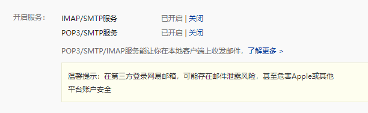
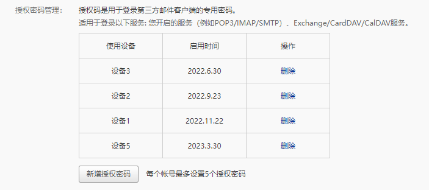
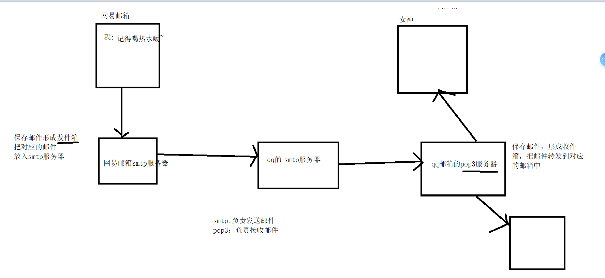
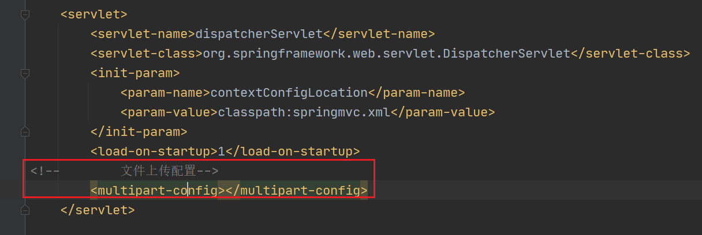
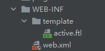
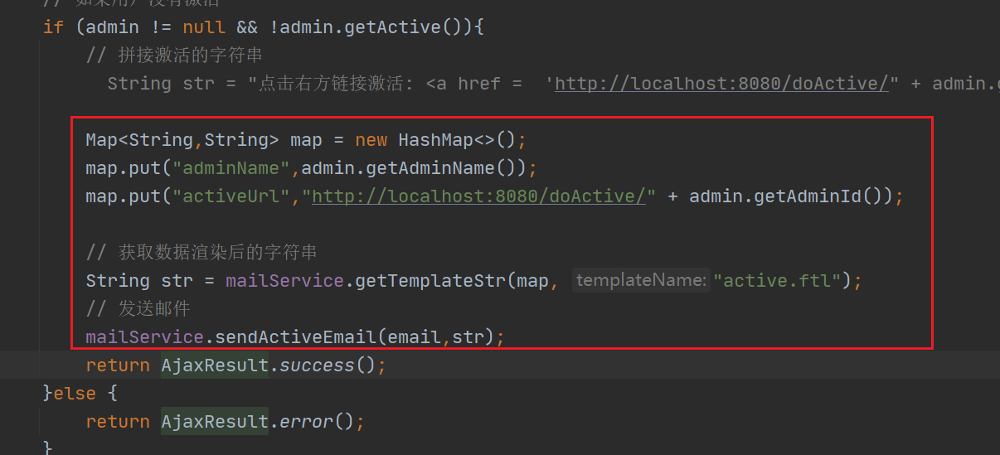
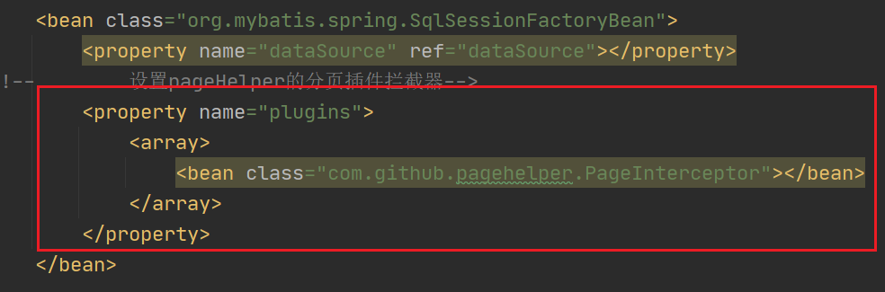

# 邮件发送技术&mybatis分页插件

- 注册邮箱，实名制
- 在邮箱的设置中开启SMTP和POP3服务



- 获取授权码



- 发送邮件的步骤



java中发送邮件有两种实现方式

- 使用工具类(了解)
- 和spring整合发送

## 使用工具类发送邮件

- 导入依赖

```xml
<!-- https://mvnrepository.com/artifact/com.sun.mail/javax.mail -->
<dependency>
    <groupId>com.sun.mail</groupId>
    <artifactId>javax.mail</artifactId>
    <version>1.6.2</version>
</dependency>
```

- 代码直接百度即可

```java
package com.shangma.demo;

import com.sun.mail.util.MailSSLSocketFactory;
 
import javax.mail.*;
import javax.mail.internet.InternetAddress;
import javax.mail.internet.MimeMessage;
import java.security.GeneralSecurityException;
import java.util.Properties;
 
public class SendEmail {
    public static void main(String[] args) throws MessagingException, GeneralSecurityException {
        //创建一个配置文件并保存
        Properties properties = new Properties();
 
        properties.setProperty("mail.host","smtp.163.com");
 
        properties.setProperty("mail.transport.protocol","smtp");
 
        properties.setProperty("mail.smtp.auth","true");
 
 
//        //QQ存在一个特性设置SSL加密
//        MailSSLSocketFactory sf = new MailSSLSocketFactory();
//        sf.setTrustAllHosts(true);
//        properties.put("mail.smtp.ssl.enable", "true");
//        properties.put("mail.smtp.ssl.socketFactory", sf);
 
        //创建一个session对象
        Session session = Session.getDefaultInstance(properties, new Authenticator() {
            @Override
            protected PasswordAuthentication getPasswordAuthentication() {
                return new PasswordAuthentication("gfsios@163.com","UDBGLKQMLPMIMYHJ");
            }
        });
 
        //开启debug模式
        session.setDebug(true);
 
        //获取连接对象
        Transport transport = session.getTransport();
 
        //连接服务器
        transport.connect("smtp.163.com","gfsios@163.com","UDBGLKQMLPMIMYHJ");
 
        //创建邮件对象
        MimeMessage mimeMessage = new MimeMessage(session);
 
        //邮件发送人
        mimeMessage.setFrom(new InternetAddress("gfsios@163.com"));
 
        //邮件接收人
        mimeMessage.setRecipient(Message.RecipientType.TO,new InternetAddress("gfsios@163.com"));
 
        //邮件标题
        mimeMessage.setSubject("表白信");
 
        //邮件内容
        mimeMessage.setContent("我爱你,希望这辈子和下辈子都能一直陪伴着你。希望你能和你老公好好商量下~","text/html;charset=UTF-8");
 
        //发送邮件
        transport.sendMessage(mimeMessage,mimeMessage.getAllRecipients());
 
        //关闭连接
        transport.close();
    }
}
```

## Spring整合的方式发送邮件

这种方式需要在上面导入依赖的基础上，再导入一个spring-context-support包
```xml
<!-- https://mvnrepository.com/artifact/org.springframework/spring-context-support -->
        <dependency>
            <groupId>org.springframework</groupId>
            <artifactId>spring-context-support</artifactId>
            <version>5.1.9.RELEASE</version>
        </dependency>
```

- 发送简单文本的邮件

  - 先配置JavaMailSender

  ```xml
  <!--    配置java邮箱发送-->
      <bean id="javaMailSender" class="org.springframework.mail.javamail.JavaMailSenderImpl">
          <property name="defaultEncoding" value="utf-8"></property>
          <property name="host" value="smtp.163.com"></property>
          <property name="username" value="gfsios@163.com"></property>
          <property name="password" value="UDBGLKQMLPMIMYHJ"></property>
      </bean>
  ```

  - 发送邮件

```java
package com.shangma.web;

import org.springframework.beans.factory.annotation.Autowired;
import org.springframework.mail.SimpleMailMessage;
import org.springframework.mail.javamail.JavaMailSender;
import org.springframework.mail.javamail.JavaMailSenderImpl;
import org.springframework.stereotype.Controller;
import org.springframework.web.bind.annotation.GetMapping;
import org.springframework.web.bind.annotation.ResponseBody;

/**
 * @author: ShangMa
 * @className: MailController
 * @description:
 * @date: 2023/3/30 16:51
 * @since: 11
 */
@Controller
public class MailController {

    @Autowired
    private JavaMailSender javaMailSender;

    @GetMapping("sendMail")
    @ResponseBody
    public String sendMail(){

        // 创建简单邮件发送对象
        SimpleMailMessage smm = new SimpleMailMessage();

        // 发件人
        smm.setFrom("gfsios@163.com");
        // 接收者
        smm.setTo("gfsios@163.com");
        // 邮件的标题
        smm.setSubject("恭喜你中奖了");
        // 邮件的内容
        smm.setText("我，秦始皇，打钱!");

        javaMailSender.send(smm);

        return "success...";
    }
}

```

- 发送能够识别标签的邮件

```java
@GetMapping("sendMailByHtml")
    @ResponseBody
    public String sendMailByHtml() throws MessagingException {

        // 创建复杂邮件对象
        MimeMessage mimeMessage = javaMailSender.createMimeMessage();
        // 创建复杂邮件帮助器
        MimeMessageHelper helper = new MimeMessageHelper(mimeMessage);
        // 发件人
        helper.setFrom("尚马教育<gfsios@163.com>");
        // 收件人
        helper.setTo("gfsios@163.com");
        // 标题
        helper.setSubject("出去旅游吧");
        // 内容   把第二个参数设置为true，就可以识别标签
        helper.setText("<a href='https://www.baidu.com'>百度一下</a>",true);
        // 发送邮件
        javaMailSender.send(mimeMessage);
        return "success";
    }
```

- 发送带附件的邮件

```java
/**
     * 发送带附件的邮件
     */
    @GetMapping("sendMailWithFile")
    @ResponseBody
    public String sendMailWithFile() throws MessagingException {
        // 创建复杂邮件消息
        MimeMessage mimeMessage = javaMailSender.createMimeMessage();;

        // 创建复杂邮件帮助器  当需要发送附件时，第二个参数需要设置为true
        MimeMessageHelper helper = new MimeMessageHelper(mimeMessage,true);
        // 发件人
        helper.setFrom("寂寞男孩<gfsios@163.com>");
        // 收件人
        helper.setTo("gfsios@163.com");
        // 标题
        helper.setSubject("来玩吗?");
        // 正文
        helper.setText("面基吗？附件是我的私房照");

        // 携带附件
        helper.addAttachment("私房照.jpg",new File("D:\\帅哥.webp"));

        // 发送邮件
        javaMailSender.send(mimeMessage);

        return "success";
    }
```

- 用文件上传的方式发送附件

编写前端页面

```html
<!DOCTYPE html>
<html lang="en">
<head>
    <meta charset="UTF-8">
    <title>发送邮件</title>
</head>
<body>
<form action="/sendMailByUpload" method="post" enctype="multipart/form-data">
    收件人: <input type="text" name="to" value="gfsios@163.com"> <br>
    标题 : <input type="text" name="subject"> <br>
    内容: <input type="text" name="text"> <br>
    附件： <input type="file" name="part"> <br>
    <input type="submit" value="发送">
</form>
</body>
</html>
```

设置文件上传的配置



编写后端代码

```java
    @PostMapping("sendMailByUpload")
    @ResponseBody
    public String sendMailByUpload(String to, String subject, String text, Part part) throws MessagingException, IOException {
        // 创建复杂邮件消息
        MimeMessage mimeMessage = javaMailSender.createMimeMessage();;
        // 创建复杂邮件消息帮助器
        MimeMessageHelper helper = new MimeMessageHelper(mimeMessage,true);
        // 设置发件人
        helper.setFrom("尚马教育<gfsios@163.com>");
        // 设置收件人
        helper.setTo(to);
        // 设置标题
        helper.setSubject(subject);
        // 设置正文
        helper.setText(text);

        // 设置携带的附件

        // 先从上传的文件中读取字节数组
        InputStream inputStream = part.getInputStream();
        byte[] buffer = new byte[inputStream.available()];
        inputStream.read(buffer);
        // 设置附件
        helper.addAttachment(part.getSubmittedFileName(),new ByteArrayResource(buffer));

        // 发送邮件
        javaMailSender.send(mimeMessage);
        return "success";
    }
```

- 发送内联资源邮件

```java
/**
     * 发送内联资源邮件
     */
    @GetMapping("sendMailByInnerResource")
    @ResponseBody
    public String sendMailByInnerResource() throws MessagingException {
        // 创建复杂邮件消息
        MimeMessage mimeMessage = javaMailSender.createMimeMessage();;
        // 创建复杂邮件帮助器
        MimeMessageHelper helper = new MimeMessageHelper(mimeMessage,true,"utf-8");

        // 发件人
        helper.setFrom("尚马教育<gfsios@163.com>");
        // 收件人
        helper.setTo("gfsios@163.com");
        // 标题
        helper.setSubject("美女图片");
        // 正文
        helper.setText("<h1>下面这张是美女图片</h1>  ",true);

        // 添加内联资源
        helper.addInline("id",new File("E:\\Svn资料\\第二阶段\\二阶段资料\\img\\赵丽颖.jpg"));

        // 发送邮件
        javaMailSender.send(mimeMessage);
        return "success";
    }
```

- 发送模板邮件(内容在本地)

```xml
<!-- https://mvnrepository.com/artifact/org.freemarker/freemarker -->
        <dependency>
            <groupId>org.freemarker</groupId>
            <artifactId>freemarker</artifactId>
            <version>2.3.28</version>
        </dependency>
```

 导入模板



在applicationContext.xml中配置对象

```xml
<!--    配置FreeMarkerConfigure  配置模板所在的位置-->
    <bean class="org.springframework.web.servlet.view.freemarker.FreeMarkerConfigurer">
<!--        加载路径-->
        <property name="templateLoaderPath" value="/WEB-INF/template/"></property>
<!--        编码-->
        <property name="defaultEncoding" value="utf-8"></property>
    </bean>
```


编写controller测试

```java
package com.shangma.web;

import freemarker.template.Configuration;
import freemarker.template.Template;
import freemarker.template.TemplateException;
import org.springframework.beans.factory.annotation.Autowired;
import org.springframework.stereotype.Controller;
import org.springframework.web.bind.annotation.GetMapping;
import org.springframework.web.bind.annotation.ResponseBody;
import org.springframework.web.servlet.view.freemarker.FreeMarkerConfigurer;

import java.io.*;
import java.nio.charset.Charset;
import java.util.HashMap;
import java.util.Map;

import static java.nio.charset.StandardCharsets.UTF_8;

/**
 * @author: ShangMa
 * @className: FreeMarkerController
 * @description:
 * @date: 2023/3/31 15:08
 * @since: 11
 */
@Controller
public class FreeMarkerController {
    @Autowired
    private FreeMarkerConfigurer freeMarkerConfigurer;

    @GetMapping("readTemplate")
    @ResponseBody
    public String readTemplate() throws IOException, TemplateException {
        // 获取配置对象
        Configuration configuration = freeMarkerConfigurer.getConfiguration();
        // 获取模板
        Template template = configuration.getTemplate("active.ftl","utf-8");

        Map<String,String> map = new HashMap<>();
        map.put("adminName","谷丰硕");
        map.put("activeUrl","http://www.baidu.com");

        // 把map中的数据渲染到template对应的模板上面，输出到D:\\active.html上
        // 默认输出到本地电脑上时会出现乱码，因为在内存中我们规定好了编码就是utf-8,但是本地电脑编码可能时gbk
        // 所以要保证内存中的编码和输出的编码一致
        template.process(map,new FileWriter("D:\\active.html", UTF_8));
//        OutputStreamWriter outputStreamWriter = new OutputStreamWriter(new FileOutputStream("D:\\active.html"), "utf-8");
//        template.process(map,outputStreamWriter);
        return "success";
    }
}

```

- 真正发送模板的邮件

封装代码到mailService

```java
/**
     * 把数据渲染到模板上
     * @param data          需要渲染的数据
     * @param templateName
     * @return
     */
    public String getTemplateStr(Object data,String templateName){
        // 获取配置对象
        Configuration configuration = freeMarkerConfigurer.getConfiguration();
        // 获取模板
        Template template = null;
        try {
            template = configuration.getTemplate(templateName,"utf-8");
        } catch (IOException e) {
            e.printStackTrace();
        }

        // 把数据渲染到模板上,并且读取到内存中,并且写到内存中的字符串   读取内存的流
        StringWriter stringWriter = new StringWriter();
        try {
            template.process(data,stringWriter);
        } catch (TemplateException e) {
            e.printStackTrace();
        } catch (IOException e) {
            e.printStackTrace();
        }
        String str = stringWriter.toString();
        return str;
    }
```

在CommonController中直接用




- 异步发送邮件

设计一个单例模式，在里面使用线程池，保证线程池在整个项目中只有一个

```java
package com.shangma.pool;

import java.util.concurrent.ScheduledThreadPoolExecutor;
import java.util.concurrent.TimeUnit;

/**
 * @author: ShangMa
 * @className: AsyncManager
 * @description:
 * @date: 2023/3/31 16:22
 * @since: 11
 */
// 设计成一个异步管理者AsyncManager的单例模式
public class AsyncManager {
    public static ScheduledThreadPoolExecutor scheduledThreadPoolExecutor;
    
    private static AsyncManager asyncManager;
    
    private AsyncManager(){
        // 单例模式下的构造方法只会被调用一次
        scheduledThreadPoolExecutor = new ScheduledThreadPoolExecutor(50);
    }
    
    // 懒汉式
    public static AsyncManager getInstance(){
        if (asyncManager == null){
            asyncManager = new AsyncManager();
            return asyncManager;
        }
        return asyncManager;
    }
    
    // 立即使用线程池执行
    public void execute(Runnable runnable){
        scheduledThreadPoolExecutor.execute(runnable);
    }
    
    // 延迟second秒后执行
    public void execute(Runnable runnable,long second){
        scheduledThreadPoolExecutor.schedule(runnable,second, TimeUnit.SECONDS);
    }
    
    
    // 立即关闭线程池
    public void release(){
        scheduledThreadPoolExecutor.shutdownNow();
    }
}

```

## mybatis分页插件

分页时，前端需要给后端传递当前页和每页显示的条数

后端需要给前端传当前页的数据和总条数


PageHelper分页插件会将查询所有的sql语句拦截下来，化成两个sql语句

- 查询总数量 select count(0) from book;
- 分页查询  select * from book limit 0,10;


使用分页插件

- 导入依赖

```xml
<!-- https://mvnrepository.com/artifact/com.github.pagehelper/pagehelper -->
        <dependency>
            <groupId>com.github.pagehelper</groupId>
            <artifactId>pagehelper</artifactId>
            <version>5.2.0</version>
        </dependency>
```

- 封装实体类

```java
package com.shangma.entity;

import java.util.List;

/**
 * @author: ShangMa
 * @className: PageBean
 * @description:
 * @date: 2023/3/31 17:27
 * @since: 11
 */
public class PageBean {

    private long total;

    private List data;

    public static PageBean setPageAndData(long total,List data){
        PageBean pageBean = new PageBean();
        pageBean.setTotal(total);
        pageBean.setData(data);
        return pageBean;
    }

    public long getTotal() {
        return total;
    }

    public void setTotal(long total) {
        this.total = total;
    }

    public List getData() {
        return data;
    }

    public void setData(List data) {
        this.data = data;
    }
}

```

- 配置分页插件的拦截器




- 使用

```java
	@GetMapping("findByPage")
    public AjaxResult findByPage(int currentPage,int pageSize){
        // 开启分页  这行代码的下一行有效代码就会进行分页
        PageHelper.startPage(currentPage,pageSize);
        List<Book> books = bookService.findAll();
        PageInfo<Book> pageInfo = new PageInfo<>(books);
        // 获取分页后的总数量
        long total = pageInfo.getTotal();
        return AjaxResult.success(PageBean.setPageAndData(total,books));
    }
```


