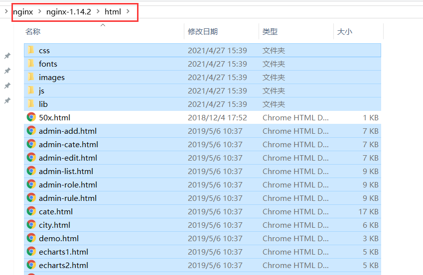
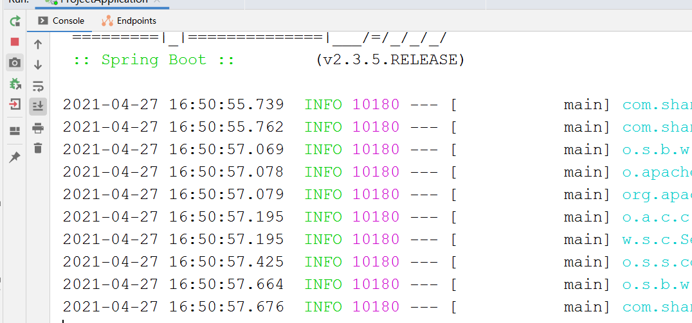

# Nginx_辉哥

## 1. 什么是nginx

```properties
Nginx (engine x) 是一个高性能的HTTP和反向代理web服务器，特点是占有内存少，并发能力强，事实上nginx的并发能力在同类型的网页服务器中表现较好。

Nginx专为性能优化而开发，性能是其重要的考量，实现上非常注重效率，能经受高负载的考验，能支持高达50000个并发连接数
```

## 2. Nginx的作用 

```properties
1： 静态服务器
	在我们前后端分离的项目中 我们的前端项目开发完毕之后，也是需要发布到一个服务器上，供用户访问  此时
	就需要用到nginx   
	
2： 虚拟主机：
		我们一个服务器可以模拟多个虚拟主机，虽然访问的链接不同，但是都表示一个主机 所以访问的内容是一致的
		
3： 反向代理：
		nginx可以作为反向代理服务器，客户端发送http请求 访问的是nginx这个反向代理服务器，反向代理			服务器nginx会选择目标服务器，最终完成请求 获取数据 


4： 负载均衡： 
		我们部署应用，项目运行在tomcat上 一个tomcat的并发访问默认200 手动调并发数量 最多600-700的并发 
		当我们用户量比较大的时候 我们的项目要占用不同的端口部署多个，目的起到请求分流的效果，减轻服务器		的压力，此时就需要负载均衡
		
```

## 3. window下的安装

### 3.1. 下载 


###3.2. 直接解压 


### 3.3. 双击启动

```properties
进入解压目录 双击即可启动  此时可能页面一闪而过
```


### 3.4. 浏览器访问

```properties
http://localhost 
```

## 4. 静态资源服务器

```properties
nginx做静态资源服务器配置的方式有很多 
```

### 4.1. 放在nginx中 

```properties
当我们访问http：//localhost时 浏览器会出现一个页面  这个页面 就是nginx解压目录中的html文件夹中的index.html  
既然能够显示这个index.html  我们可以把我们的页面也放到这个目录下，此时就能访问 
```

#### 4.1.1. 部署流程 

* **放入静态资源**



* **重启nginx**

  

* **浏览器访问**

  

#### 4.1.2. 修改首页

```properties
问题描述： 
	1： 默认加载index.html  为什么默认加载index.html 
	2： 不想加载index.html  我想进入加载其他的页面 或者我的首页就不叫index.html
```

* **修改配置文件**

  

  

### 4.2. 放到nginx外

```properties
部署静态资源除了放在nginx解压目录中之外 还可以放到电脑上的任何一个地方 然后通过配置的访问 指定到这个位置
```

#### 4.2.1. 部署流程

* **静态资源位置**

  

* **修改配置文件**

  

* **重启测试**

  

## 5. nginx配置文件

```properties
nginx的配置文件名字叫 nginx.conf  在解压目录下的config目录 
```

### 5.1. 配置文件组成部分

```properties
第一部分：全局块
	主要会设置一些影响Nginx 服务器整体运行的配置指令
第二部分：Events块
	worker_connections  1024；表示每个 worker process 支持的最大连接数
第三部分：Http块		
	这是Nginx服务配置中最频繁的部分，代理、缓存和日志定义等绝不多数功能和第三方模块的配置都在这里。需要	注意的是：http 块也可以包括http全局块、server块。server 块又包含全局server块和localtion块。
```

### 5.2. 配置文件的结构 

```properties
main:    # 全局配置，对全局生效
	events:  # 配置影响 Nginx 服务器或与用户的网络连接
	http:   # 配置代理，缓存，日志定义等绝大多数功能和第三方模块的配置
	   upstream:   # 配置后端服务器具体地址，负载均衡配置不可或缺的部分
	   server : #配置虚拟主机的相关参数，一个 http 块中可以有多个 server 块
	   server
	     location: # server 块可以包含多个 location 块，location 指令用于匹配 uri
	     location 
```

## 6. 虚拟主机 

```properties
我们一个服务器可以模拟多个虚拟主机，虽然访问的链接不同，但是都表示一个主机 所以访问的内容是一致		的,nginx的一个server标签就是一个虚拟主机  我们配置多个server标签就可以代表多个主机
```

### 6.1. 储备知识（域名解析）


### 6.2. 配置虚拟主机 

* **配置多个server**

  

* **添加域名映射**

  ```properties
  C:\Windows\System32\drivers\etc\hosts文件
  ```

  

* **重启测试**

  

  

 ### 6.3. 课堂练习（防剁手）

```properties
需求： 屏蔽淘宝
```

## 7. 反向代理服务器

### 7.1. 正向代理

```properties
概念： Nginx代理客户端来访问互联网。典型代表：翻墙。
特点： 客户端非常明确要访问的服务器地址；服务器只清楚请求来自哪个代理服务器，而不清楚来自哪个具体的客户	  端；正向代理模式隐藏了真实客户端信息。
```


### 7.2. 反向代理

```properties
概念： Nginx作为反向代理服务器接收来自客户端的请求，并将请求转发给后端的真实服务器集群中的一台。
      典型代表：负载均衡
      
      
      、
      
特点： 主要用于服务器进群分布式部署的情况下，隐藏了服务器的真实信息
```


### 7.3. 反向代理配置 

* **新建springboot工程**

  

* **启动项目**

  

* **配置反向代理**

  

* **nginx重启测试**

  

  

## 8. 负载均衡

```properties
场景： 当一个应用占用不同的端口启动多次的情况下， 每个端口的应用都包含所有的功能，在高并发的情况下 做到分流效果，此时客户端的一个请求过来，到底这个请求要去哪个服务器中访问，此时面临了一个一对多的关系，此时需要负载均衡算法
```

### 8.1. 配置负载均衡

* **启动多个springBoot工程**

  略

* **配置负载均衡**

  

* **负载均衡策略**

  ```properties
  通过测试 默认是轮训  
  除了轮训还有其他的负载均衡策略 
  比如： 
  	加权轮询： 
  	ip_hash
  	url_hash
  	fair
  ```

### 8.2. 轮训策略演示

 #### 8.2.1. 加权轮训

* **配置**

  

* **测试**

  

#### 8.2.2. ip_hash策略

```properties
每个请求按照IP的hash结果分配，同一个IP客户端访问一个固定的后端服务器。
优点：可以保证来自同一个IP的请求，被打到固定的机器上，可以解决session的问题。 
```

* **配置**

  

* **测试**

  

#### 8.2.3. url_hash策略（不要掌握）

```properties
按访问url的hash结果来分配请求，相同url固定转发到同一个后端服务器进行处理。
```

* **配置**

  

#### 8.2.4. fair策略(不要掌握)

```properties
按后端服务器的响应时间来分配请求，响应时间短的优先分配。 

需要安装 插件
```

### 8.3. 参数了解 

```properties
任何负载均衡策略都可以携带参数 

1： down：当前服务器暂不参与负载；
2： weight：权重，值越大，服务器的负载量越大；
3： max_fails：允许请求失败的次数，默认为1；
4： fail_timeout：max_fails次失败后暂停的时间；
5： backup：备份机，只有其他所有的非backup机器down或者忙时才会请求backup机器。
```


## 9. Linux安装nginx 

第一步： 

```properties
安装需要的插件

yum -y install gcc-c++ 

yum -y install  zlib zlib-devel openssl openssl-devel 

yum -y install patch
```

第二步：

```properties
新建目录
 mkdir  /opt/nginx 

进入目录
	cd /opt/nginx 
```

第三步： 

```properties
上传nginx的包 
```

第四步：

```properties
解压 
 tar -zxvf nginx-1.14.2.tar.gz 
```

第五步： 

```properties
进入解压目录 
 cd nginx-1.14.2

执行命令 
	./configure  (注意这个命令可以携带参数)
```

第六步： 

```properties
执行make指令  
 make  
 
执行安装指令 
	make install
 
```

第七步： 

```properties
默认的安装的目录： /usr/local 目录下的nginx  
	
进入安装目录 
	cd /usr/local/nginx 
```

第八步： 

```properties
//进去sbin目录 
cd  sbin  

启动nginx  
 ./nginx 
```

第九步：测试

 略  

## 10. Linux中练习配置

 ```properties
课堂练习
 ```

## 11. 传统项目Session问题 

### 11.1. 问题说明 

```properties
当部署多台tomcat时 使用nginx做负载均衡，此时当浏览器访问时 nginx负载均衡到其中的一个服务器 在这台服务器上生成session 并保持到当前服务器中  如果浏览器再次访问 通过nginx负载均衡到另外一台服务器上时  这台服务器中并没有session 此时我们需要做session共享
```

### 11.2. 问题演示和解决

#### 11.2.1. 定义控制器


#### 11.2.2. 配置负载均衡 


#### 11.2.3. 测试 


#### 11.2.4. 添加springSession  

```xml
     <dependency>
                <groupId>org.springframework.session</groupId>
                <artifactId>spring-session-data-redis</artifactId>
        </dependency>

        <dependency>
            <groupId>org.springframework.boot</groupId>
            <artifactId>spring-boot-starter-data-redis</artifactId>
        </dependency>
```

#### 11.2.5. 添加配置 


#### 11.2.6. 测试 


## 12. 限流问题 

### 12.1. 问题说明 

```properties
nginx一秒大概能都处理5万个请求，而tomcat默认情况下默认并发200个线程  nginx承受能力比tomcat的承受能力要强 此时为了防止流量爆发的情况  我们需要给nginx限流 来保护我们的tomcat服务器
```

### 12.2. 常见限流算法

```properties
## 1: 计数器算法 
 计数器算法是一种比较简单的限流实现的算法，表示在指定的周期内限制访问的上限，比如1分钟进入100个请求 
 如果一分钟之内请求次数达到100之后 剩下的请求将会被限流  进入下一分钟 次数清零  
 
 好处： 实现简单 只需要一个计数的变量即可   
 缺点： 存在临界问题 比如1分钟请求100次请求  第一分钟的30秒到60秒 这30秒进入100个请求  下一分钟的0秒到		 30秒 进入100个请求  那么在这1分钟的时间断中 进入了200个请求 这就是临界问题  
 
 
## 2： 滑动窗口算法 
	  滑动窗口算法 这种算法在TCP的滑动窗口协议中有体现，可以这么说 tcp就是通过滑动窗口解决网络阻塞的问题  我们使用的sentinel就是滑动窗口算法 实现的限流 并且可以解决计数器的临界问题  
	  
	  理解： 1分钟进入100个请求  把1分钟 分成10小段  一小段占6秒  平均下来一小段6秒允许10个请求  
	  		然后定义一个窗口 比如说窗口时间是12秒 就是包含2段  也就是说在这个窗口的内的请求最大是20
	  		并且随着时间的推移  窗口往前滑动 到达下一个时间段的时候 第一个时间段不参与统计  统计的值
             永远在这个窗口内统计
             
       
## 3： 令牌桶算法 
		 系统以一个固定的速度往一个容器中（桶中）生产令牌（tokens）  请求想要请求成功 必须先从桶中获取到令牌 才能正常访问，如果没有令牌 请求将会被限流   
		 
	令牌桶算法 会出现如下3种情况 
		1： 系统生成的速度高于请求的速度， 桶中的tokens用不完  此时并发量不高 都能正常访问 
		2： 系统生成的速度等价于请求速度  此时系统基本请求稳定   
		3： 系统生产的速度小于请求的速度  此时会有请求被限流 
		
## 4: 漏桶限流算法 
		一个容器（桶），以一个恒定的速度向外流出，但是不管这个桶的流入多大  流出都是一个固定的速度  
		当流入的速度高于流出的速度时  容器（桶）会溢出 溢出的部分就是被限流的请求 
```

### 12.3. nginx的限流 

```properties
nginx的限流是以模块的形式引入的    限流的模块有2个  使用的是漏桶算法
第一个： 根据ip限制请求速率（limit_req_zone）
第二个： 同一时间的并发数 （limit_req_conn）
```

#### 12.3.1. 限流的配置 

```properties
http {
    limit_req_zone $binary_remote_addr zone=huigezhenqiushuai:10m rate=1r/s;
    server {
        location / {
            limit_req zone=huigezhenqiushuai burst=5 nodelay;
        }
} 
```

#### 12.3.2. 配置说明 

```properties
limit_req_zone 
		limit_req_zone 表示模块名（可以当做key） 
		
		$binary_remote_addr 表示限制同一客户端的ip地址  
		
		zone=huigezhenqiushuai:10m 表示生成一个大小为10M，名字为huigezhenqiushuai的内存区域，用来存		 储访问的频次信息 这个名字随意写 
		
		rate=1r/s 表示请求速率 一秒最多请求一次
		

 limit_req 
 	 limit_req 指定模块可以当做一个key  
 	 
 	 zone=huigezhenqiushuai 指定上面定义的这个内存区域名称 
     
 	 burst 设置一个大小为5的缓冲区当有大量请求（爆发）过来时，超过了访问频次限制的请求可以先放到这个缓冲			 区内。比如 burst=5 表示缓存区是5  当过来7个请求的时候 第一个请求去处理 缓冲区5个请求 排队			 处理  其中1个直接失败 	可以不设置
     
     nodelay 如果设置，缓冲区的请求 将会被立即处理 不需要太多的等待时间 如果缓冲区满了 请求过来之后直接			失败。 可以不设置

```

#### 12.3.3. 限流后的处理

```properties
server {
        listen       80;
        server_name  localhost;

        location / {
        ## 配置限流
			limit_req zone=huigezhenqiushuai burst=5 nodelay;
            root   html;
            index  index.html index.htm;
        }
        ## 通过控制台查看 限流之后 状态码是503  设置但状态吗是503时  请求/xxxxxxxxx
        ## 然后在/xxxxxxx请求中 返回json 
        error_page 503  /xxxxxxxxxx;
        location = /xxxxxxxxxx {
		  default_type application/json; 
		  ## 如果乱码了 可以添加这一行
		  add_header Content-Type 'text/html; charset=utf-8';
		  return 200 '{"status":777777,"message":"被限流了"}'; 
            
        }
```

## 13. 拓展内容

### 13.1. 面试题一

```properties
nginx能够并发处理5万请求，请问nginx 请求处理机制是如何的?  
```

#### 13.1.1. 相关知识储备

```properties
一个nginx可以并发处理多个请求，就证明了nginx和客户端是一对多的关系 ， 也就是说nginx服务器有能力同时给多个客户端提供服务， 一般来说，能够完成并行处理的方式大概有如下几种 

第一种： 多进程的方式 
第二种： 多线程的方式 
第三种： 异步的方式 
```

#####13.1.1.1.  多进程的方式

```properties
理解： 
	服务器接收到一个客户端请求时，服务器的主进程会生成一个子进程，这个子进程会和客户端连接并且进行交互，
	交互完毕之后 连接断开，这个子进程就结束了  
	
优缺点： 
	多进程方式的优点在于，设计和实现相对简单，各个子进程之间相互独立，处理客户端请求的过程彼此不受到干扰，并且当一个子进程产生问题时，不容易将影响漫延到其他进程中，这保证了提供服务的稳定性。当子进程退出	   时，其占用资源会被操作系统回收，在资源和时间上会产生一定的额外开销，因此，如果服务器接受大量并发请	求，就会对系统资源造成压力，导致系统性能下降
```

#####13.1.1.2. 多线程的方式

```properties
理解： 
	服务器每当接受到一个客户端请求时，会由服务器主进程派生一个线程出来和该客户端进行交互。

优缺点： 
	由于操作系统产生一个线程的开销远远小于产生一个进程的开销，所以多线程方式在很大程度上减轻了web服务器		对系统资源的要求。该方式使用线程进行任务调度，开发方面可以遵循一定的标准，这相对来说比较规范和有利于	  协作。但在线程管理方面，该方式有一定的不足。多个线程位于同一个进程内，可以访问同样的内存空间，彼此之	间相互影响
```

#####13.1.1.3. 异步的方式

```properties
同步： 是指发送方发送请求后，需要等待接收到接收方发回的响应后，才接着发送下一个请求
异步： 发送方发出一个请求后，不等待接收响应这个请求，就继续发送下个请求


异步的方式也分为2种 

异步阻塞
异步非阻塞 
```

* **异步阻塞**

  ```properties
    发送方向接收方发送请求后，不用等待响应，可以接着进行其他工作；接收方处理请求时进行操作如果不能马上得到结果，就一直等待返回结果后，才响应发送方，期间不能进行其他工作。这种方式在实际中不使用。
  ```

* **异步非阻塞**

  ```properties
    发送方向接收方发送请求后，不用等待响应，可以继续其他工作；接收方处理请求时进行操作如果不能马上得到结果，也不等待，而是马上返回去做其他事情。当操作完成以后，将完成状态和结果通知接收方，接收方再响应发送方。
    
  例如： 
     在超市排队付账。客户（发送方）向收款员（接收方）付款（发送请求）后在等待收款员找零的过程中，还可以做 其他事情，比如打电话、聊天等；而收款员在等待收款机处理交易（操作）的过程中可以帮助客户将商品打包，  当收款机产生结果后，收款员给客户结账（响应请求），这种方式是发送方和接收方通信效率最高的一种。

  ```


#### 12.1.2. 面试题回答

```properties
nginx 之所以能够处理高并发的情况 主要是 nginx采用的是多进程+异步中（异步非阻塞的方式）处理web请求的。

流程： 
	nginx服务器启动后，会产生一个主进程（master process）和多个工作进程（worker process）（工作进程个数可以指定 例如 worker_processes 5 ）。nginx服务器的所有工作进程都用于接收和处理客户端的请求。
	
	每个工作进程使用了异步非阻塞方式，可以处理多个客户端请求。当某个工作进程接收到客户端的请求以后，进行处理，如果不能立即得到结果，就去处理其他的请求而非阻塞；而客户端在此期间也无需等待响应，可以去处理其他的事情；当返回结果时，就会通知此工作进程；该进程得到通知，暂时挂起当前处理的事物，去响应客户端请求。
```

### 13.2.面试题二

```properties
Nginx的工作模式（或者问Nginx的工作原理）
```

#### 13.2.1. 面试题回答 

```properties
1: Nginx在启动后，会有一个master进程和多个相互独立的worker进程。
2: master进程接受来自外界的信号，向各个worker进程发送信号，每个worker进程都有可能来处理这个连接。
3: master进程能监控worker进程的运行状态，当worker进程退出后（异常情况下），会自动启动新的worker进程。不 	 会造成业务的中断。
```

#### 13.2.2. nginx的原理图


