# Redis_辉哥

# 1. Redis回顾

### 1.1. 什么是缓存

```properties
缓存就是一个容器  用来存储业务逻辑需要的数据
```

### 1.2. 缓存的作用 

```properties
提高性能，减少与数据库的交互，减小数据库并发压力，提高响应速度等
```

### 1.3. 缓存的思想

```properties
当用户第一次查询的时候 去查询数据库 查询到的内容 一方面返给页面 另外一方面做缓存（存在容器中） 
当用户第二次查询的时候 此时缓存中 就有了 此时不用查询数据库 就能够拿到数据 
当增删改数据库信息时 把缓存清空
```

### 1.4. 缓存的弊端

```properties
由于用户获取数据从缓存中获取的  缓存中的数据 可能和数据库中的数据不一致  
```

### 1.5. 弊端的解决方案

```properties
当数据库中数据发生修改的时候 删除缓存 或者更新缓存
```

### 1.6. 什么是NOSQL 

```properties
Not  only SQL  字面意思  不仅仅是SQL，表示非关系型数据库
```

### 1.7. NoSQL的分类 

```properties
1： 键值数据库
2： 文档数据库
3： 列式数据库
4： 图形数据库 
 。。。。。
```

### 1.8. NoSql和关系型数据库的区别 

```properties
区别一： 
	关系型数据库是需要依赖数据库的关系的 比如说主外键
	非关系型数据库（redis来说） 没有主外键概念 
区别二： 
	关系型数据库是数据在硬盘上  
	非关系型数据库（redis来说） 数据在内存中 可以做持久化 
区别三： 
	硬盘上的读取效率低 但是安全高 
	内存读取效率高  但是安全性相对较低
```

### 1.9. 什么是Redis   

```properties
Redis是使用c语言开发的一个高性能键值NoSQL数据库。Redis可以通过一些键值类型来存储数据
```

### 1.10. Redis的特点 

```properties
快  快  快
```

### 1.11. Redis的作用 

```properties
1： 做缓存 
2： 存储临时数据
```

### 1.12. Redis的数据类型 

```properties
redis 有9种数据类型  但是最经典 最常用的就是前5种 
```

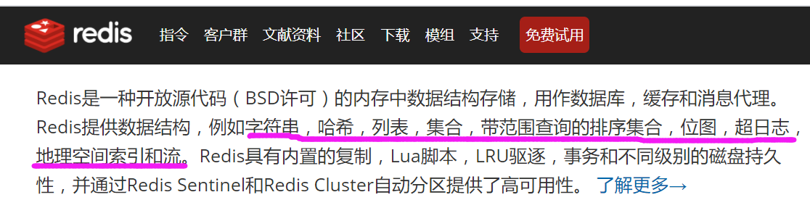

### 1.13. Redis的持久化 

```properties
RDB（快照）
AOF（记录追加写指令）
```

### 1.14. Java操作的方式 

```properties
jedis 
springdataRedis  
```

## 2. Linux中搭建Redis 

* **第一步：安装依赖**

  ```properties
   yum install gcc-c++
  ```

* **第二步：创建文件夹**

  ```properties
  mkdir /opt/redis -p 
  ```

* **第三步：进入创建的文件夹**

  ```properties
  cd  /opt/reids
  ```

* **第四步: 上传压缩包**

  ```properties
  rz指令上传压缩包
  ```

* **第五步：解压**

  ```properties
  tar -zxvf redis-3.2.9.tar.gz 
  ```

* **第六步：进入解压目录**

  ```properties
  cd redis-3.2.9
  ```

* **第七步：编译**

  ```properties
  make
  ```

* **第八步：安装**

  ```properties
  make install 
  ```

* **第九步：进入src目录**

  ```properties
  cd src 
  ```

* **第十步：前台启动**

  ```properties
  redis 分为前台启动 和后台启动 

  前台启动： 
  	命令： 	./redis-server
  	问题： 启动后 窗口无法操作 
  ```

  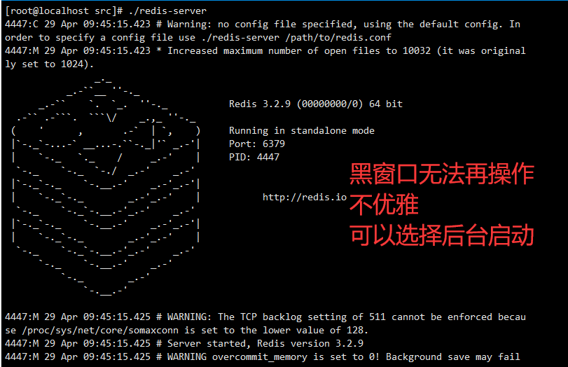

* **第十一步： 可以后台启动**

  ```properties
  1： 修改配置文件 
  	修改redis.config (配置文件在解压目录)
  	修改配置文件中的 daemonize
  	修改成 
  		daemonize yes  （默认是no 改成yes） 保存退出 

  2： 指定配置文件启动 
     		进入 src目录
  		./redis-server ../redis.conf
  ```

* **第十二步： 查看是否启动成功**

  ```properties
  ps -ef | grep redis 
  ```

  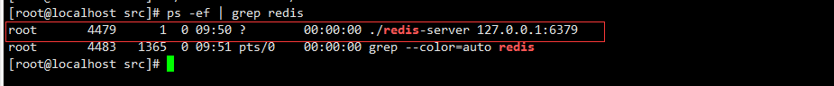

* **第十三步： 本地连接**

  ```properties
  ./redis-cli
  ```

* **第十四步： 退出**

  ```properties
  exit 或者quit 
  ```

## 3. 远程连接

### 3.1. 开放端口

```properties
firewall-cmd --zone=public --add-port=6379/tcp --permanent
## 开放端口之后 需要重新启动防火墙
systemctl restart firewalld.service    # 重启防火墙 

###################################################################
除了开放端口关闭防火墙也可以 
```

### 3.2. 关闭绑定IP 

```properties
修改redis.config配置文件   把bind 127.0.0.1 注释掉
```

### 3.3. 关闭受保护模式或者设置密码

```properties
方案一： 关闭受保护模式
 修改配置文件  protected-mode no  (默认是yes  变成no)
 
方案二： 设置密码
  修改配置文件 requirepass 新密码的值
```

### 3.4. 重启redis  

```properties
先关闭  
	kill -9  进程号  
	
重启 
	进入 src目录
	./redis-server ../redis.conf
```

### 3.5. 远程连接

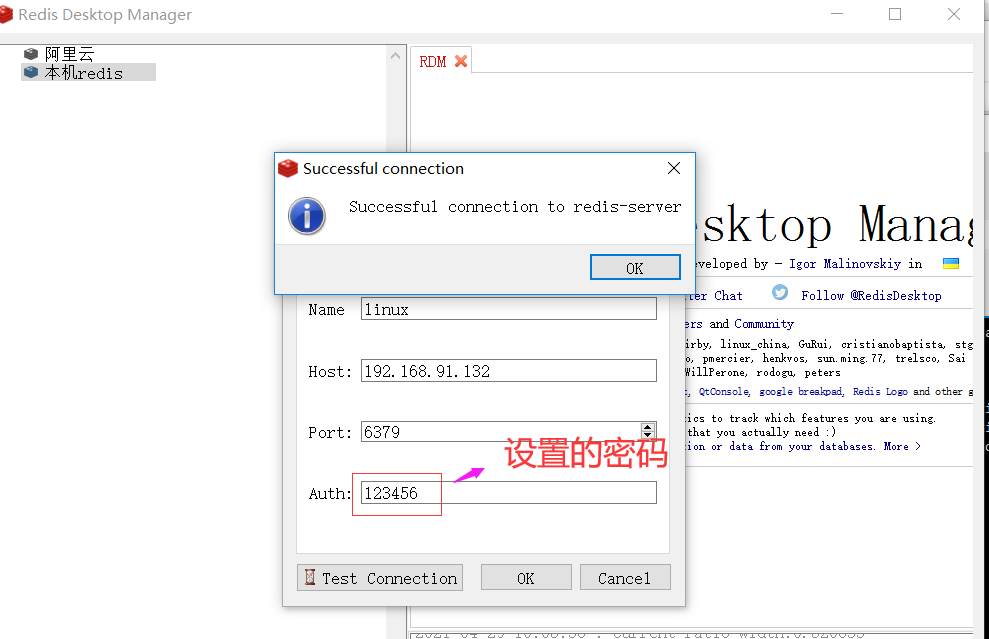


### 3.6. 设置密码你需要知道的 

```properties
配置文件中  设置密码的地方有如下2处  

第一个： masterauth  
		主要是针对master对应的slave节点设置的，在slave节点数据同步的时候用到 主要是用于主从复制 验证从		库 当从库要连接主库主从复制时 需要的密码

第二个： requirepass
	设置的密码是 对登录权限做限制，redis每个节点的requirepass可以是独立、不同的。 验证的是客户端登录要	  填写的密码  
```

## 4. 单机的问题

### 4.1. 搭建boot工程 

#### 4.1.1. 新建工程

略

#### 4.1.2. 引入依赖

```xml
 <dependencies>
        <dependency>
            <groupId>org.springframework.boot</groupId>
            <artifactId>spring-boot-starter-web</artifactId>
            <version>2.3.5.RELEASE</version>
        </dependency>
        <dependency>
            <groupId>org.springframework.boot</groupId>
            <artifactId>spring-boot-starter-data-redis</artifactId>
            <version>2.3.5.RELEASE</version>
        </dependency>
        <!-- https://mvnrepository.com/artifact/org.apache.commons/commons-pool2 -->
        <dependency>
            <groupId>org.apache.commons</groupId>
            <artifactId>commons-pool2</artifactId>
            <version>2.8.0</version>
        </dependency>
    </dependencies>
```

#### 4.1.3. 编写配置 

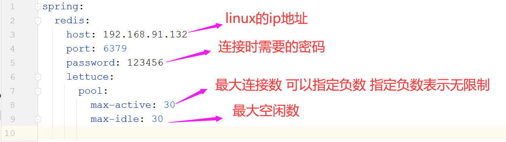

```properties
注意：  
 引入的redis的版本  这个版本操作redis使用的不是Jedis  而是lettuce    
区别： 
	lettuce : 基于Netty  是一个可伸缩线程安全的Redis客户端 多线程可以共享同一个Redis链接 线程安全 会				 稍微浪费掉一点性能
	
	Jedis:  是一个多线程非安全的客户端 性能比Lettuce略高   看情况 作为缓存来讲 可以使用jedis 缓存本身			  就是为了性能 
 
```

#### 4.1.4. 编写controller

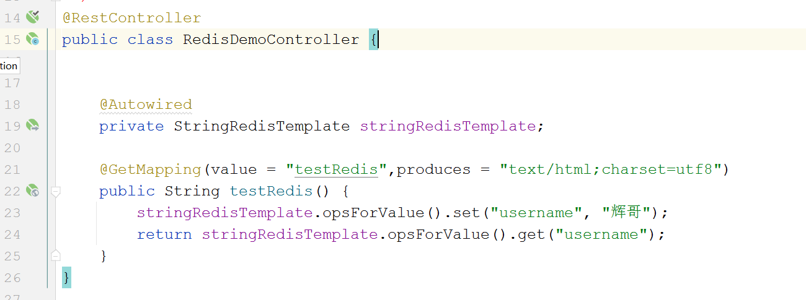

#### 4.1.5. 测试

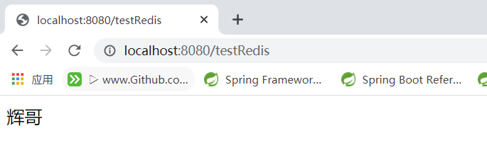

### 4.2. Redis单机问题说明

```properties
情况一： 当redis服务器宕机  
	问题： 
		1： 宕机后，程序进入阻塞一致尝试连接状态，最终报错 
         2： 因为数据在内存中 导致数据丢失  
         
情况二： 高并发的情况  
	问题： 
		1： 数据在内存中 内存资源有限 
		2： 单Redis 这个redis 不仅要负责写数据 还要负责读数据 面对高并发的情况下 
```

## 5. 主从复制

### 5.1. 什么是主从复制

```properties
表示：部署多个台Redis服务器，多台Redis服务器可以不在同一台机器上，将一台Redis服务器中的数据，复制到其他多台服务器身上，其中被复制的服务器是主节点，复制的服务器是从节点
注意：复制时单项的  是从主节点复制到从节点  一个主节点可以有多个从节点，一个从节点后面也可以有很多从节点 整体是一个树型
```

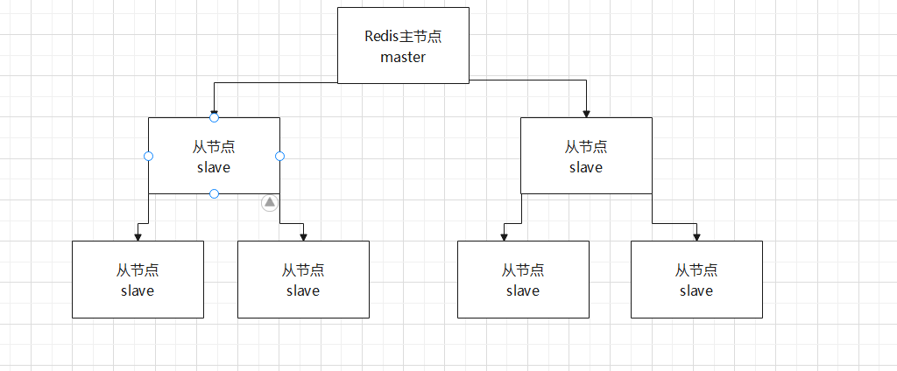

### 5.2. 主从复制的好处

```properties
1： 数据备份： 主节点中的数据 都会被复制到从节点中 ，就算主节点数据丢失了  从节点也会有备份的数据  

2： 故障恢复： 当主节点挂了之后 因为从节点有所有备份的数据 可以使用从节点对外提供服务 对于客户端来讲
			 无感知 
			 
3： 读写分离： 单机的时候 主节点又负责写 又负责读，此时我们有主节点又从节点 我们主节点可以只负责写 
			 从节点只负责读，此时在一些写少读多的系统  我们多个从节点进行负载均衡 大大提升系统的并发量
```

### 5.3. 主从复制搭建 

```properties
注意： 在同一台机器上演示

配置一主三从
```

#### 5.3.1. 复制三份配置文件

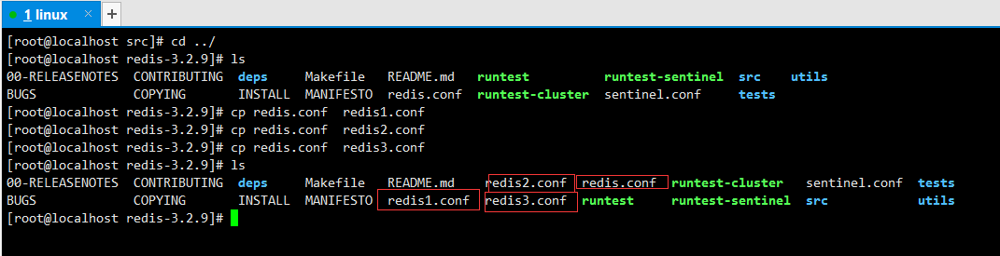

#### 5.3.2. 修改这3个配置文件

```properties
三个配置文件都要修改  
 修改一： 修改启动的端口 （端口不能一致）  
 修改二： 指定主节点的ip 端口 
 修改三： 指定主节点的密码
```

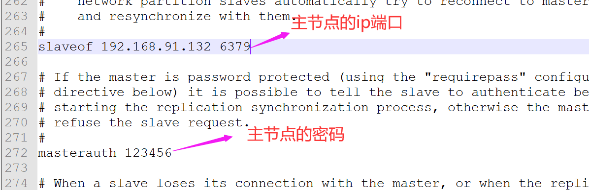

#### 5.3.3. 启动主节点 

```properties
./redis-server  ../redis.conf 
```

#### 5.3.4. 启动三个从节点

```properties
./redis-server  ../redis1.conf
./redis-server  ../redis2.conf
./redis-server  ../redis3.conf
```

#### 5.3.5. 查看启动情况

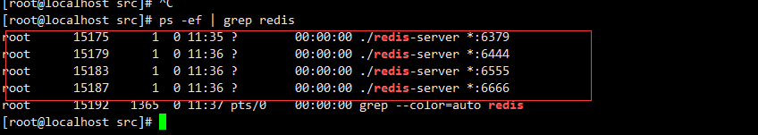

#### 5.3.6. 查看主节点 

```properties
 登录 
   ./redis-cli    或者（./redis-cli -a 123456）登录直接指定密码
 验证密码
   auth 123456
 查看信息
   info replication 
```

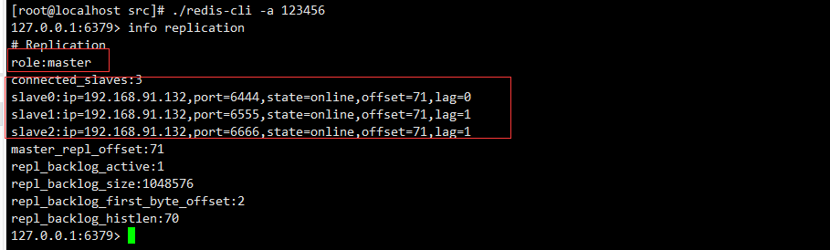

#### 5.3.7. 查看从节点

```properties
登录从节点 
验证密码 
	./redis-cli -h 192.168.91.132 -p 6444 -a 123456
查看信息
	info replication 
```

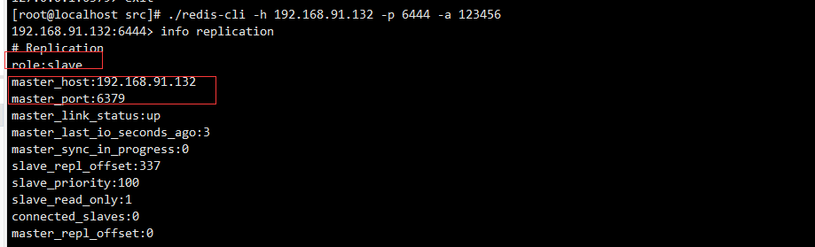

#### 5.3.8. 开放端口

```properties
## 开放端口 或者关闭防火墙
firewall-cmd --zone=public --add-port=6444/tcp --permanent
firewall-cmd --zone=public --add-port=6555/tcp --permanent
firewall-cmd --zone=public --add-port=6666/tcp --permanent
## 开放端口之后 需要重新启动防火墙
systemctl restart firewalld.service    
```

#### 5.3.9. 远程连接

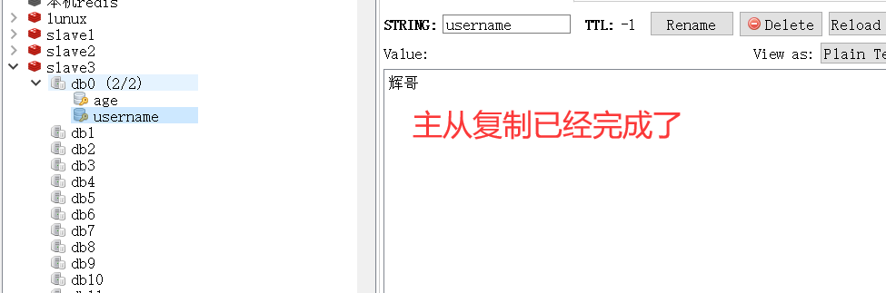

### 5.4. 主从复制原理（流程）

```properties
主从复制的流程分为3个阶段  
第一阶段：准备阶段 （连接阶段） 
第二阶段：同步阶段
第三阶段：命令传播阶段
```

#### 5.4.1. 准备阶段

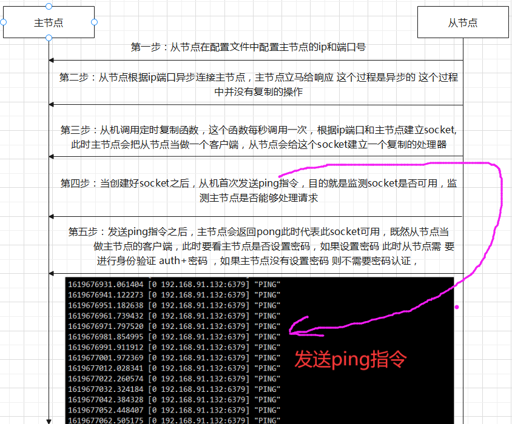

* **注意点**

  ```properties
  注意点一： 发送ping指令 如果不返回pong时
  		 当发送ping指令是 可能会出现另外2种结果  
  		  第一种超时 
  		  第二种其他结果
  		  不管是哪中结果 此时socket不可用 则会断开 并且重连
  	
  注意点二： 输入密码不正确时 
  		 密码如果输入不正确  此socket会断开 并且尝试重连
  ```

#### 5.4.2. 复制阶段

```properties
复制阶段分类
	全量复制： 全量复制 表示主从初次连接此时从节点把主机中的所有的内容全部复制过来 如果数据量大 这个			   过程是一个重型的过程 
	
	部分复制：当全量复制完成之后，再进行写的操作 此时从节点只需要复制新写的内容即可 并不需要重新再全部复制一遍 ，另外一个场景，当进行网络故障时 
```

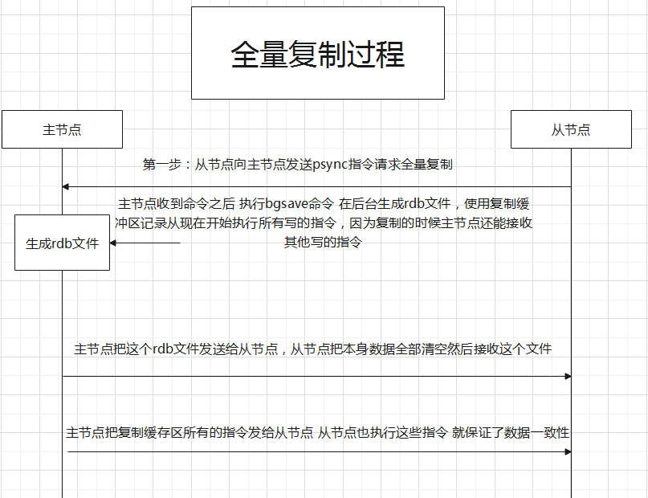

#### 5.4.3. 命令传递阶段

```properties
	数据同步阶段完成后，主从节点进入命令传播阶段；在这个阶段主节点将自己执行的写命令发送给从节点，从节点接收命令并执行，从而保证主从节点数据的一致性。

注意： 
	命令传播是异步的过程，即主节点发送写命令后并不会等待从节点的回复；此时网络延迟，主从节点之间的网络状况、主节点写命令的执行频率、都会影响数据的一致性，
```

### 5.5. 主从复制问题

```properties
主从复制无法保证高可用，当主节点宕机之后，从节点不会自动变成主节点对外提供服务 此时需要人工参与，如果由人工参与 则会增加人力成本 并且人工操作 容易产生错误 
```

## 6. Redis高可用

```properties
Redis高可用分为2种  
	第一种： 哨兵模式 
	第二种： 集群
```

### 6.1. 哨兵模式 

```properties
哨兵：顾名思义 放哨的  监控一些动态的  Redis中的哨兵模式是也是监控，不过哨兵是一个进程 运行在系统中，通过发送指令监控主从节点是否正常运作  当然除了监控之外 还可以主从自动切换等等功能，。
```

#### 6.1.1. 单哨兵模式介绍

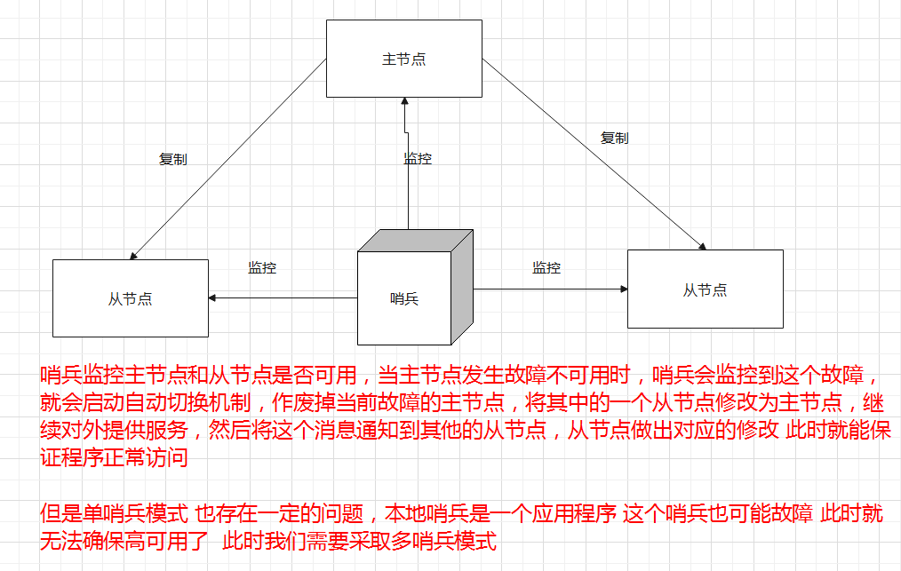

#### 6.1.2. 多哨兵模式

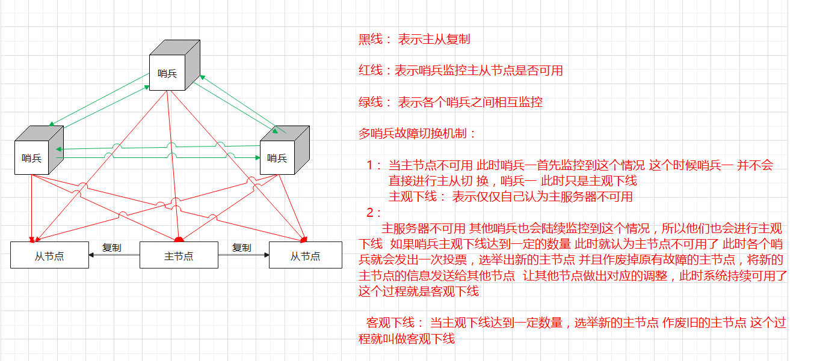

#### 6.1.3. 多哨兵模式搭建

* **修改 sentinel.conf**

  ```properties
  //这个文件在redis解压目录中  

  修改一： 添加守护进程模式
  	daemonize yes	
  修改二： 关闭保护模式
  	protected-mode no
  修改三：  修改主监控信息 
  	sentinel monitor mymaster 192.168.60.128 6379 2
  修改四： 添加主从节点密码 （注意：无法区分主从节点密码 所以主从节点密码必须一致）
  	sentinel auth-pass mymaster 123456
  ```

* **复制2份sentinel.conf**

  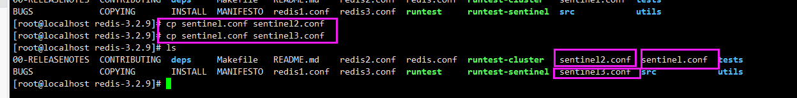

* **修改复制2份的端口**

  ```properties
  因为哨兵模式 是独立的进程 端口不能冲突  所以要占用不同端口 所以必须修改端口
  ```

* **开放端口或者关闭防火墙**

  ```properties
  firewall-cmd --zone=public --add-port=28888/tcp --permanent
  firewall-cmd --zone=public --add-port=29999/tcp --permanent
  firewall-cmd --zone=public --add-port=26379/tcp --permanent
  ## 开放端口之后 需要重新启动防火墙
  systemctl restart firewalld.service    # 重启防火墙 
  ```

* **启动哨兵**

  ```properties
  ./redis-sentinel  ../sentinel.conf 
  ./redis-sentinel  ../sentinel2.conf 
  ./redis-sentinel  ../sentinel3.conf 
  ```

  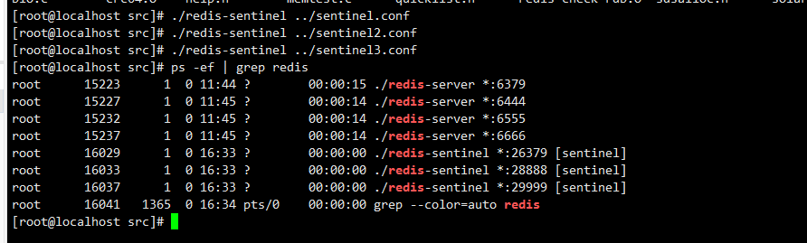

#### 6.1.4. 测试自动切换 

* **修改yml文件连接信息**

  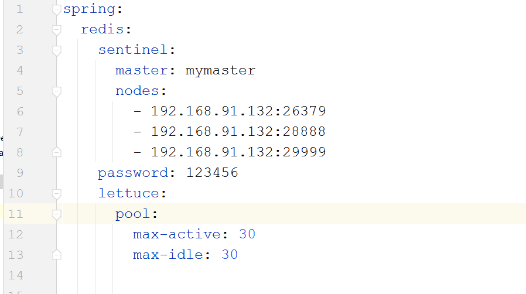

* **关闭主节点**

  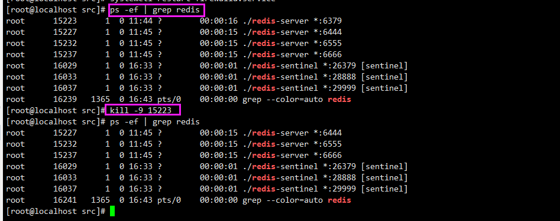

* **查看idea日志**

  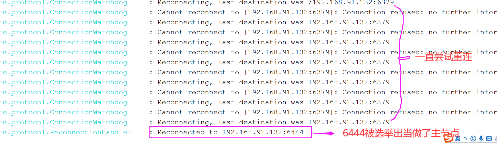

* **问题说明**

  ```properties
  当我们关闭掉主节点之后  我们会发现有一段时间一直重新连接宕机的主节点  ，因为修复选举是需要一定的时间间隔的 这个时间间隔中 并没有选举出新的主节点 所以还是会尝试连接宕机的主节点  这个时间间隔默认是30秒  可以修改sentinel.conf中的 
  sentinel down-after-milliseconds mymaster 30000 修改 
  ```

  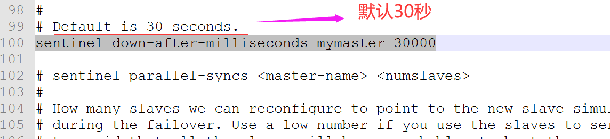

#### 6.1.5. 哨兵模式内部原理

```properties
哨兵模式内部是依赖三个定时任务 主观下线，客观下线的 和 sentinel Raft选举的
```

* **第一个定时任务**

  ```properties
  问题描述： 
  	因为我们并没有在哨兵配置文件中配置从节点的信息，哨兵会把从节点切换成主节点，那么哨兵如何知道从节	点的信息的？  这个就是依赖于我们的第一个定时任务  
  	
  定时任务： 每隔10秒，每个Sentinel节点会向主节点发送info命令 用于获取最新的主从结构以及从节点信息。
  ```

* **第二个定时任务**

  ```properties
  每隔2秒 每个sentinel都会向一个固定的频道（_sentinel_：hello）上发送自己对主节点的判断以及自身的信息 
  其他的sentinel节点都会订阅这个频道 了解其他的sentinel节点对主节点的判断
  ```

* **第三个定时任务**

  ```properties
  每隔一秒，每个sentinel都会向主从节点和其他sentinel节点发送心跳（ping命令） 用于彼此检测是否可用
  ```

* **主观下线**

  ```properties
  说过了
  ```

* **客观下线**

  ```properties
  说过了
  ```

* **raft算法选出Sentinel领导者 这个领导者进行把从变成主 然后废掉宕机的主**

  ```properties
  问题说明： 
  	当宕机的主节点 被客观下线之后， 从节点会变成主节点，那么是谁让从节点变成主节点的呢？ 此时有多个 	  sentinel 到底谁说了算 此时sentinel 会选举出一个领导者 Leader 
      
  选举流程 
  	当sentinel-A 对主节点主观下线之后  会向其他Sentinel节点发送sentinel is-master-down-by-addr	  	  命令，要求将自己设置为领导者
  	
  	每个节点在每个选举轮次中只有一次投票权，接收到这个指令之后 节点将会给Sentinel-A投票 同意这个	sentinel-A成为领导者 
  	
  	如果sentinel-A的票数最高 则sentinel-A 将会成为领导者  做故障转移
  ```

* **图解**

  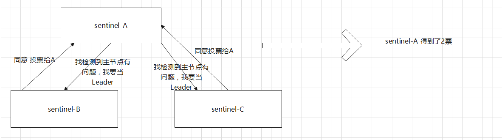

  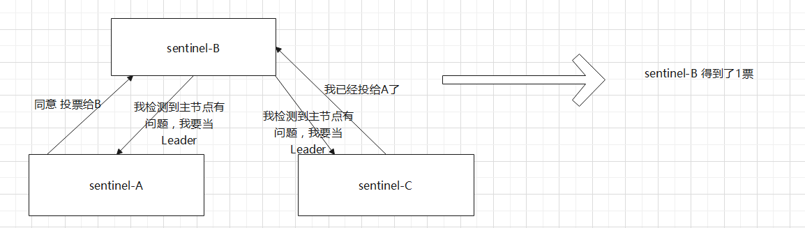

  


