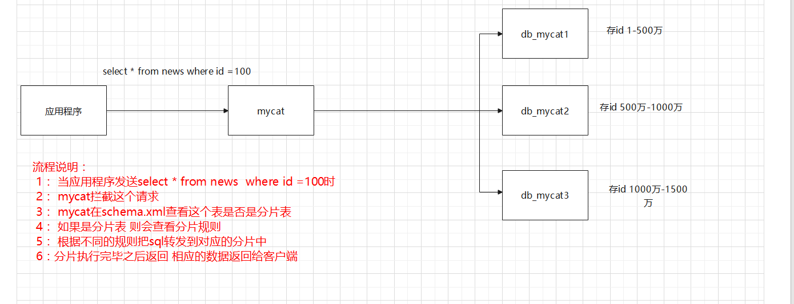
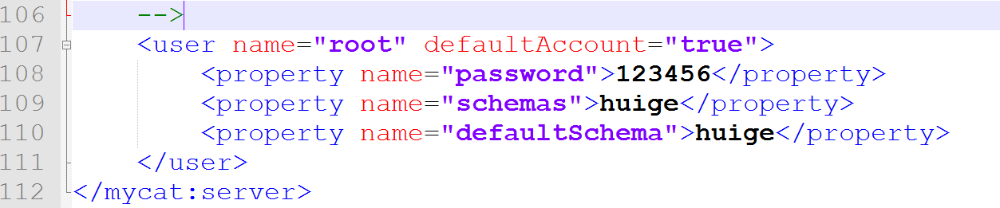

# 数据库中间件Mycat_辉哥

## 1. 面临的问题

### 1.1. 问题描述

```properties
随着计算机和信息技术的迅猛发展和普及，行业应用系统的规模迅速扩大，行业应用所产生的数据量呈爆炸式增长，动辄达到数百TB 甚至达到数百PB的规模，已经远远超出现有的传统计算技术和信息系统的处理能力，而集中式数据库面对大规模的数据处理逐渐表现出其局限性，因此人们希望寻找一种能够快速处理数据和及时响应用户的访问的方法，也希望对数据进行集中分析管理和维护。
```

### 1.2. 分布式数据库

```properties
分布式数据库是在集中式数据库的基础上发展起来的，是计算机技术和网络技术结合的产物，分布式数据库是指 数据在物理上分散存储，在逻辑上集中管理的数据库系统，
物理上分散是指： 数据分散存储在不同物理机上 甚至不是同一个服务器 甚至这些服务都不在同一个国家 
y： 各个数据库节点之间在逻辑上是一个整体，并由统一的数据库管理系统管理。
```

### 1.3. 分布式数据库的特点

```properties
透明性
	用户不需要关心数据的逻辑分区和物理位置分步的细节，也不用关心重复副本（冗余数据）一致性的问题，
	对于用户而言我们完全可以把一个分布式系统看成一个集中式系统来使用

数据冗余性
	分布式数据库会有个多个节点存储数据副本，这些副本数据一致，这样的话看似数据冗余了，但是当某一个节点的	  数据遭到破坏 冗余的副本可保证数据的完整性，当工作的节点发生故障，可以通过心跳机制进行切换 保证系统整	 体的可用性 不被破坏

易于拓展性
	在分布式数据库中能够方便的通过水平扩容提供系统的整体性能，也能通过垂直拓展来提高性能，扩展不需要		修改系统程序

自治性 
	分布式数据库各个节点上的数据都有本地的数据库管理系统管理，具有自治的处理能力。

```

## 2. Mycat相关概述 

### 2.1. Mycat是什么

```properties
一个彻底开源的，面向企业应用开发的大数据库集群，支持事务、ACID、可以理解为MySQL的加强版数据库
一个可以视为MySQL集群的企业级数据库，一个融合内存缓存技术、NoSQL技术、HDFS大数据的新型数据库
结合传统数据库和新型分布式数据仓库的新一代企业级数据库产品一个新颖的数据库中间件产品

总结： mycat就是一个分布式数据库的中间件
```

### 2.2. mycat能做什么 

#### 2.4.1. 数据分片

```properties
当数据库的数据过于庞大，尤其是写入的操作过于频繁，此时一台主机很难支撑，我们会面临拓展瓶颈，当我们将存放在同一个数据库中的数据分散存储到多个数据库主机上，进行多台机器存储可以提高性能，这个数据到底应该怎么样分散存储 有三种切分方式  垂直切分，水平切分，混合切分
```

- **垂直切分**

```properties
一个数据库有多个表构成，每个表针对不同的业务，垂直切分是指按照业务将表进行分类并且发布到不同的节点上
说白了 垂直切分 就是把一个库的表 分散存储不同的机器上
```


- **水平切分**

```properties
表示按照某种字段的某种规则将数据分散到不同的节点中 可以理解为把一张表的数据的记录分散存储  
比如： 这张表中有100条数据， 分三个机器存储 一个机器大约33条记录 但是这三台机器整体就是这100条数据
```

- **混合切分**

```properties
表示垂直切分和水平切分的结合
```


#### 2.4.2. 读写分离

```properties
简单的说 就是把对数据库的读和写的操作分开，读和写对应不同的数据库服务器，主数据集负责写的操作，从数据库提供读的操作，这样能有效的减轻单台服务器的压力，主数据库进行写的操作后，数据及时同步到读的数据库上，尽可能的保证写和读的服务器的数据一致  
```


#### 2.4.3. 多数据源整合


### 2.3. mycat的历史 

```properties
以前有一个项目叫做变形虫(Amoeba) 这个项目主要做客户端(应用层) 访问mysql时 在中间做SQL路由的功能
随后阿里巴巴在这个变形虫的基础上开发出了Cobar 2012年6月正式开源，吸引很多开发者，但是后来不更新了
并且在后期使用中 由于场景越来越多 bug越来越多，于是广大开源爱好者将Cobar改良 并且重命名Mycat 
改良后 性能有了巨大的提升，很多项目都开始使用Mycat 随着时间的推移 Mycat持续更新 功能更加强大 性能更加稳定 成为了可选择的高性能Mysql中间件 
```

### 2.4. Mycat的优势

```properties
1： 功能强大  性能优雅 
2： 支持多种数据库  
3： 强大的团队维护 
4： 免费开源 
5： 社区活跃 
6： 周边产品完善	
```

## 3. Mycat的下载安装

```properties
# 1.相关说明
   Mycat可以安装在window系统和Linux系统 但是一般都会安装在linux系统 因为这样更接近生产环境  

# 2.安装前提一：安装jdk 配置JAVA_HOME (可选)
	## 2.1. 查看JAVA_HOME 
	     echo $JAVA_HOMR
	## 2.2. 编辑配置文件 
		 vi /etc/profile
	## 2.3. 配置JAVA_HOME
		export JAVA_HOME=/usr/java/jdk-11.0.9
		export PATH=$JAVA_HOME/bin:$PATH
	## 2.4. 刷新配置 
		source  /etc/profile 
	## 2.5.查看JAVA_HOME
		echo $JAVA_HOMR
		
## 3. 安装前提二： 安装MySQL 
	   具体安装略

## 4. 下载mycat 
		https://github.com/MyCATApache/Mycat-Server/releases
## 5. 新建文件夹 
	   mkdir  /opt/mycat -p 
## 6. 切换到文件夹
		cd /opt/mycat  
## 7. 上传压缩包 
		使用rz命令 或者 xftp
## 8. 解压 
		tar -zxvf Mycat-server-1.6.7.4-release-20200105164103-linux.tar.gz 
## 9. 进入bin目录
		cd mycat/bin
## 10. 启动 
		./mycat start
		
## 11.关闭防火墙或者开启8066端口 
		systemctl stop firewalld.service #停止firewall 
		systemctl disable firewalld.service #禁止firewall开机启动
## 12. 其他操作 
		## 重启  ./mycat restart   
		## 停止  ./mycat stop
		## 查看mycat的运行状态  ./mycat status 
```

## 4. Mycat入门使用

### 4.1. 创建三个数据库 

```properties
在linux系统中的mysql中创建三个数据库 
	db_mycat1
	db_mycat2
	db_mycat3 
```


### 4.2. 分别创建表 

```mysql
## 三个数据库都创建相同的表
CREATE TABLE `news` (
  `id` int(11) NOT NULL,
  `content` text,
  `pic` varchar(255) DEFAULT NULL,
  `src` varchar(255) DEFAULT NULL,
  `time` varchar(255) DEFAULT NULL,
  `title` varchar(255) DEFAULT NULL,
  `type_id` int(11) DEFAULT NULL,
  `url` varchar(255) DEFAULT NULL,
  `weburl` varchar(255) DEFAULT NULL,
  PRIMARY KEY (`id`) USING BTREE
) ENGINE=InnoDB DEFAULT CHARSET=utf8
```

### 4.3. 修改server.xml 


### 4.4. 修改schema.xml

```xml-dtd
<?xml version="1.0"?>
<!DOCTYPE mycat:schema SYSTEM "schema.dtd">
<mycat:schema xmlns:mycat="http://io.mycat/">

	<schema name="huige" checkSQLschema="true" sqlMaxLimit="100" randomDataNode="dn1">
		<table name="news" dataNode="dn1,dn2,dn3" primaryKey="id" rule="auto-sharding-long"/>
	</schema>

	<dataNode name="dn1" dataHost="localhost1" database="db_mycat1" />
	<dataNode name="dn2" dataHost="localhost1" database="db_mycat2" />
	<dataNode name="dn3" dataHost="localhost1" database="db_mycat3" />

	<dataHost name="localhost1" maxCon="1000" minCon="10" balance="0"
			  writeType="0" dbType="mysql" dbDriver="native" switchType="1"  slaveThreshold="100">
		<heartbeat>select user()</heartbeat>
		<writeHost host="hostM1" url="192.168.119.129:3306" user="root"
				   password="rootroot">
		</writeHost>
	</dataHost>
	
</mycat:schema>
```

### 4.5. 重启mycat连接 


### 4.6. 测试

```properties
## 在mycat连接中执行如下语句 
    insert into news(id,title) values (1,"我是辉哥");
	insert into news(id,title) values (2,"我是辉哥2");
	insert into news(id,title) values (3,"我是辉哥3");
	
## 查看具体位置 继续测试 
	insert into news(id,title) values (5000001,"我是辉哥5000001");
	insert into news(id,title) values (10000001,"我是辉哥10000001");
	
## 结论 
	默认情况下： 如果id的取值1-500万 则会在第一个数据库中  500万以上 1000万以下将会第二个数据库中 
	1000万-1500万 会在第三个数据库  以此类推
```

## 5. Mycat的相关概念

### 5.1. 逻辑库（schema）

```properties
业务开发人员通常在实际用用中并不需要知道中间件的存在 只需要关注数据库，所以数据中间件可以被当作一个或者多个数据库集群构成的逻辑库
```

### 5.2. 逻辑表(table)

```properties
既然有逻辑库 就会有逻辑表，在分布式数据库中，对于应用来说读写数据的表就是逻辑表。逻辑表可以分步在一个或者多个分片库中 也可以不分片
```

- **分片表**

  ```properties
  分片表是将数据量很大的表切分到多个数据库实例中，所有分片组合起来构成一张完整的表 
  例如： 刚刚我们把news中的数据 放到三个数据库实例中 

  	<schema name="huige" checkSQLschema="true" sqlMaxLimit="100">
  		<table name="news" dataNode="dn1,dn2,dn3" rule="auto-sharding-long" />
  	</schema>
  ```

- **不分片表**

  ```properties
  并不是所有的表在数据量很大的时候都需要进行分片 某些表可以不用分片，不分片表是相对分片表而言的 
  其实就是不需要对数据进行切分  不需要切分 说白了 只需要存到其中一个数据库中即可 
  <table name="news" dataNode="dn1" />
  ```

- **ER表**

  ```properties
  关系型数据库是基于实体关系模型的 mycat的ER表便来源于此，基于此思想，Mycat提出基于E-R关系的数据分片策略，子表的记录与其所关联的父表的记录存在同一个数据库分片上，即子表依赖于父表 通过表分组保证数据关联查询不会跨库操作 
  ```

- **全局表**

  ```properties
  在一个真实的业务场景中 往往存在大量类似的字典表，这些字典表在数据变动不频繁 并且规模不大  很少有超过数十万条的记录 
  当业务表 因规模进行分片后 业务表和这些附属的字典表之间的关联查询就变成了一个棘手的问题，所以mycat通过数据冗余的方式来解决这类表的关联查询 即所有的分片都复制一份数据，这些复制的数据 造成的冗余表 就是全局表
  ```

### 5.3. 分片节点(dataNode) 

```properties
数据切分之后  一个大表被分到不同的分片数据库上，每个表分片所在的数据库就是分片节点

比如我们的案例中： 就有3个分片节点  
	<dataNode name="dn1" dataHost="localhost1" database="db_mycat1" />
	<dataNode name="dn2" dataHost="localhost1" database="db_mycat2" />
	<dataNode name="dn3" dataHost="localhost1" database="db_mycat3" />
```

### 5.4 . 分片主机(dataHost)

```properties
将数据切分之后，每个分片节点不一定在同一台机器上，同一台机器上可以有多个分片节点，这样一个或者多个分片节点所在的机器 就是节点主机

比如案例中 只有一个分片主机  这三个分片节点在同一台机器上
<writeHost host="hostM1" url="192.168.200.128:3306" user="root"
				   password="rootroot">
</writeHost>
```

## 6. Mycat的原理

```properties
mycat的原理 就是拦截接收到的SQL语句，然后对sql语句进行特定分析 比如 分库分析 路由分析 读写分离分析 缓存分析等 然后再把sql发送到真实的数据库中 然后处理 响应结果 最终返回给客户
```

**结合案例理解**



## 7. Mycat配置详解 

### 7.1. server.xml

```properties
这个文件中的配置 包含了mycat系统的配置信息 这个文件中 有个2个重要的标签 user标签和system标签    
```


### 7.2. schema.xml

```properties
这个配置文件时最重要的配置文件 这个配置文件涵盖了mycat的逻辑库 表 分片规则 分片节点以及数据源信息
```

#### 7.2.1. scheme标签


#### 7.2.2. table标签


#### 7.2.3. dataNode标签


#### 7.2.4. dataHost标签


#### 7.2.5. heartbeat标签


#### 7.2.6. writeHost和readHost标签


### 7.3. rule.xml

```properties
 这个文件中定义了所有拆分表的规则，在使用的过程中可以灵活使用不同的分片算法，或者对同一个分片算法使用不同的参数，让分配的过程可配置化 只需要简单的几步就可以让运维人员及数据库管理员轻松将数据拆分到不同的物理库中  里面提供了2个标签  
	Function 
	tableRule 
```

#### 7.3.1. function标签


#### 7.3.2. tableRule标签


## 8. 多主机拆分操作

```properties
刚刚的练习中我们把三个分片节点都放在了一台机器上 数据是分开了 但是操作还是同一个mysql数据库 
```

### 8.1. 多主机环境搭建 

#### 8.1.1. 删除mycat

```properties
停止mycat 删除mycat的解压包 
```

#### 8.1.2. 克隆二台机器


#### 8.1.3. 记录ip地址

```properties
linux1： 192.168.119.129
linux2： 192.168.119.130
linux3： 192.168.119.131
```

#### 8.1.4. navicat连接mysql


### 8.2. 多主机拆库

#### 8.2.1. 创建对应的数据库 


#### 8.2.2. 新建相应的表


#### 8.2.3. 解压mycat

```properties
# 执行命令
tar -zxvf Mycat-server-1.6.7.4-release-20200105164103-linux.tar.gz
```

#### 8.2.4. 修改server.xml


#### 8.2.5. 修改schema.xml

```xml-dtd
<?xml version="1.0"?>
<!DOCTYPE mycat:schema SYSTEM "schema.dtd">
<mycat:schema xmlns:mycat="http://io.mycat/">

	<schema name="crm" checkSQLschema="true" sqlMaxLimit="100" randomDataNode="dn1">
	
		<table name="base_admin,base_brand,base_category,base_dept,base_good" dataNode="dn1"  splitTableNames ="true"/>
		
		<table name="sys_admin_role,sys_menu,sys_role,sys_role_menu" dataNode="dn2"  splitTableNames ="true"/>
		
		<table name="log_login_log" dataNode="dn3" />
		
	</schema>

	<dataNode name="dn1" dataHost="localhost1" database="db_base" />
	<dataNode name="dn2" dataHost="localhost2" database="db_sys" />
	<dataNode name="dn3" dataHost="localhost3" database="db_log" />


	<dataHost name="localhost1" maxCon="1000" minCon="10" balance="0"
			  writeType="0" dbType="mysql" dbDriver="native" switchType="1"  slaveThreshold="100">
		<heartbeat>select user()</heartbeat>
		<writeHost host="hostM1" url="192.168.119.129:3306" user="root"
				   password="rootroot">
		</writeHost>	
	</dataHost>
		
	<dataHost name="localhost2" maxCon="1000" minCon="10" balance="0"
			  writeType="0" dbType="mysql" dbDriver="native" switchType="1"  slaveThreshold="100">
		<heartbeat>select user()</heartbeat>
		<writeHost host="hostM1" url="192.168.119.130:3306" user="root"
				   password="rootroot">
		</writeHost>	
	</dataHost>
	
	<dataHost name="localhost3" maxCon="1000" minCon="10" balance="0"
			  writeType="0" dbType="mysql" dbDriver="native" switchType="1"  slaveThreshold="100">
		<heartbeat>select user()</heartbeat>
		<writeHost host="hostM1" url="192.168.119.131:3306" user="root"
				   password="rootroot">
		</writeHost>	
	</dataHost>

</mycat:schema>
```

#### 8.2.6. 测试访问 

```properties
# 基本测试
select  *  from log_login_log
select  *  from base_good
select  *  from base_admin
insert into base_brand(brand_name) values('huige')

# 测试不添加分页查询时 自动分页100条
 select  *  from base_brand
```

### 8.3. 多主机拆表 

#### 8.3.1. 删除清空已有资源

```properties
## 1： 删除所有的数据库

## 2： 停止mycat

## 3:  删除mycat
```

#### 8.3.2. 新建数据库 


#### 8.3.3. 创建表

```sql
 -- 三个数据库都要执行 
CREATE TABLE `base_brand` (
  `id` bigint NOT NULL AUTO_INCREMENT COMMENT '品牌Id',
  `brand_name` varchar(255) DEFAULT NULL COMMENT '品牌名称',
  `brand_desc` varchar(255) DEFAULT NULL COMMENT '品牌描述',
  `brand_logo` mediumtext COMMENT '品牌LOGO',
  `brand_site` varchar(150) DEFAULT NULL COMMENT '品牌官网',
  `create_by` bigint DEFAULT NULL COMMENT '创建者',
  `create_time` datetime DEFAULT NULL COMMENT '创建时间',
  `update_by` bigint DEFAULT NULL COMMENT '修改者',
  `update_time` datetime DEFAULT NULL COMMENT '修改时间',
  PRIMARY KEY (`id`)
) ENGINE=InnoDB AUTO_INCREMENT=694 DEFAULT CHARSET=utf8mb4 COLLATE=utf8mb4_0900_ai_ci;
```

#### 8.3.4. 解压mycat

```properties
# 执行命令
tar -zxvf Mycat-server-1.6.7.4-release-20200105164103-linux.tar.gz
```

#### 8.3.5. 修改server.xml



#### 8.3.6. 修改schema.xml 

```xml-dtd
<?xml version="1.0"?>
<!DOCTYPE mycat:schema SYSTEM "schema.dtd">
<mycat:schema xmlns:mycat="http://io.mycat/">

	<schema name="huige" checkSQLschema="true" sqlMaxLimit="100" randomDataNode="dn1">
		
		<table name="base_brand" dataNode="dn1,dn2,dn3" rule="auto-sharding-long" splitTableNames ="true"/>
	</schema>
		<dataNode name="dn1" dataHost="localhost1" database="db_base1" />
		<dataNode name="dn2" dataHost="localhost2" database="db_base2" />
		<dataNode name="dn3" dataHost="localhost3" database="db_base3" />
	<dataHost name="localhost1" maxCon="1000" minCon="10" balance="0"
			  writeType="0" dbType="mysql" dbDriver="native" switchType="1"  slaveThreshold="100">
		<heartbeat>select user()</heartbeat>
		<!-- can have multi write hosts -->
		<writeHost host="hostM1" url="192.168.119.129:3306" user="root"
				   password="rootroot">
		</writeHost>
	</dataHost>
		<dataHost name="localhost2" maxCon="1000" minCon="10" balance="0"
			  writeType="0" dbType="mysql" dbDriver="native" switchType="1"  slaveThreshold="100">
		<heartbeat>select user()</heartbeat>
		<!-- can have multi write hosts -->
		<writeHost host="hostM1" url="192.168.119.130:3306" user="root"
				   password="rootroot">
		</writeHost>
	</dataHost>
	
		<dataHost name="localhost3" maxCon="1000" minCon="10" balance="0"
			  writeType="0" dbType="mysql" dbDriver="native" switchType="1"  slaveThreshold="100">
		<heartbeat>select user()</heartbeat>
		<!-- can have multi write hosts -->
		<writeHost host="hostM1" url="192.168.119.131:3306" user="root"
				   password="rootroot">
		</writeHost>
	</dataHost>

</mycat:schema>
```

#### 8.3.6. 启动mycat

```properties
## 命令 
  ./mycat start 
```

#### 8.3.7. 测试

```sql
select * from base_brand

-- 测试分片 
  insert into base_brand(id,brand_name) values (1,"杜蕾斯");
  insert into base_brand(id,brand_name) values (2,"岗本");
  insert into base_brand(id,brand_name) values (3,"倍力乐");
  insert into base_brand(id,brand_name) values (5000001,"多乐士");
  insert into base_brand(id,brand_name) values (10000001,"名流");
```

### 8.4. 拆表面临的问题（自增）

#### 8.4.1. 问题描述

```properties
刚刚水平拆分，添加数据的时候我们添加了Id  但是mysql中 base_brand这个id是数据库自增的 
但是我添加的时候 不指定id 则会报错  

在分库分表的情况下 数据库自增已经无法保证在集群中是全局唯一的主键了 
```


#### 8.4.2. 解决方式概述

``` properties
解决主键自增的方式有很多  
比如： 
	1： 不让主键自增 代码维护自增 插入数据时携带id  
	2： 本地文件的方式 
	3： 时间搓的方式 
	4： 其他方式 比如zookeeper的方式 
	5： 数据库的方式（推荐）
```

#### 8.4.3. 数据库的方式

##### 8.4.3.1. 执行sql 

```sql
-- 在三个数据主机中 任意一个数据主机中执行如下操作  

-- 1： 创建表 
DROP TABLE IF EXISTS MYCAT_SEQUENCE;
CREATE TABLE MYCAT_SEQUENCE (
NAME VARCHAR (50) NOT NULL,
current_value INT NOT NULL,
increment INT NOT NULL DEFAULT 100,
PRIMARY KEY (NAME)
) ENGINE = INNODB ;

-- 2： 添加数据 
	INSERT INTO MYCAT_SEQUENCE(NAME,current_value,increment) VALUES ('GLOBAL', 100000, 100);
	
-- 3： 创建第一个函数 
DROP FUNCTION IF EXISTS `mycat_seq_currval`;
DELIMITER ;;
CREATE FUNCTION `mycat_seq_currval`(seq_name VARCHAR(50)) 
RETURNS VARCHAR(64) CHARSET utf8
    DETERMINISTIC
BEGIN DECLARE retval VARCHAR(64);
        SET retval="-999999999,null";  
        SELECT CONCAT(CAST(current_value AS CHAR),",",CAST(increment AS CHAR) ) INTO retval 
          FROM MYCAT_SEQUENCE WHERE NAME = seq_name;  
        RETURN retval ; 
END
;;
DELIMITER ;

-- 4： 创建第二个函数 
DROP FUNCTION IF EXISTS `mycat_seq_nextval`;
DELIMITER ;;
CREATE FUNCTION `mycat_seq_nextval`(seq_name VARCHAR(50)) RETURNS VARCHAR(64)
 CHARSET utf8
    DETERMINISTIC
BEGIN UPDATE MYCAT_SEQUENCE  
                 SET current_value = current_value + increment 
                  WHERE NAME = seq_name;  
         RETURN mycat_seq_currval(seq_name);  
END
;;
DELIMITER ;

-- 5：创建第三个函数 
DROP FUNCTION IF EXISTS `mycat_seq_setval`;
DELIMITER ;;
CREATE FUNCTION `mycat_seq_setval`(seq_name VARCHAR(50), VALUE INTEGER) 
RETURNS VARCHAR(64) CHARSET utf8
    DETERMINISTIC
BEGIN UPDATE MYCAT_SEQUENCE  
                   SET current_value = VALUE  
                   WHERE NAME = seq_name;  
         RETURN mycat_seq_currval(seq_name);  
END
;;
DELIMITER ;

```

##### 8.4.3.2. 指定数据库的方式 


##### 8.4.3.3. 修改配置文件 

```properties
修改sequence_db_conf.properties文件  文件在mycat解压目录中的conf目录下
```


##### 8.4.3.4. 修改schema.xml


##### 8.4.3.5. 连接测试

```properties
 	insert into base_brand(id,brand_name)values(next value for MYCATSEQ_GLOBAL,'辉哥真球帅');
	insert into base_brand(id,brand_name)values(next value for MYCATSEQ_GLOBAL,'辉哥真球帅1');
	insert into base_brand(id,brand_name)values(next value for MYCATSEQ_GLOBAL,'辉哥真球帅2');
	insert into base_brand(id,brand_name)values(next value for MYCATSEQ_GLOBAL,'辉哥真球帅3');
	insert into base_brand(id,brand_name)values(next value for MYCATSEQ_GLOBAL,'辉哥真球帅4');
	
## 一些说明
	一些版本中 primaryKey 和 autoIncrement 可配置 也可以不配置
```

##### 8.4.3.6.  问题说明 

```properties
我们添加数据的时候 添加了next value for MYCATSEQ_GLOBAL  实际当中 我们想要插入数据是不携带Id的 
但是我们执行 insert into base_brand(brand_name)values('辉哥真球帅');是报错的 
因为如果不指定id的话 需要序列名称 和表名保持一致 
```

##### 8.4.3.7. 清空数据重新创建

```properties
## 1，清空表中数据 

## 2，删除序列表   

## 3，删除函数 

## 4,新建序列表 和 函数 
```


##### 8.4.3.8. 修改序列名称


#####  8.4.3.9. 测试 

```sql
insert into base_brand(brand_name)values('辉哥真球帅');
insert into base_brand(brand_name)values('辉哥真球帅2');
insert into base_brand(brand_name)values('辉哥真球帅3');
insert into base_brand(brand_name)values('辉哥真球帅4');
```

##### 8.4.3.10. 注意点说明

```properties
此时我们的sql中 没有了类似next value for MYCATSEQ_GLOBAL的词汇，所以执行的sql时标准的sql 
此时开启语法检测 此时可以开启语法检测 
```


## 9.Mycat的读写分离

### 9.1. 读写分离相关概述

```properties
读写分离简单的说 是把对数据库的读和写操作分开，以对应不同的数据库服务器 主数据库提供写的操作，从数据库提供读的操作 ，这样能有效的减轻单台数据库的压力 主数据库进行写的操作后数据应及时同步到从数据库 尽可能保证读和写的数据一致性 在很多系统中读取的操作远远大于写的操作，所以读的数据库可以有多台 通过负载均衡技术来分摊压力 让整个数据库系统更加的高效平稳的运行 

这过程需要依赖于mysql的主从复制 mysql的主流的主从复制有2种解决方案  分别是master-slave和galera cluster 


注意： 配置之前把没用的数据库都给删了
```


### 9.2. mysql主从复制搭建

```properties
把主mysql 和 从mysql中 自建的数据库都给删了 
```

|      Mycat      |  mysql-master   |   mysql-slave   |
| :-------------: | :-------------: | :-------------: |
| 192.168.119.132 | 192.168.119.133 | 192.168.119.131 |

#### 9.2.1. 搭建主机 

```properties
## 在192.168.119.133机器上操作  

## 1.修改配置
	vi /etc/my.cnf

## 2.添加服务id配置 在/etc/my.cnf里面加上
	server-id=1 (保证唯一)
	log-bin=/var/lib/mysql/mysql-bin  开启二进制日志文件 在/etc/my.cnf里面加上

## 3.删除auto.cnf（非必须）
	原因：我们的虚拟机是克隆的 mysql的uuid一致  所以把 auto.cnf 删除 然后重启mysql 从机
	位置： /var/lib/mysql/auto.cnf
	rm -rf  /var/lib/mysql/auto.cnf

## 4.重启mysql 
	service mysqld restart

## 5.进入mysql 
	mysql -uroot -prootroot 
	
## 6. 查看状态 
	show master status; 

## 7. 记录下状态中的File和Position
	+------------------+----------+--------------+------------------+-------------------+
| File             | Position | Binlog_Do_DB | Binlog_Ignore_DB | Executed_Gtid_Set |
+------------------+----------+--------------+------------------+-------------------+
| mysql-bin.000001 |      156 |              |                  |                   |
+------------------+----------+--------------+------------------+-------------------


--------------------------------可选配置----------------------------------------
#设置不需要复制的库（可选）
	binlog-ignore-db=mysql
#设置需要复制的库（可选）
	binlog-do-db= 需要复制的库名
```

#### 9.2.2. 搭建从机

```properties
## 在192.168.119.131机器上操作  

### 1.编辑配置文件
	vi /etc/my.cnf

## 2.添加service-id
	server-id=129 (保持唯一)

## 3. 删除auto.cnf
	原因：我们的虚拟机是克隆的 mysql的uuid一致  所以把 auto.cnf 删除 然后重启mysql 从机
	位置 /var/lib/mysql/auto.cnf
	rm -rf  /var/lib/mysql/auto.cnf
	
## 4. 重启mysql 
	service mysqld restart

## 5. 登录mysql 
mysql -uroot -prootroot

## 停止slave 
	stop slave;
	
## 配置主机信息
change master to master_host='192.168.198.130',
master_port=3306, master_user='root', 
master_password='rootroot', 
master_log_file='mysql-bin.000001',
master_log_pos=156;

## 启动slave
start slave;

## 查看从机状态
show slave status\G;
```


#### 9.2.3. 主从复制测试 

```properties
在主机上建库建表  从机会自动把库和表复制过来 
在主机上把建的库删了  从机也会自动把数据库删了
```

### 9.3. mycat读写分离搭建 

#### 9.3.1. 在主机上建库建表

```sql
CREATE TABLE `base_brand` (
  `id` bigint NOT NULL AUTO_INCREMENT COMMENT '品牌Id',
  `brand_name` varchar(255) DEFAULT NULL COMMENT '品牌名称',
  `brand_desc` varchar(255) DEFAULT NULL COMMENT '品牌描述',
  `brand_logo` mediumtext COMMENT '品牌LOGO',
  `brand_site` varchar(150) DEFAULT NULL COMMENT '品牌官网',
  `create_by` bigint DEFAULT NULL COMMENT '创建者',
  `create_time` datetime DEFAULT NULL COMMENT '创建时间',
  `update_by` bigint DEFAULT NULL COMMENT '修改者',
  `update_time` datetime DEFAULT NULL COMMENT '修改时间',
  PRIMARY KEY (`id`)
) ENGINE=InnoDB AUTO_INCREMENT=694 DEFAULT CHARSET=utf8mb4 COLLATE=utf8mb4_0900_ai_ci;
```

#### 9.3.2. 删除已有mycat

```properties
# 在192.168.119.132上操作

## 1： 停止mycat

## 2:  删除mycat

## 3： 重新解压mycat    
```

#### 9.3.3. 修改server.xml


#### 9.3.4. 修改schema.xml

```xml-dtd
<?xml version="1.0"?>
<!DOCTYPE mycat:schema SYSTEM "schema.dtd">
<mycat:schema xmlns:mycat="http://io.mycat/">

	<schema name="huige" checkSQLschema="true" sqlMaxLimit="100" randomDataNode="dn1">
		<table name="base_brand" dataNode="dn1" />
	</schema>
	
	<dataNode name="dn1" dataHost="localhost1" database="db_base" />
	
	<dataHost name="localhost1" maxCon="1000" minCon="10" balance="3"
			  writeType="0" dbType="mysql" dbDriver="native" switchType="1"  slaveThreshold="100">
		<heartbeat>select user()</heartbeat>
		<writeHost host="hostM1" url="192.168.119.133:3306" user="root"
				   password="rootroot">
		<readHost host="hostS1" url="192.168.119.131:3306" user="root" 
				password="rootroot" />
		</writeHost>
	</dataHost>
	
</mycat:schema>
```

#### 9.3.5. 启动测试

```properties
## 往主数据库插入2条数据 
  insert into base_brand(id,brand_name) values (1,"杜蕾斯");
  insert into base_brand(id,brand_name) values (2,"岗本");

## 往从数据库插入2条数据 
  insert into base_brand(id,brand_name) values (1000000,"倍力乐");
  insert into base_brand(id,brand_name) values (2000000,"多乐士");
  
## 从mycat连接中 插入数据  看看从机有没有 如果从机有 证明插入数据时在主机插入的   
 insert into base_brand(id,brand_name) values (3,"娃娃");
 
## 从mycat连接中 查询数据 分别测试 balance 取值 0 1 2 3 的情况
```

#### 9.3.6. 问题描述

```properties
## 把mysql主机停止 
	systemctl stop mysqld
## 此时查询报错  	
  原因： 
  	虽然说我们balance=3 查询全部都由从节点处理，但是由于Mycat的机制（mycat接受到sql之后 不管是		查询还是其他 都会先发送给主节点，主节点再根据读写分离配置 把sql转发给从节点）  此时虽然说只		是查询 依然需要依赖主节点    
  	
## 注意此时修改switchType="2"  添加show slave status 切换无效 因为想要切换成功 从节点必须是写节点
## writeHost  如果是readHost不行
```

#### 9.3.7. 简单主从切换 

```properties
## 1. 修改配置文件
	如下图 

## 2.关闭主机
	systemctl stop mysqld
	
## 3.稍等一下 从机切换成主机了 可以正常插入查询 
		select * from base_brand
```


### 9.4. mycat读写分离优化

```properties
注意： 这个读写分离优化 需要根据实际场景 比如写的多 可以多配置几个writeHost做负载均衡 如果读的场景多
则可以配置多个读的从节点  用于负载均衡  以双主双从为例 
```

#### 9.4.1. 搭建效果图 


#### 9.4.2. 搭建双主双从

[搭建参考](https://blog.csdn.net/xiaojin21cen/article/details/103913870)

##### 9.4.2.1. 清除已有资源

```properties
## 1： 删除所有的自建的数据库  

## 2： 停止mycat  

## 3： 删除mycat解压包 
```

##### 9.4.2.2. 准备4台机器


```properties
linux1: 192.168.119.132 
linux2: 192.168.119.133
linux3: 192.168.119.131 
linux4: 192.168.119.134
```

##### 9.4.2.3. 搭建说明 

| 软件角色 | 所在机器 |     机器IP      |
| :------: | :------: | :-------------: |
|  Mycat   |  linux1  | 192.168.119.132 |
| Master1  |  linux1  | 192.168.119.132 |
| Master2  |  linux2  | 192.168.119.133 |
|  Slave1  |  linux3  | 192.168.119.131 |
|  Slave2  |  linux4  | 192.168.119.134 |

##### 9.4.2.4. Master1配置 

```properties
## 在192.168.119.132机器上操作 

## 1.修改配置 
	vi /etc/my.cnf 
	
## 2.添加服务id配置 在/etc/my.cnf里面加上 
	server-id=1 (保证唯一) 
	log-bin=/var/lib/mysql/mysql-bin 开启二进制日志文件 在/etc/my.cnf里面加上 
	
## 3.删除auto.cnf（非必须）
    原因：我们的虚拟机是克隆的 mysql的uuid一致 所以把 auto.cnf 删除 然后重启mysql 
    位置： /var/lib/mysql/auto.cnf 
    rm -rf /var/lib/mysql/auto.cnf 
    
## 4.重启mysql 
  	service mysqld restart 
  	
## 5.进入mysql 
  	mysql -uroot -prootroot
  	
## 6. 查看状态 
   show master status; 
## 7. 记录下状态中的File和Position
+------------------+----------+--------------+------------------+-------------------+
| File             | Position | Binlog_Do_DB | Binlog_Ignore_DB | Executed_Gtid_Set |
+------------------+----------+--------------+------------------+-------------------+
| mysql-bin.000001 |      156 |              |                  |                   |
+------------------+----------+--------------+------------------+-------------------+


--------------------------------可选配置---------------------------------------- 
#设置不需要复制的库（可选）
binlog-ignore-db=mysql 
#设置需要复制的库（可选） 
binlog-do-db= 需要复制的库名
```

##### 9.4.2.5. Master2配置

```properties
## 在192.168.119.133机器上操作 

## 1.修改配置 
	vi /etc/my.cnf 
	
## 2.添加服务id配置 在/etc/my.cnf里面加上 
	server-id=2 (保证唯一) 
	log-bin=/var/lib/mysql/mysql-bin 开启二进制日志文件 在/etc/my.cnf里面加上 
	
## 3.删除auto.cnf（非必须）
    原因：我们的虚拟机是克隆的 mysql的uuid一致 所以把 auto.cnf 删除 然后重启mysql 
    位置： /var/lib/mysql/auto.cnf 
    rm -rf /var/lib/mysql/auto.cnf 
    
## 4.重启mysql 
  	service mysqld restart 
  	
## 5.进入mysql 
  	mysql -uroot -prootroot
  	
## 6. 查看状态 
   show master status; 
## 7. 记录下状态中的File和Position
+------------------+----------+--------------+------------------+-------------------+
| File             | Position | Binlog_Do_DB | Binlog_Ignore_DB | Executed_Gtid_Set |
+------------------+----------+--------------+------------------+-------------------+
| mysql-bin.000007 |      156 |              |                  |                   |
+------------------+----------+--------------+------------------+-------------------+

--------------------------------可选配置---------------------------------------- 
#设置不需要复制的库（可选）
binlog-ignore-db=mysql 
#设置需要复制的库（可选） 
binlog-do-db= 需要复制的库名
```

##### 9.4.2.6. Slave1配置 

```properties
## 在192.168.119.131机器上操作 
### 1.编辑配置文件 
	vi /etc/my.cnf 
	
## 2.添加service-id 
	server-id=131 (保持唯一)
	
## 3. 删除auto.cnf 
	原因：我们的虚拟机是克隆的 mysql的uuid一致 所以把 auto.cnf 删除 然后重启mysql
    位置： /var/lib/mysql/auto.cnf 
    rm -rf /var/lib/mysql/auto.cnf 
    
## 4. 重启mysql 
	service mysqld restart 
	
## 5. 登录mysql 
	mysql -uroot -prootroot 
	
## 6. 停止slave 
	stop slave; 
	
## 7. 配置master1做为主机 
	change master to master_host='192.168.52.140',
	master_port=3306, master_user='root', 
	master_password='rootroot', 
	master_log_file='mysql-bin.000001',
	master_log_pos=156;
	
## 8. 启动slave 
	start slave;
	
##9. 查看从机状态 
	show slave status\G;
```

##### 9.4.2.7. Slave2配置

```properties
## 在192.168.119.134机器上操作 
### 1.编辑配置文件 
	vi /etc/my.cnf 
	
## 2.添加service-id 
	server-id=132 (保持唯一)
	
## 3. 删除auto.cnf 
	原因：我们的虚拟机是克隆的 mysql的uuid一致 所以把 auto.cnf 删除 然后重启mysql
    位置： /var/lib/mysql/auto.cnf 
    rm -rf /var/lib/mysql/auto.cnf 
    
## 4. 重启mysql 
	service mysqld restart 
	
## 5. 登录mysql 
	mysql -uroot -prootroot 
	
## 6. 停止slave 
	stop slave; 
	
## 7. 配置master2做为主机 
	change master to master_host='192.168.52.137',
	master_port=3306, master_user='root', 
	master_password='rootroot', 
	master_log_file='mysql-bin.000006',
	master_log_pos=156;
	
## 8. 启动slave 
	start slave;
	
##9. 查看从机状态 
	show slave status\G;
```

##### 9.4.2.8. master相互复制 

```properties
## master1 192.168.119.132上操作    
	## 1. 进入mysql 
		mysql -uroot -prootroot  
	
    ## 2. 指定从master2上复制
    	change master to master_host='192.168.52.137',
		master_port=3306, master_user='root', 
		master_password='rootroot', 
		master_log_file='mysql-bin.000006',
		master_log_pos=156;
	
	## 启动slave  
		start slave; 
		
	## 查看状态 
		show slave status\G;
    
-------------------------------------------------------------------------------------

## master2 192.168.119.133 上操作 

	## 1. 进入mysql 
		mysql -uroot -prootroot  
	
    ## 2. 指定从master1上复制
    		change master to master_host='192.168.119.132',
			master_port=3306, master_user='root', 
			master_password='rootroot', 
			master_log_file='mysql-bin.000001',
			master_log_pos=156;
	
	## 启动slave  
		start slave; 
		
	## 查看状态 
		show slave status\G;
```

##### 9.4.2.9. 测试 

```properties
在其中的任意一个master 建库建表插入数据库  看看其他的master和slave是否有数据 
```

#### 9.4.3. 双主双从读写分离

##### 9.4.3.1. 在主机上建库建表

```sql
CREATE TABLE `base_brand` (
  `id` bigint NOT NULL AUTO_INCREMENT COMMENT '品牌Id',
  `brand_name` varchar(255) DEFAULT NULL COMMENT '品牌名称',
  `brand_desc` varchar(255) DEFAULT NULL COMMENT '品牌描述',
  `brand_logo` mediumtext COMMENT '品牌LOGO',
  `brand_site` varchar(150) DEFAULT NULL COMMENT '品牌官网',
  `create_by` bigint DEFAULT NULL COMMENT '创建者',
  `create_time` datetime DEFAULT NULL COMMENT '创建时间',
  `update_by` bigint DEFAULT NULL COMMENT '修改者',
  `update_time` datetime DEFAULT NULL COMMENT '修改时间',
  PRIMARY KEY (`id`)
) ENGINE=InnoDB AUTO_INCREMENT=694 DEFAULT CHARSET=utf8mb4 COLLATE=utf8mb4_0900_ai_ci;
```

##### 9.4.3.2. 删除已有mycat

```properties
## 1： 停止mycat

## 2:  删除mycat

## 3： 重新解压mycat    
```

##### 9.4.3.3. 修改server.xml


##### 9.4.3.4. 修改schema.xml

```xml-dtd
<?xml version="1.0"?>
<!DOCTYPE mycat:schema SYSTEM "schema.dtd">
<mycat:schema xmlns:mycat="http://io.mycat/">

	<schema name="huige" checkSQLschema="true" sqlMaxLimit="100" randomDataNode="dn1">
		<table name="base_brand" dataNode="dn1" />
	</schema>
	
	<dataNode name="dn1" dataHost="localhost1" database="db_base" />
	
	<dataHost name="localhost1" maxCon="1000" minCon="10" balance="1"
			  writeType="0" dbType="mysql" dbDriver="native" switchType="1"  slaveThreshold="100">
		<heartbeat>select user()</heartbeat>
		<writeHost host="hostM1" url="192.168.119.132:3306" user="root"
				   password="rootroot">
		<readHost host="hostS1" url="192.168.119.131:3306" user="root" 
				password="rootroot" />
		</writeHost>
		
		<writeHost host="hostM2" url="192.168.119.133:3306" user="root"
				   password="rootroot">
		<readHost host="hostS2" url="192.168.119.134:3306" user="root" 
				password="rootroot" />
		</writeHost>
	</dataHost>
	
</mycat:schema>
```

##### 9.4.3.5. 启动测试

```properties
## 往master1主数据库插入2条数据 (所有的节点都会有)
  insert into base_brand(id,brand_name) values (1,"杜蕾斯");
  insert into base_brand(id,brand_name) values (2,"岗本");

## 往slave1从数据库插入2条数据 
  insert into base_brand(id,brand_name) values (1000000,"倍力乐slave1");
  insert into base_brand(id,brand_name) values (2000000,"多乐士slave1");
## 往slave2从数据库插入2条数据 
  insert into base_brand(id,brand_name) values (3000000,"倍力乐slave2");
  insert into base_brand(id,brand_name) values (4000000,"多乐士slave2");
  
## 从mycat连接中 插入数据  看看从机有没有 如果从机有 证明插入数据时在主机插入的   
 insert into base_brand(id,brand_name) values (3,"娃娃");
 
## 从mycat连接中 查询数据 分别测试 balance 取值 0 1 2 3 的情况
```

##### 9.4.3.6. 说明

```properties
当master1挂掉之后 master2将会代替master1  再次启动master1 将会自动作为master2的备用节点 
```

## 10. 项目实战 

### 10.1. 环境搭建 

#### 10.1.1. 本地执行sql  

```sql
-- 新建数据库 
	create database ticket;
-- 使用数据库
	use ticket;

-- 创建车站表
CREATE TABLE `t_station` (
  `id` bigint NOT NULL AUTO_INCREMENT COMMENT '主键id',
  `name` varchar(255) CHARACTER SET utf8mb4 COLLATE utf8mb4_0900_ai_ci DEFAULT NULL COMMENT '站点名称',
  `city` varchar(255) CHARACTER SET utf8mb4 COLLATE utf8mb4_0900_ai_ci DEFAULT NULL COMMENT '所在城市',
  PRIMARY KEY (`id`) USING BTREE
) ENGINE=InnoDB AUTO_INCREMENT=2 DEFAULT CHARSET=utf8mb4 COLLATE=utf8mb4_0900_ai_ci;

-- 创建车次表 
CREATE TABLE `t_train` (
  `id` bigint NOT NULL AUTO_INCREMENT COMMENT '主键id',
  `name` varchar(255) DEFAULT NULL COMMENT '车次名称',
  `start_station_id` bigint DEFAULT NULL COMMENT '起始站点',
  `start_time` datetime DEFAULT NULL COMMENT '发车时间',
  `terminal_station_id` bigint DEFAULT NULL COMMENT '终点站id',
  `terminal_time` datetime DEFAULT NULL COMMENT '到达时间',
  PRIMARY KEY (`id`)
) ENGINE=InnoDB DEFAULT CHARSET=utf8mb4 COLLATE=utf8mb4_0900_ai_ci;

-- 创建用户表 
CREATE TABLE `t_user` (
  `id` bigint NOT NULL AUTO_INCREMENT COMMENT '唯一id值',
  `username` varchar(255) CHARACTER SET utf8mb4 COLLATE utf8mb4_0900_ai_ci DEFAULT NULL COMMENT '用户名',
  `password` varchar(255) CHARACTER SET utf8mb4 COLLATE utf8mb4_0900_ai_ci DEFAULT NULL COMMENT '密码',
  `sex` int DEFAULT NULL COMMENT '性别',
  `phone` varchar(255) CHARACTER SET utf8mb4 COLLATE utf8mb4_0900_ai_ci DEFAULT NULL COMMENT '手机号',
  PRIMARY KEY (`id`)
) ENGINE=InnoDB AUTO_INCREMENT=2 DEFAULT CHARSET=utf8mb4 COLLATE=utf8mb4_0900_ai_ci;

-- 创建订单表
CREATE TABLE `t_order` (
  `id` bigint NOT NULL AUTO_INCREMENT COMMENT '订单id',
  `user_id` bigint DEFAULT NULL COMMENT '用户id',
  `train_id` bigint DEFAULT NULL COMMENT '车次id',
  `start_station_id` bigint DEFAULT NULL COMMENT '车票起始站',
  `terminal_station_id` bigint DEFAULT NULL COMMENT '车票重点站',
  `price` double(10,2) DEFAULT NULL COMMENT '价格',
  `is_pay` bit(1) DEFAULT NULL COMMENT '是否支付',
  PRIMARY KEY (`id`) USING BTREE
) ENGINE=InnoDB DEFAULT CHARSET=utf8mb4 COLLATE=utf8mb4_0900_ai_ci;
```

#### 10.1.2.  导入案例 


#### 10.1.3. 本机测试

> 略

#### 10.1.4. 准备机器 

```properties
## 准备4台机器 
```

| 软件位置 | 连接名称 |     ip地址      |
| :------: | :------: | :-------------: |
|  Mycat   |  linux1  | 192.168.119.132 |
|  mysql   |  linux2  | 192.168.119.135 |
|  mysql   |  linux3  | 192.168.119.131 |
|  mysql   |  linux4  | 192.168.119.134 |

#### 10.1.5. 垂直拆分

```properties
## 1. 把t_train和t_station 拆分到 linux2中  
	在linux2中新建数据库 把表结构同步到linux2中  

## 2. 把t_order拆分到linux3中  
	在linux3中新建数据库 把表结构同步到linux3中  
	
## 3.把t_user拆分到linux4中
	在linux4中创建数据库 把表结构同步到linux4中
```


### 10.2. 垂直拆分配置 

```properties
## 重新解压一份mycat 
```

#### 10.2.1. 配置server.xml


#### 10.2.2. 配置schema.xml

```xml-dtd
<?xml version="1.0"?>
<!DOCTYPE mycat:schema SYSTEM "schema.dtd">
<mycat:schema xmlns:mycat="http://io.mycat/">

	<schema name="ticket" checkSQLschema="true" sqlMaxLimit="100" randomDataNode="dn1">
		<!-- 车次和站点-->
		<table name="t_train,t_station" dataNode="dn1" splitTableNames ="true"/>
		<!--订单-->
		<table name="t_order" dataNode="dn2"/>
		<!--用户-->
		<table name="t_user" dataNode="dn3"/>
	</schema>

	<dataNode name="dn1" dataHost="localhost1" database="ticket_sr" />
	<dataNode name="dn2" dataHost="localhost2" database="ticket_order" />
	<dataNode name="dn3" dataHost="localhost3" database="ticket_user" />

	<dataHost name="localhost1" maxCon="1000" minCon="10" balance="0"
			  writeType="0" dbType="mysql" dbDriver="native" switchType="1"  slaveThreshold="100">
		<heartbeat>select user()</heartbeat>
		<writeHost host="hostM1" url="192.168.119.135:3306" user="root"
				   password="rootroot">
		</writeHost>
	</dataHost>
	
	<dataHost name="localhost2" maxCon="1000" minCon="10" balance="0"
			  writeType="0" dbType="mysql" dbDriver="native" switchType="1"  slaveThreshold="100">
		<heartbeat>select user()</heartbeat>
		<writeHost host="hostM1" url="192.168.119.131:3306" user="root"
				   password="rootroot">
		</writeHost>
	</dataHost>
	
	<dataHost name="localhost3" maxCon="1000" minCon="10" balance="0"
			  writeType="0" dbType="mysql" dbDriver="native" switchType="1"  slaveThreshold="100">
		<heartbeat>select user()</heartbeat>
		
		<writeHost host="hostM1" url="192.168.119.134:3306" user="root"
				   password="rootroot">
		</writeHost>
	</dataHost>
	
</mycat:schema>
```

#### 10.2.3. 启动测试 

```properties
## 启动mycat  

## 测试查询  

## 测试添加主键自增情况 
```

### 10.3. 订单用户水平拆分

#### 10.3.1. 环境准备 

```properties
## 1, 在linux4中水平拆分linux3中的t_order表  
		在linux4中 新建数据库 
## 2. 在linux3中水平拆分linux4的t_user表  
		在linux3中 新建数据库 	
## 3. 清空数据 同步表结构
```


#### 10.3.2. 修改schema.xml

```xml-dtd
<?xml version="1.0"?>
<!DOCTYPE mycat:schema SYSTEM "schema.dtd">
<mycat:schema xmlns:mycat="http://io.mycat/">

	<schema name="ticket" checkSQLschema="true" sqlMaxLimit="100" randomDataNode="dn1">
		<!-- 车次和站点-->
		<table name="t_train,t_station" dataNode="dn1" splitTableNames ="true"/>
		<!--订单-->
		<table name="t_order" dataNode="dn2,dn4" rule="mod-long"/>
		<!--用户-->
		<table name="t_user" dataNode="dn3,dn5" rule="mod-long"/>
	</schema>

	<dataNode name="dn1" dataHost="localhost1" database="ticket_sr" />
	<dataNode name="dn2" dataHost="localhost2" database="ticket_order" />
	<dataNode name="dn4" dataHost="localhost3" database="ticket_order2" />
	
	<dataNode name="dn3" dataHost="localhost3" database="ticket_user" />
	<dataNode name="dn5" dataHost="localhost2" database="ticket_user2" />
	
	<dataHost name="localhost1" maxCon="1000" minCon="10" balance="0"
			  writeType="0" dbType="mysql" dbDriver="native" switchType="1"  slaveThreshold="100">
		<heartbeat>select user()</heartbeat>
		<writeHost host="hostM1" url="192.168.119.135:3306" user="root"
				   password="rootroot">
		</writeHost>
	</dataHost>
	
	<dataHost name="localhost2" maxCon="1000" minCon="10" balance="0"
			  writeType="0" dbType="mysql" dbDriver="native" switchType="1"  slaveThreshold="100">
		<heartbeat>select user()</heartbeat>
		<writeHost host="hostM1" url="192.168.119.131:3306" user="root"
				   password="rootroot">
		</writeHost>
	</dataHost>
	
	<dataHost name="localhost3" maxCon="1000" minCon="10" balance="0"
			  writeType="0" dbType="mysql" dbDriver="native" switchType="1"  slaveThreshold="100">
		<heartbeat>select user()</heartbeat>
		
		<writeHost host="hostM1" url="192.168.119.134:3306" user="root"
				   password="rootroot">
		</writeHost>
	</dataHost>
	
</mycat:schema>
```

#### 10.3.3. 取模分配修改 


#### 10.3.4. navicat测试 

```sql
insert into t_user(id,username,password) values(1,"辉哥1","密码1");
insert into t_user(id,username,password) values(2,"辉哥2","密码2");
insert into t_user(id,username,password) values(3,"辉哥3","密码3");
insert into t_user(id,username,password) values(4,"辉哥4","密码4");
```

#### 10.3.5. 代码测试(自增问题) 

```properties
## 代码测试 查询成功 但是插入不成功  主要是因为主键自增 
```


#### 10.3.6. 解决主键自增 

##### 10.3.6.1. 执行sql 

```properties
## 1 在linux3 或者 linux4 上执行sql  
 参考主键自增sql 
 
 注意：添加序列数据时 name等于表的大写
```


##### 10.3.6.2. 修改配置文件 


##### 10.3.6.3. 修改schema.xml


##### 10.3.6.4. 清空数据测试 

```properties
注意在重启时 把数据清空
```


### 10.4. 车次表读写分离

```properties
一般情况下 我们买车票 一般都会先查询车票信息 然后选择合适的行程再下单  所以车票查询频率比较高，单机mysql承载力有限  此时我们主要做读写分离 来分散单机mysql的压力
```

#### 10.4.1. 删除数据 


#### 10.4.2. 环境准备 

```properties
搭建过程 参考上面的 
```

| 角色名称 | 主机名称 | ip端口          |
| -------- | -------- | --------------- |
| mycat    | linux1   | 192.168.119.132 |
| master1  | linux2   | 192.168.119.135 |
| master2  | linux1   | 192.168.119.132 |
| slave1   | linux3   | 192.168.119.131 |
| slave2   | linux4   | 192.168.119.134 |

#### 10.4.3. 建库同步表


#### 10.4.4. 修改schema.xml

```xml-dtd
<?xml version="1.0"?>
<!DOCTYPE mycat:schema SYSTEM "schema.dtd">
<mycat:schema xmlns:mycat="http://io.mycat/">

	<schema name="ticket" checkSQLschema="true" sqlMaxLimit="100" randomDataNode="dn1">
		<!-- 车次和站点-->
		<table name="t_train,t_station" dataNode="dn1" splitTableNames ="true"/>
		<!--订单-->
		<table name="t_order" dataNode="dn2,dn4" primaryKey="id" autoIncrement="true" rule="mod-long"/>
		<!--用户-->
		<table name="t_user" dataNode="dn3,dn5"  primaryKey="id" autoIncrement="true" rule="mod-long"/>
	</schema>

	<dataNode name="dn1" dataHost="localhost1" database="ticket_sr" />
	<dataNode name="dn2" dataHost="localhost2" database="ticket_order" />
	<dataNode name="dn4" dataHost="localhost3" database="ticket_order2" />
	
	<dataNode name="dn3" dataHost="localhost3" database="ticket_user" />
	<dataNode name="dn5" dataHost="localhost2" database="ticket_user2" />
	
	<dataHost name="localhost1" maxCon="1000" minCon="10" balance="1"
			  writeType="0" dbType="mysql" dbDriver="native" switchType="1"  slaveThreshold="100">
		<heartbeat>select user()</heartbeat>
		<writeHost host="hostM1" url="192.168.119.135:3306" user="root"
				   password="rootroot">
			<readHost host="hostS1" url="192.168.119.134:3306" user="root"
				   password="rootroot" />
		</writeHost>
		
		<writeHost host="hostM2" url="192.168.119.132:3306" user="root"
				   password="rootroot">
			<readHost host="hostS2" url="192.168.119.131:3306" user="root"
				   password="rootroot" />
		</writeHost>
	</dataHost>
	
	<dataHost name="localhost2" maxCon="1000" minCon="10" balance="0"
			  writeType="0" dbType="mysql" dbDriver="native" switchType="1"  slaveThreshold="100">
		<heartbeat>select user()</heartbeat>
		<writeHost host="hostM1" url="192.168.119.131:3306" user="root"
				   password="rootroot">
		</writeHost>
	</dataHost>
	
	<dataHost name="localhost3" maxCon="1000" minCon="10" balance="0"
			  writeType="0" dbType="mysql" dbDriver="native" switchType="1"  slaveThreshold="100">
		<heartbeat>select user()</heartbeat>
		
		<writeHost host="hostM1" url="192.168.119.134:3306" user="root"
				   password="rootroot">
		</writeHost>
	</dataHost>
	
</mycat:schema>
```

## 11. 项目实战面临的问题

### 11.1. 项目的搭建图解 


### 11.2. 问题说明

```properties
mycat此时作为java代码和数据库的中间代理层， 成为java代码访问数据层的入口，不管你的数据层配置的是多么的优雅 总之会面临如下几个问题  
 
 问题一： 大并发量  单机mycat是否能够承载住压力 
 问题二： 单机mycat挂了导致业务整体不可用  

解决的目的：  
		1： mycat负载均衡 
		2： mycat集群高可用
```

### 11.3. mycat高可用集群

#### 11.3.1. 优化一


#### 11.3.2. 优化二


#### 11.3.3. 环境准备 

| 软件名称 | 所在机器 |     ip地址      |
| :------: | :------: | :-------------: |
|  mycat1  |  linux1  | 192.168.119.132 |
|  mycat2  |  linux2  | 192.168.119.135 |
|  mycat3  |  linux3  | 192.168.119.131 |
| HAProxy1 |  linux3  | 192.168.119.131 |
| HAProxy2 |  linux4  | 192.168.119.134 |

#### 11.3.4. 搭建mycat2和3

```properties
和mycat1一模一样  直接复制粘贴配置 启动即可
注意 
 需要复制： sequence_db_conf.properties   因为做了主键自增 
 需要复制： server.xml
 需要复制： schema.xml
 需要复制： rule.xml 因为分片规则 默认节点 我们由3个变成了2个
```

#### 11.3.5. 安装HAProxy 

[下载地址](https://src.fedoraproject.org/repo/pkgs/haproxy/)

```properties
## linux3和linux4 都要安装 

## 准备工作-安装依赖
	yum -y install readline-devel gcc gcc-c++ systemd-devel pcre-devel openeel openssl-	devel popt-devel

## 1. 创建haproxy和haproxyinstall目录 
	  mkdir /opt/haproxy -p 
	  mkdir /opt/haproxyinstall -p
	  
## 2. 切换到haproxy
		cd haproxy
			
## 3.上传haproxy压缩包 
		haproxy-2.2.17.tar.gz

## 4.解压 
	tar -zxvf haproxy-2.2.17.tar.gz

## 5. 查看系统版本
		uname -r
		[root@localhost haproxy]# uname -r 
		3.10.0-1062.el7.x86_64 
	

## 6. 进入到解压目录 
	  cd haproxy-2.2.17
	 
## 7. 编译haproxy
	make TARGET=linux3100 PREFIX=/opt/haproxyinstall ARCH=x86_64
		
## 8. 安装haproxy 
 	make install PREFIX=/opt/haproxyinstall
	 
## 9. 在/opt/haproxyinstall目录下创建配置文件 
	 touch  haproxy.cfg 
		
## 10. 编辑配置文件 
global
	log 127.0.0.1 local0 
	maxconn 10000 
	chroot /opt/haproxyinstall
	pidfile /opt/haproxyinstall/haproxy.pid
	daemon

defaults
	log global
	mode tcp
	retries 3
	maxconn 10000
	timeout connect 50000ms
	timeout client 50000ms
	timeout server 50000ms
listen proxy_status
	bind 0.0.0.0:22222
		mode tcp
		balance roundrobin
		server mycat_1 192.168.119.132:8066 check inter 2000 rise 3 fall 3 
		server mycat_2 192.168.119.135:8066 check inter 2000 rise 3 fall 3 
		server mycat_3 192.168.119.131:8066 check inter 2000 rise 3 fall 3 
frontend admin_stats
	bind 0.0.0.0:7777
		mode http
		stats enable
		option httplog
		maxconn 100
		stats refresh 30s
		stats uri /web
		stats auth admin:123456
		stats admin if TRUE

## 15. 指定配置文件启动 
	./haproxy -f ../haproxy.cfg 
	
	
## 16. navicat连接测试
	
```


#### 11.3.6. 安装Keepalived

```properties
## linux3和linux4 都要安装 

## 1. 创建文件夹 
	mkdir /opt/keepalived -p 
	mkdir /opt/keepalivedinstall -p 
    
## 2. 进入keepalived
	cd keepalived
    
## 3. 上传压缩包 
	keepalived-2.1.5.tar.gz
	
## 4. 解压 
	tar -zxvf keepalived-2.1.5.tar.gz

## 5. 进入解压目录 
	cd keepalived-2.1.5
	
## 6. 指定安装位置 
	./configure --prefix=/opt/keepalivedinstall
	
## 7. 编译安装 
	make && make install
	
## 8. 复制配置文件 
	cp ./keepalived/etc/init.d/keepalived  /etc/init.d/
	cp ./keepalived/etc/sysconfig/keepalived /etc/sysconfig/
	mkdir /etc/keepalived
	cp /opt/keepalivedinstall/etc/keepalived/keepalived.conf /etc/keepalived/
	cp /opt/keepalivedinstall/sbin/keepalived /usr/sbin/
	
## 9. 修改配置文件
		vim /etc/keepalived/keepalived.conf
! Configuration File for keepalived

global_defs {
   notification_email {
     acassen@firewall.loc
     failover@firewall.loc
     sysadmin@firewall.loc
   }
   notification_email_from Alexandre.Cassen@firewall.loc
   smtp_server 127.0.0.1
   smtp_connect_timeout 30
   router_id LVS_DEVEL
   vrrp_skip_check_adv_addr
   vrrp_strict
   vrrp_garp_interval 0
   vrrp_gna_interval 0
}

vrrp_instance VI_1 {
	#主机配MASTER，备机配BACKU
    state MASTER
	#所在机器网卡
    interface ens33
    virtual_router_id 51
	#数值越大 优先级越高
    priority 100
    advert_int 1
    authentication {
        auth_type PASS
        auth_pass 1111
    }
	# 配置虚拟ip
    virtual_ipaddress {
        192.168.119.200
    }
	 track_script {
       chk_haproxy
    }
}

vrrp_script chk_haproxy {
    script "killall -0 haproxy"
    interval 2
}

# 虚拟ip配置
virtual_server 192.168.119.200 12345 {
    delay_loop 6
    lb_algo rr
    lb_kind NAT
    persistence_timeout 50
    protocol TCP

    real_server 192.168.119.131 22222 {
        weight 1
		TCP_CHECK {
			connect_timeout 3
			retry 3
			delay_before_retry 3
		}
    }
}


## 10. 启动keepalived
	systemctl start keepalived
	
	
----------------------------------------------------------------------------
备机安装步骤一致  
	配置文件 
global_defs {
   notification_email {
     acassen@firewall.loc
     failover@firewall.loc
     sysadmin@firewall.loc
   }
   notification_email_from Alexandre.Cassen@firewall.loc
   smtp_server 127.0.0.1
   smtp_connect_timeout 30
   router_id LVS_DEVEL
   vrrp_skip_check_adv_addr
   vrrp_strict
   vrrp_garp_interval 0
   vrrp_gna_interval 0
}

vrrp_instance VI_1 {
	#主机配MASTER，备机配BACKU
    state BACKUP
	#所在机器网卡
    interface ens33
    virtual_router_id 51
	#数值越大 优先级越高
    priority 50
    advert_int 1
    authentication {
        auth_type PASS
        auth_pass 1111
    }
	# 配置虚拟ip
    virtual_ipaddress {
        192.168.119.200
    }
	 track_script {
       chk_haproxy
    }
}

vrrp_script chk_haproxy {
    script "killall -0 haproxy"
    interval 2
}

# 虚拟ip配置
virtual_server 192.168.119.200 12345 {
    delay_loop 6
    lb_algo rr
    lb_kind NAT
    persistence_timeout 50
    protocol TCP

    real_server 192.168.119.134 22222 {
        weight 1
		TCP_CHECK {
			connect_timeout 3
			retry 3
			delay_before_retry 3
		}
    }
}	
```

#### 11.3.7. 代码测试 


## 12. 分片规则讨论 

### 12.1. 准备工作 

|  软件名称  | 所在机器 |     ip地址      |
| :--------: | :------: | :-------------: |
|   mycat    |  linux1  | 192.168.119.128 |
| mysql分片1 |  linux1  | 192.168.119.128 |
| mysql分片2 |  linux2  | 192.168.119.135 |
| mysql分片3 |  linux3  | 192.168.119.131 |

### 12.2. 范围约定分片

```properties
	<tableRule name="auto-sharding-long">
		<rule>
			<columns>id</columns>
			<algorithm>rang-long</algorithm>
		</rule>
	</tableRule>

	<function name="rang-long"
			  class="io.mycat.route.function.AutoPartitionByLong">
		<property name="mapFile">autopartition-long.txt</property>
	</function>

# range start-end ,data node index
# K=1000,M=10000.
	0-500M=0
	500M-1000M=1
	1000M-1500M=2
```

### 12.3.  枚举分片 

```properties
<tableRule name="sharding-by-intfile">
		<rule>
			<columns>sharding_id</columns>
			<algorithm>hash-int</algorithm>
		</rule>
	</tableRule>
	
<function name="hash-int"
			  class="io.mycat.route.function.PartitionByFileMap">
		<property name="mapFile">partition-hash-int.txt</property>
</function>

partition-hash-int.txt
10000=0
10010=1
```

