# SpringCloud技术栈_辉哥

## 1. 单体架构微服务架构浅谈

### 1.1. 面临的问题 

```properties
当我们使用ssm开发时 我们使用maven的聚合工程，做到了模块的划分，但是使用SpringBoot工程之后，我们会发现所有代码又写到了一起，在一个工程中，很显然工程很庞大,拆分的思想好像没有了
```


**总结：不管是ssm项目 还是之前编写的SpringBoot的项目 都属于单体架构**

### 1.2. 单体架构

```properties
传统项目： 应用程序前后端所有的功能模块的代码 打包成一个jar包 或者war包 然后运行在tomcat中对外提供服务 都叫做单体架构 

前后端分离项目：后台所有的功能打包成一个jar或者war  然后运行在tomcat等服务器中对外提供服务 叫做单体架构

单体架构是一种比较传统的软件架构形式 
```

**如图**


#### 1.2.1. 单体架构的特点

```properties
1：所有的功能代码最终都集成在一个工程项目中
2：所有的功能都打包成一个jar包或者war包 
3：每个jar包和war包都包含所有的功能，通过整个应用部署集群扩容提高性能 
```

####1.2.2. 单体架构的优点

```properties
1： 项目架构简单
2： 前期开发成本低，周期短 
3： 前期部署简单 
4： 前期维护简单
```

#### 1.2.3. 单体架构面临的问题

```properties
1： 用户量越来越多，网站的访问量越来越大，导致后台服务器的负载越来越高
2： 用户量大了需求多了，产品需求要满足不同的用户，会导致业务场景越来越复杂
3： 随着业务的增加，jar包或者war包的体积越来越大，甚至达到几百兆或者上G，部署很痛苦
```

####1.2.4. 单体架构的缺点

```properties
根据上述面临的问题： 能总结出以下缺点 
1： 随着业务需求的复杂性，开发效率变得很低 
	  所有的代码都在一个项目中，导致所有的程序员协作开发都在同一个项目中提交代码 此时合并代码时 会出现意   	   想不到的冲突 
2： 代码维护难：各个功能的代码都耦合在一起，对于新加入的员工不友好，学习难度大 

3： 部署不灵活： 随着业务的增加，项目变得庞大，随便修改一处 就必须重新构建整个项目 导致构建时间长 
4： 稳定性不高： 一个很小的问题就有可能导致整个应用不可用 
5： 拓展性不高： 无法满足高并发的情况下的快速扩容 
```

### 1.3. 微服务架构

#### 1.3.1. 微服务字面的意义

```properties
微： 表示细小，强调了尺寸，针对这个微有很多个定义，
     比如，服务应该微小到不超过100行代码
     比如，开发周期必须被限制在2周之内等等 
     
服务： 功能完成之后 向外提供服务接口     
```

#### 1.3.2. 微服务架构的定义

```properties
1：netflix架构师Adrian Cockcroft的定义为：微服务架构是面向服务的架构 它们是由松耦合和具有上下边界上下文的元素组成  

2：美国架构师 Chris Richardson的定义为：微服务架构就是把应用程序功能性的分解成一组服务的架构风格，每个服务都是一个麻雀虽小但是五脏俱全的应用程序

3： 辉哥的定义： 微服务架构是一种架构模式，是功能模块化的一种体现，把一个应用程序划分成一组小的服务，各个服务之间相互协调，相互配合，为用户提供最终价值，并且各个服务都能独立运行在进程中 各个微服务之间采用轻量级的通讯机制相互协作 一般是基于RestApi              
```

#### 1.3.3. 微服务架构雏形


#### 1.3.4.  微服务架构的优点

```properties
1： 每个服务都相对较小，并且容易维护 
2： 服务可以单独运行 可以拥有自己的数据库
3： 服务可以独立扩展 
4： 微服务架构可以实现团队自治  
5： 更容易实验和采纳新的技术 
6： 更好的容错性 
7： 对刚入职的员工比较友好
8： 是大型的复杂性应用程序可以持续交付和持续部署 
```

#### 1.3.5. 微服务架构的缺点

```properties
1： 服务的拆分和定义是一种挑战 
2： 分布式系统带来的各种复杂性 使开发,测试，部署变得更加的困难 运维人员的噩梦
3： 服务间的间的通讯成本增加
4： 数据一致性挑战难度增加 
5： 开发者需要思考到底什么样的应用 或者 应用到达哪个阶段使用微服务架构
6： 技术成本高团队挑战度增加 
```

### 1.4. 微服务拆分开发原则

#### 1.4.1. 微服务设计原则

#####1.4.1.1. AKF原则


```properties
X轴： 指的是水平扩容，单个应用程序多运行几次做成一个集群 然后使用负载均衡的方式
Z轴： Z轴是基于X轴的，是数据分区 由一个分区变成多个数据分区的过程 然后根据用户请求属性进行路由请求
	 举个例子： 每个应用程序负责一部分用户的数据，可以根据用户id把不同的用户的数据放到不同的实例中
	 根据请求的token 中的userId 来区分哪个用户  并且根据不同的用户分配到不同的服务器处理；
	 
Y轴： X轴和Z轴扩展有效的提升了应用的吞吐量和可用性，但是这2种方式都没有解决日益增长的开发问题和应用的复      杂性为了解决这个问题，我们需要采用Y轴拓展， Y轴扩展表示的是功能拆分，把一个项目(单体架构)拆分成          一组服务      
```

##### 1.4.1.2. 前后端分离原则

```properties
前段和后端 要做逻辑和物理上的分离，实现了前后端独立部署，各自更关注自身业务，前后端分离之后，把前段推送到cdn服务器更加容易 提升加速能力
```

#####1.4.1.3. 服务无状态原则

```properties
微服务尽量无状态化，优点项目可以任意横向扩容拓展
```

#####1.4.1.4. Rest通讯风格

```properties
无状态的RestFul通讯风格的http协议具备先天优势 扩展能力强 JSON报文序列化 轻量简单 具备语言无惯性 主流语言都提供成熟的RestApi风格框架 相对于一些RPC框架生态更加完善
```

#### 1.4.2. 微服务拆分原则

```properties
1： 颗粒度适中 
	 服务的拆分不应该过分的追求细颗粒度，要考虑适中性，拆分后代码应该是易读 易维护的，业务职责明确并且        单一 
	 
2： 先大后小 
	   在拆分大颗粒度模块时 一个模块拆分一个微服务，后续迭代优化时 可以根据需要把较大的服务进一步拆分成	   多个微服务
	   
3： 公共服务抽取原则 	
	 公共服务 一般时指数据库服务，缓存服务，消息服务，日志服务，查询服务等 这些服务抽取成功能服务，然        后向其他服务提供对外API接口
	  
4： 实体类封装原则 
	数据库对应的实体类  代码过程过渡类 还是封装查询类  以及第三方返回结果类是所有微服务都会使用的模块
	此时我们需要封装         
```

####1.4.3. 微服务开发原则

##### 1.4.3.1. 命名规则

```properties
微服务的命名采用三段式的明敏规则 中间使用-隔开  也就是 xxxx-yyyy-zzzz的格式  
这三段分别代表不同的意思  
    第一段（xxxx） 表示的组织名称(公司名)， 比如shangma
    第二段（yyyy）  表示项目名称  比如 crm  
    第三段（zzzz） 表示功能模块名  比如 auth 表示授权
  
整体下来
	  shangma-crm-auth：表示 尚马公司crm项目的授权模块  
	  
比如： baidu-tieba-login 表示 百度公司的贴吧项目登录功能段                    
```

#####1.4.3.2. 项目依赖规范

```properties
1： 最大的父工程 做版本管理  
2： 父工程中有其他的pom工程  即父工程中嵌套父工程，内层的父工程下的module中如果使用相同的内容  
	比如在springboot web starter  是每个模块都要用的 所以可以在内部的父工程中 直接引入 不需要在每个	 Module中再都引入一次   
```

#####1.4.3.3. 配置文件规范

```properties
微服务开发会配置多个环境版本 一般包括 开发（dev） 测试（test）  灰度（grey） 生产（prod）
通过指定spring.profiles.active=test指定要使用哪个配置文件
```

| 序号 | 配置文件名称         | 对应的环境 |
| ---- | -------------------- | ---------- |
| 1    | application-dev.yml  | 开发       |
| 2    | application-test.yml | 测试       |
| 3    | application-grey.yml | 灰度       |
| 4    | application-prod.yml | 生产       |

##2. 微服务落地技术SpringCloud

### 2.1. 什么是springcloud

```properties
SpringCloud是 Privotal(开发spring的团队)在2015年发布的一个项目 ，它提供了一些可以让开发者快速构建微服 务项目的工具，比如配置管理，服务发现，熔断，路由等等，可以在任何分布式环境下很好的工作，

但是注意：springCloud 并不是一个全新研发的框架，它只是把一些优秀的解决微服务架构中的优秀开源框架基于 SpringCloud的规范进行了整合，采用SpringBoot这个框架再次封装屏蔽掉了复杂的配置 让开发者快递上手，不需要 关注底层复杂的配置 只需要简单的配置就能开发微服务项目，所以SpringCloud是一套微服务架构的规范， 而它的实现有很多比如：springCloud netflix,SpringCloud Consoul SpringCloud Alibaba            
```

### 2.2. springCloud的版本说明

```properties
SpringCloud的版本，并不是像其他的Spring框架那样 x.x.x的命名格式 以前的版本名称采用了伦敦地铁站的名字根据字母表的 顺序结合 ，现在使用年份加月份定义 
```

### 2.3. 两大家族

```properties
netflix家族 
	netflix公司 是美国加利福尼亚州的一家公司  这家公司是做在线影片租赁的，这个公司为了搭建自己公司的网站开发一条分布式系统的组件，因为这套系统性能卓越，曾经连续5次被评为顾客最满意的网站，这个优秀的技术，被pivotal团队通过springboot的形式把netflix家族开发的分布式组件封装起来 命名 spring-cloud-netflix由于springBoot基于自动配置 所以让程序员使用起来非常简单
	
alibaba 家族
	 Spring Cloud Alibaba 是阿里巴巴集团下的开源组件和云产品产品在SpringCloud规范下实现的 2018年    10月31号 入驻SpringCloud官方孵化器，发布了预览版本，2019年8月1日发布第一个正式版本            SpringCloudAlibaba 和 SpringCloud netflix一样 提供了微服务的一站式解决方案  
```

### 2.4. 组件对照关系

```properties
netflix家族 和 alibaba家族 还是springCloud本身实现 有一些组件，而这些组件有些功能是一样的 此时我们
做一个组件之间的对照关系
```

| 作用           | netflix家族 | springcloud自己实现          | alibaba  |
| -------------- | ----------- | ---------------------------- | -------- |
| 服务注册与发现 | eureka      | consul                       | nacos    |
| 负载均衡       | ribbon      | openFeign和LoadBalancer      | 无       |
| 熔断降级       | hystrix     | Spring Cloud Circuit Breaker | sentinel |
| 服务网关       | zuul        | gateway                      | 无       |
| 全局配置       | 无          | springcloud-config           | nacos    |

### 2.5. netflix遗憾的事情


```properties
springcloudnetflix帮我们提供了很多快速开发微服务项目的组件 比如eureka zuul hystrix等，但是这些组件慢 慢的有的都停止了更新，进入维护模式，从长远的角度看的话，使用这些技术不是很合适，除非老项目之前没有停止更 新之前用了，现在项目没有重构的前提下 还在使用，但是新开发的一个项目 再使用 很显然不够优雅
```

### 2.6. 学习版本说明

```properties
在使用springboot  springCloud  以及springCloudalibaba时  这个版本对应很关键 有的版本不兼容 容易出现意想不到的问题 ， 此时我们需要寻觅一套兼容的版本来学习 
springBoot 2.3.5
springcloud SR9
springCloud alibaba 2.2.6 
```

## 3. 基础环境搭建 

### 3.1. 搭建父工程


### 3.2. 添加版本管理 


### 3.3. 创建实体工程 


### 3.4. 添加依赖


### 3.5. 新建实体类 


### 3.6. 创建提供者 


### 3.7. 添加依赖 


### 3.8. 编写主配置类 


### 3.9. 编写配置文件 


### 3.10. 编写控制器


### 3.11. 浏览器测试 


### 3.12. 创建消费者 


### 3.13. 添加依赖


### 3.14. 编写主配置类


### 3.15. 编写配置文件


### 3.16. 编写controller  


### 3.17. 远程调用测试 


### 3.18. 远程访问说明 


### 3.19. 面临的问题 

```properties
浏览器访问huige-cloud-consumer ,huige-cloud-consumer使用restApi访问huige-cloud-provider 此时url是 http://localhost8000/getHuige 

问题一： url写死了 当huige-cloud-provider的ip 端口修改后 我们需要修改huige-cloud-consumer的url 
问题二： 当huige-cloud-provider解决高并发高可用部署集群的时候 huige-cloud-consumer中的url将会无法写 

```

## 4. 注册中心相关  

### 4.1. 什么是注册中心 

```properties
注册中心是微服务架构中最基础最核心的组件之一，用于服务的注册和服务的发现，以及服务的动态感知，所以很多时候注册中心又叫服务注册与发现。

常见的注册中心 
	eureka 
	consul
	nacos
	zookeeper 
```

### 4.2.注册中心的基本思想 


### 4.3. 注册中心整体架构图


### 4.4. 注册中心之Eureka

#### 4.4.1. 什么是Eureka

```properties
Eureka是Netflix开发的服务发现框架，本身是一个基于REST的服务, 

Eureka包含两个组件：Eureka Server和Eureka Client。

Eureka Server提供服务注册服务，各个节点启动后，会在Eureka Server中进行注册，这样EurekaServer中的服务注册表中将会存储所有可用服务节点的信息，服务节点的信息可以在界面中直观的看到。

Eureka Client是一个java客户端，用于简化与Eureka Server的交互，客户端同时也就是一个内置的、使用轮询 (round‐robin)负载算法的负载均衡器。 在应用启动后，将会向Eureka Server发送心跳,默认周期为30秒，如果Eureka Server在多个心跳周期内没有接收到某个节点的心跳，Eureka Server将会从服务注册表中把这个服务节点移除(默认90秒)。

Eureka Server之间通过复制的方式完成数据的同步，Eureka还提供了客户端缓存机制，即使所有的Eureka Server都 挂掉，客户端依然可以利用缓存中的信息消费其他服务的API。

综上，Eureka通过心跳检查、客户端缓存等机制，确保了系统的高可用性、灵活性和可伸缩性。
```

#### 4.4.2. Eureka服务器搭建 

##### 4.4.2.1. 父工程版本管理

```xml
   <properties>
        <spring.cloud-version>Hoxton.SR9</spring.cloud-version>
    </properties>
    <dependencyManagement>
        <dependencies>
            <dependency>
                <groupId>org.springframework.cloud</groupId>
                <artifactId>spring-cloud-dependencies</artifactId>
                <version>${spring.cloud-version}</version>
                <type>pom</type>
                <scope>import</scope>
            </dependency>
        </dependencies>
    </dependencyManagement>
```

##### 4.4.2.2. 新建工程 


##### 4.4.2.3. 添加依赖 


##### 4.4.2.4. 创建主配置类 


##### 4.4.2.5. 编写配置文件


##### 4.4.2.6. 启动测试 


#### 4.4.3. 提供者注册

##### 4.4.3.1. 添加依赖 

```xml
        <dependency>
            <groupId>org.springframework.cloud</groupId>
            <artifactId>spring-cloud-starter-netflix-eureka-client</artifactId>
        </dependency>
```

##### 4.4.3.2. 修改配置 


##### 4.4.3.3. 重启测试 


#### 4.4.4. 消费者注册

##### 4.4.4.1. 添加依赖 

```xml
        <dependency>
            <groupId>org.springframework.cloud</groupId>
            <artifactId>spring-cloud-starter-netflix-eureka-client</artifactId>
        </dependency>
```

##### 4.4.4.2. 修改配置 


##### 4.4.4.3. 重启测试 


##### 4.4.4.4. 远程调用 

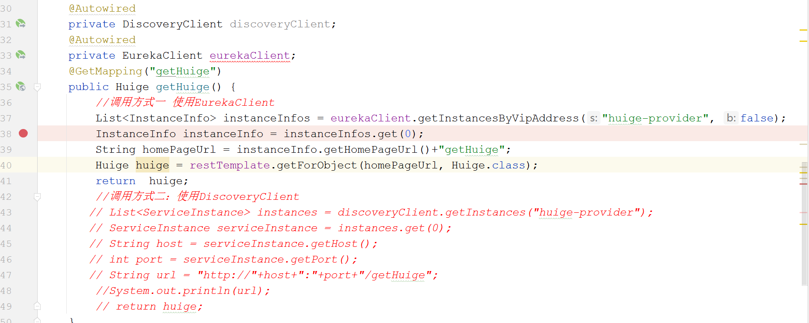

#### 4.4.5. 相关概念说明

- **微服务**

  ```properties
  是指完成某一业务功能的独立系统 一个微服务可以运行多个服务实例 判断是否是同一个微服务，使用的spring.application.name属性判断 
  ```

- **服务实例**

  ```properties
  服务实例表达的是 其中某一个微服务中的某一个服务节点  
  可以这样理解： 一个项目 占用不同的端口启动三次， 项目只有一个 但是项目的实例有三个
  ```

- **注册中心**

  ```properties
  服务注册中心即EurekaServer提供服务注册和发现功能
  ```

- **服务提供者**

  ```properties
  提供服务的应用 服务提供者要向EurekaServer注册服务;
  ```

- **服务消费者**

  ```properties
  消费应用从注册中心获取服务列表 从而得知服务的信息 远程请求
  ```

#### 4.4.6. Eureka集群搭建

```properties
eureka的集群和其他集群不太一样 eureka集群是对等模式 就是集群节点都是对等的 比如Redis rocketMQ集群是 master-slave模式
```

##### 4.4.6.1. 添加域名映射 

```properties
127.0.0.1 www.eureka8100.com
127.0.0.1 www.eureka8101.com
127.0.0.1 www.eureka8102.com
```

##### 4.4.6.2. 新建2个配置文件

- **application.yml**

  ```yaml
  server:
    port: 8100

  spring:
    application:
      name: huige-eureka

  eureka:
    client:
      service-url:
        defaultZone: http://www.eureka8100.com:8100/eureka,http://www.eureka8101.com:8101/eureka,http://www.eureka8102.com:8102/eureka
    instance:
      instance-id: ${spring.application.name}:${server.port}
      hostname: www.eureka8100.com

  ```

- **application-peer1.yml**

  ```yaml
  server:
    port: 8101

  spring:
    application:
      name: huige-eureka

  eureka:
    client:
      service-url:
        defaultZone: http://www.eureka8100.com:8100/eureka,http://www.eureka8101.com:8101/eureka,http://www.eureka8102.com:8102/eureka

    instance:
      instance-id: ${spring.application.name}:${server.port}
      hostname: www.eureka8101.com
  ```

- **application-peer2.yml**

  ```yaml
  server:
    port: 8102

  spring:
    application:
      name: huige-eureka

  eureka:
    client:
      service-url:
        defaultZone: http://www.eureka8100.com:8100/eureka,http://www.eureka8101.com:8101/eureka,http://www.eureka8102.com:8102/eureka

    instance:
      instance-id: ${spring.application.name}:${server.port}
      hostname: www.eureka8102.com
  ```

##### 4.4.6.3. 复制主配置类


##### 4.4.6.4. 启动测试 


##### 4.4.6.5. 提供者加入集群 


##### 4.4.6.6. 消费者加入集群 


##### 4.4.6.7. 启动测试

略

#### 4.4.7. 注册中心相关概念

- **相互复制**

  ```properties
  eurekaServer 本身就进行了相互注册，确保高可用，各个eurekaServer之间数据会相互复制（相互同步） 当服务注册 续约 下线之后eurekaServer 会将这些消息发送给其他注册中心 以完成数据的同步 

  测试相互复制很简单  
  	当我们提供者或者消费者设置defaultZone只设置其中的一个eurekaServer时 其他的eurekaServer也会有这个注册信息
  ```

- **失效剔除**

  ```properties
  	Eureka Server在启动完成后会创建一个定时器每隔60秒检查一次服务健康状况，如果其中一个服务节点超过90秒 未检查到心跳，那么Eureka Server会自动从服务实例列表内将该服务剔除。(剔除不剔除还受自我保护的影响) 由于非正常关闭不会执行主动下线动作，所以才会出现失效剔除机制，该机制主要是应对非正常关闭服务的情况， 如：内存溢出、杀死进程、服务器宕机等非正常流程关闭服务节点时。 

  可以通过eureka.server.eviction‐interval‐timer‐in‐ms参数对其进行修改，
  ```

- **自我保护**

  ```properties
  关闭提供者微服务 消费者再次访问   就会出现自我保护 
      
  	Eureka Server的自我保护机制会检查最近15分钟内所有Eureka Client正常心跳的占比，如果低于85%就会被触 发。 我们如果在Eureka Server的管理界面发现如下的红色内容，就说明已经触发了自我保护机制。 当触发自我保护机制后Eureka Server就会锁定服务列表，不让服务列表内的服务过期，不过这样我们在访问服 务时，得到的服务很有可能是已经失效的实例，如果是这样我们就会无法访问到期望的资源，会导致服务调用失 败，所以这时我们就需要有对应的容错机制、熔断机制（后面的知识）。
  	
      server:enable‐self‐preservation：false 关闭自我保护
  ```

#### 4.4.8. 其他概念 

- **注册**

  ```properties
    当服务在启动的时候 会检测配置属性中的eureka.client.register‐eureka是否等于true 默认就是true 如果等于true 服务将会携带自己的信息发送Rest风格请求，请求地址就是defaultZone指定的路径，完成注册功能
    
    但是注意：  
    	当服务启动的时候 并不会直接发送这个Rest请求去注册，而是延时40秒之后才去注册的，所以当我们启动后
    	直接刷新注册中心时  可能看不到任何注册信息，需要等待一会儿再去刷新 信息就会存在	
    	
   EurekaServer获得数据之后 存储到一个 Map集合中
  ```

- **续约**

  ```properties
  当我们服务注册成功之后，并不能保证我们的服务实例一直可用，因为该实例可能会出现网络故障，机器故障或者服务器宕机，所以此时服务会向注册中心定时发送心跳告诉注册中心我还活着 这个时间是30秒，每隔30秒发送一次心跳，如果注册中心90秒还没有收到来自服务的心跳，那么EurekaServer注册中心 将会把服务从服务列表中剔除

  注意： 是否剔除服务还和自我保护有关

  相关配置： 
  lease‐renewal‐interval‐in‐seconds: 30 //每隔30秒发送依次心跳 
  lease‐expiration‐duration‐in‐seconds: 90	
  ```

- **下线**

  ```properties
  在系统故障 需要手动停止或者重启某个服务时 在正常关闭的情况下 服务实例会向注册中心发送Rest请求，告知注册中心，此时客户端就不能请求这个实例了，但是非正常关闭的情况下 无法测试
  ```

### 4.5. 注册中心之Consul

#### 4.5.1. 面临的问题 

```properties
eureka学习了那么多，但是eureka已经停止维护了，springCloud在Greenwich将netflix的一些组件改成了维护模式  (维护模式意味着这些组件不会有太大的更新了 只会修改大的bug以及安全问题)，当然目前来看可以使用，但是从长远的角度考虑很显然不够优雅 

注意： 注意consoul不属于netflix家族的组件 而是另外一个对SpringCloud规范的一个实现
```

#### 4.5.2. Consul能做什么 

```properties
服务注册发现：
	Consul客户能够注册一个服务，比如api或mysql，其他客户可以在Consul上查询一个指定服务的提供者。Consul提供DNS和HTTP的服务发现接口。

健康检查：
	Consul可以灵活的使用脚本等来检测注册在其上的服务是否可用，不健康的服务Consul也能够灵活处理，比如提供服务的主机内存使用超过90%，我们可以配置让Consul不要把这样的服务提供给服务调用者。

key/value存储：
	这个功能和etcd有些类似，可以通过HTTP API方便地使用。

多数据中心支持：
	Consul支持开箱即用的多数据中心支持，这意味着用户不用建立额外的抽象层让业务扩展到各个区域。
```

#### 4.5.3. consul的下载 


#### 4.5.4. consul的启动 

```properties
 ## 启动命令
 consul agent -dev
 ## 关闭命令
 consul leave
```


#### 4.5.6. 提供者注册


#### 4.5.7. 消费者注册 


#### 4.5.8. 测试 


#### 4.5.9. 添加健康检查


#### 4.5.10. 远程访问测试


### 4.6. 注册中心之Nacos

#### 4.6.1. 什么是nacos

```properties
Nacos 致力于帮助您发现、配置和管理微服务。Nacos 提供了一组简单易用的特性集，帮助您快速实现动态服务发现、服务配置、服务元数据及流量管理。

Nacos 帮助您更敏捷和容易地构建、交付和管理微服务平台。 Nacos 是构建以“服务”为中心的现代应用架构 (例如微服务范式、云原生范式) 的服务基础设施。
```

#### 4.6.2. nacos能做什么

- **服务发现和服务健康监测**

  ```properties
  Nacos 支持基于 DNS 和基于 RPC 的服务发现。服务提供者使用 原生SDK、OpenAPI、或一个独立的Agent TODO注册 Service 后，服务消费者可以使用DNS TODO 或HTTP&API查找和发现服务。
  Nacos 提供对服务的实时的健康检查，阻止向不健康的主机或服务实例发送请求。Nacos 支持传输层 (PING 或 TCP)和应用层 (如 HTTP、MySQL、用户自定义）的健康检查。 对于复杂的云环境和网络拓扑环境中（如 VPC、边缘网络等）服务的健康检查，Nacos 提供了 agent 上报模式和服务端主动检测2种健康检查模式。Nacos 还提供了统一的健康检查仪表盘，帮助您根据健康状态管理服务的可用性及流量。
  ```

- **动态配置服务**

  ```properties
  动态配置服务可以让您以中心化、外部化和动态化的方式管理所有环境的应用配置和服务配置。
  动态配置消除了配置变更时重新部署应用和服务的需要，让配置管理变得更加高效和敏捷。
  配置中心化管理让实现无状态服务变得更简单，让服务按需弹性扩展变得更容易。
  Nacos 提供了一个简洁易用的UI (控制台样例 Demo) 帮助您管理所有的服务和应用的配置。Nacos 还提供包括配置版本跟踪、金丝雀发布、一键回滚配置以及客户端配置更新状态跟踪在内的一系列开箱即用的配置管理特性，帮助您更安全地在生产环境中管理配置变更和降低配置变更带来的风险。
  ```

- **动态 DNS 服务**

  ```properties
  动态 DNS 服务支持权重路由，让您更容易地实现中间层负载均衡、更灵活的路由策略、流量控制以及数据中心内网的简单DNS解析服务。动态DNS服务还能让您更容易地实现以 DNS 协议为基础的服务发现，以帮助您消除耦合到厂商私有服务发现 API 上的风险。
  Nacos 提供了一些简单的 DNS APIs TODO 帮助您管理服务的关联域名和可用的 IP:PORT 列表.
  ```

- **服务及其元数据管理**

  ```properties
  Nacos 能让您从微服务平台建设的视角管理数据中心的所有服务及元数据，包括管理服务的描述、生命周期、服务的静态依赖分析、服务的健康状态、服务的流量管理、路由及安全策略、服务的 SLA 以及最首要的 metrics 统计数据。
  ```

#### 4.6.3. nacos的官网


#### 4.6.4. nacos的架构图


#### 4.6.5. nacos的下载


#### 4.6.6. 压缩包解压

```properties
注意解压目录不能有中文和特殊字符等  建议解压在桌面  如果有中文 启动则会报错 
```


#### 4.6.7. nacos单机启动 

```properties
##进入bin目录
startup -m standalone 
```


#### 4.6.8. 浏览器访问

```properties
浏览器访问： http://localhost:8848/nacos
```


#### 4.6.9. nacos操作说明 

```properties
nacos的操作 最核心的就是 openAPI   就是通过http请求去操作nacos  
在这个基础上 又封装了一套SDK  这个一套SDK底层使用的还是OpenAPI  只是让程序员调用方法来完成功能
更能符合开发人员习惯  

注意： 我们使用nacos的sdk就可以去操作nacos，本质也是使用openApi在操作  但是根据项目的架构不同，对sdk都有不同的封装 
比如： 
	项目是基本的java项目   使用最基本的nacos-client
	项目是ssm整合的项目    使用nacos-spring-context 
	项目是springboot项目   使用nacos-discovery-spring-boot-starter
	项目是springcloud项目  使用 spring-cloud-starter-alibaba-nacos-discovery
	
但是： 不管是什么样的项目 都是在nacos-client基础上封装的   nacos-client底层用的又是openAPi
```

#### 4.6.10. OpenAPI操作  

```properties
略
```

#### 4.6.11. 父工程加入父版本 

```xml
     			 <dependency>
                        <groupId>com.alibaba.cloud</groupId>
                        <artifactId>spring-cloud-alibaba-dependencies</artifactId>
                        <version>2.2.6.RELEASE</version>
                        <type>pom</type>
                        <scope>import</scope>
                    </dependency>
```

#### 4.6.12. 消费者注册 


#### 4.6.13. 提供者注册 


#### 4.6.14. 启动测试


#### 4.6.15. Linux搭建nacos

##### 4.6.15.1. 上传nacos的包

````properties
## 新建nacos文件夹
mkdir /opt/nacos -p 

## 进入目录 
cd /opt/nacos  

## rz指令上传包  
   rz+回车  
 
##  ls指令查看 
   ls
````

##### 4.6.15.2. 解压压缩包

```properties
##解压
tar -zxvf nacos-server-1.4.2.tar.gz
##进入解压目录
cd nacos 
```

##### 4.6.15.3. 启动nacos  

```properties
./startup.sh -m standalone
```

##### 4.6.15.4. 开放端口

```properties
开放端口 或者   关闭防火墙 


## 开放端口的操作
firewall-cmd --zone=public --add-port=8848/tcp --permanent
## 开放端口之后 需要重新启动防火墙
systemctl restart firewalld.service    # 重启防火墙 

----------------------------------------------

##关闭防火墙的操作 
systemctl stop firewalld.service             ##停止firewall
systemctl disable firewalld.service        #禁止firewall开机启动
```

##### 4.6.15.5. 查看nacos 


##### 4.6.15.6. 项目注册到nacos 


#### 4.6.16. nacos的集群搭建

```properties
nacos集群部署方案
单机模式 - 用于测试和单机试用。
集群模式 - 用于生产环境，确保高可用(掌握)
多集群模式 - 用于多数据中心场景。
```


##### 4.6.16.1. 准备三台机器 


##### 4.6.16.2. 新建数据库 

```properties
在任意一台机器中的mysql中 创建数据库（名字随意）  执行sql
sql在解压目录nacos下面的目录conf中有一个sql文件  名字是：nacos-mysql.sql
```


##### 4.6.16.3. 添加数据库信息

```properties
修改解压目录nacos下面的目录conf中的application.properties
添加内容如下：

spring.datasource.platform=mysql
db.num=1
db.url.0=jdbc:mysql://192.168.163.129:3306/nacos_data?characterEncoding=utf8&connectTimeout=1000&socketTimeout=3000&autoReconnect=true
db.user=root
db.password=rootroot
# 参数mysql8 可选之
serverTimezone=Asia/Shanghai
```

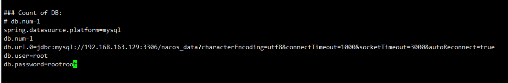

##### 4.6.16.4. 修改启动内存 

```properties
修改解压目录nacos下面的bin目录下的startup.sh

修改如下： 
	JAVA_OPT="${JAVA_OPT} -server -Xms128m -Xmx128m -Xmn64m -XX:MetaspaceSize=32m -XX:MaxMetaspaceSize=90m"
    JAVA_OPT="${JAVA_OPT} -XX:-OmitStackTraceInFastThrow -XX:+HeapDumpOnOutOfMemoryError -XX:HeapDumpPath=${BASE_DIR}/logs/java_heapdump.hprof"
    JAVA_OPT="${JAVA_OPT} -XX:-UseLargePages"
```


##### 4.6.16.5. 修改配置文件 

```properties
## 1: cd到nacos解压目录中的conf目录   

## 2: 把cluster.conf.example重命名成cluster.conf 
	mv cluster.conf.example  cluster.conf
	
## 3: 重命名后添加如下内容（添加各个nacos的地址）
     192.168.163.129:8848
	 192.168.163.130:8848
     192.168.163.131:8848	
```


##### 4.6.16.6. 分别启动nacos 

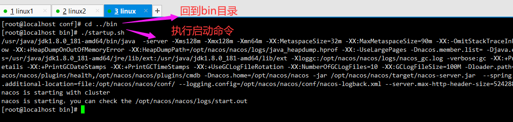

##### 4.6.16.7. 查看集群 


##### 4.6.16.8. 配置启动nginx

```properties
 ## 任何一个机器上的nginx都可以
 
 upstream huige {
    server 192.168.163.129:8848;
    server 192.168.163.130:8848;
    server 192.168.163.131:8848;
  } 
  
server {
   listen       80;
   server_name  localhost;
   location / {
     proxy_pass http://huige;
      }
```

##### 4.6.18.9. 注册到nacos  


### 4.7. 三大注册中心比较

|                            eureka                            |                            consul                            |                            nacos                             |
| :----------------------------------------------------------: | :----------------------------------------------------------: | :----------------------------------------------------------: |
|                 内部项目，使用需要自己建工程                 |                        外部的，入侵小                        |                        外部的，入侵小                        |
| 遵循AP（可用性+分离容忍）原则 有较强的可用性，服务注册快，但牺牲了一定的一致性。 | 遵循CP原则（一致性+分离容忍） 服务注册稍慢，由于其一致性导致了在Leader挂掉时重新选举期间真个consul不可用。 | 通知遵循CP原则（一致性+分离容忍） 和AP原则（可用性+分离容忍） |
|                      目前已经不进行升级                      |                     目前仍然进行版本迭代                     |                     目前仍然进行版本迭代                     |
|                    只支持SpringCloud集成                     |                   支持SpringCloud K8S集成                    |       支持Dubbo 、ssm,springboot,SpringCloud、K8S集成        |
|                         支持雪崩保护                         |                        不支持雪崩保护                        |                         支持雪崩保护                         |
|                 英文界面（对英文菜逼不优雅）                 |                 英文界面（对英文菜逼不优雅）                 |                  中文页面（识字的都能看懂）                  |
|                           支持http                           |                        支持 HTTP/DNS                         |                     支持HTTP/动态DNS/UDP                     |

## 5. 负载均衡相关

### 5.1. 面临的问题 

#### 5.1.1. 启动多个提供者


#### 5.1.2. nacos中查看


#### 5.1.3. 消费者调用


#### 5.1.4. 问题说明

```properties
由于提供者 我们启动了三个（多个），同样的服务启动了多个实例，当我们在消费者使用服务名称获取实例的时候 会获取多个（启动几个获取几个），但是我们每次都拿第一个，另外2个没有起到分流的效果，或者说启动了 然而没有任何卵用，很显然不够优雅
```

### 5.2. 负载均衡相关概述 

#### 5.2.1. 负载均衡的作用

```properties
1: 降低单机压力 
	因为在大量的用户请求和数据面前，单机是无法承受的，实现了负载均衡系统往往能够根据合理的算法将用户，请求和数据分摊到各个机器上 减少单机压力
	
2: 高可用和高性能 
	 当某个节点出现问题时 可以测试其心跳 如果失败到达一定的程度 就将它剔出系统，也可以判断它是否是忙碌阶段 通过负载均衡算法选择是否调度它  这样就确保了高可用，因为可以无限的拓展，所以在遇到性能瓶颈时 可以通过增加机器来保证性能，具备高性能的特点 
	 
3: 可伸缩性
	当企业业务规模快速扩大时  可以通过增加节点的方式，提供系统的服务能力，当业务规模快速减少时 可以通过减少节点的方式 节省资源 
	
4: 请求过滤 
    提供过滤器的使用，过滤器可以通过简单的判断来检测请求的合法性或者对请求进行流量控制 从而避免对某个具体的节点的恶意攻击，达到保护系统和提高系统响应能力的目的	
```

#### 5.2.2. 负载均衡的分类 

```properties
1: 硬件层面的负载均衡（比如f5）
2: 软件层面的负载均衡
```

#### 5.2.3. 负载均衡的基本问题

```properties
任何一个负载均衡都会面临如下2个问题： 
第一个问题： 从哪里获取服务实例 
		答案: 我们可以从注册中心中获取实例 也可以在配置文件中写死（即不和注册中心一起使用）
		
第二个问题： 用一个什么样的方式获取服务列表中的某一个
	   答案: 此时就需要负载均衡算法 常用的算法有： 随机 轮训， 最小连接数  一致hash值 权重随机等
```

#### 5.2.4. 常见的负载均衡策略 

```properties
轮训（最常见的负载均衡策略 也是很多负载均衡器的默认规则）
随机
hash
最小连接数 
权重随机
```

### 5.3. 负载均衡之Ribbon

#### 5.3.1. Ribbon是什么 

```properties
Ribbon是由Netflix开发的一款基于HTTP和TCP的负载均衡的开源软件。我们可以直接给Ribbon配置好服务列表清单，也可以配合注册中心主动的去获取服务清单，需要使用到这些服务的时候Ribbon通过轮询或者随机等均衡算法去获取服务。

Ribbon是客户端负载均衡技术 一般在消费者端使用 作用就是确定一个提供者
```

#### 5.3.2. Ribbon的使用方式

##### 5.3.2.1. 编码的方式 


##### 5.3.2.2. 注解的方式 


#### 5.3.3. Ribbon的负载均衡策略 


```properties
RoundRobinRule 
     表示轮询规则  (默认规则)
     
RamdomRule
	随机规则
	
AvailabilityFilteringRule
 	先过滤掉多次访问故障处于不能用的服务 然后对剩余的服务进行按照轮询策略进行轮询
 	
WeightedResponseTimeRule

	根据平均响应时间计算所有服务的权重 如果响应时间越快那么权重大 被选中的记录高 注意这个是需要统计的 当	统计信息不足时 会使用轮询 当统计信息足够时 会自动切换到此模式
	
RetryRule
   	先按照默认规则轮询获取服务 如果获取服务失败 则在指定的时间内重试 获得可用服务
   		
BestAvailableRule
	先过滤掉多次访问故障处于不能用的服务 然后选择并发量少的服务
	
ZoneAvoudanceRule
 	综合判断服务的性能和可用性选择服务
 		
nacosRule
	nacos实现的负载均衡算法，支持nacos的权重分配  底层使用随机加权重
```

#### 5.3.4. 修改策略 

* **第一种方式**

  

* **第二种方式**

  ```yaml
  huige-provider:
        ribbon:
          NFLoadBalancerRuleClassName: com.alibaba.cloud.nacos.ribbon.NacosRule
  ```

### 5.4. 负载均衡之LoadBalancer

#### 5.4.1. LoadBalancer是什么

```properties
LoadBalancer 是Spring官方提供的客户端负载均衡器  用于替代netflix中的Ribbon 因为Ribbon不再更新，进入维护模式，Spring在2019年7月3日 在Hoxton.M1的发布公告上 正式宣布将会使用LoadBalancer替代Ribbon
但是在目前的版本中 可能功能上并没有Ribbon强大，并且我们学习的版本 在注册中心默认携带的还是LoadBalancer 
```

#### 5.4.2. LoadBalancer的使用 


```properties

LoadBalancer的使用方式 和Ribbon一样   
	编码的方式 
	注解的方式 
```

#### 5.4.3. 自定义负载均衡

* **自定义负载均衡客户端**

  

* **使用客户端**

  

### 5.5. 负载均衡之OpenFeign

#### 5.5.1. 面临的问题 

```properties
Ribbon和LoadBalancer都可以做负载均衡，但是Ribbon和LoadBalancer做负载均衡时 都需要拼接URL  后期维护服务地址比较困难 不够优雅，所以引入OpenFeign  Openfeign是springCloud提供的一个Rest风格的客户端，提供声明式接口 让程序员远程调用更符合开发者的习惯 
```

#### 5.5.2. OpenFeign的基本使用 

##### 5.5.2.1. 消费者引入依赖 

```xml
  <dependency>
            <groupId>org.springframework.cloud</groupId>
            <artifactId>spring-cloud-starter-openfeign</artifactId>
  </dependency>
```

##### 5.5.2.2. 主配置文件添加


##### 5.5.2.3. 定义接口 


##### 5.5.2.4. 接口调用 


#### 5.5.3. 项目改造

```properties
在上面的案例中，我们把OpenFeign的接口写在了消费者端，那么如果实际开发当中，这个提供者服务不是你写的，他的服务名称以及接口的请求路径你怎么知道呢（除非查看api文档自己一点一点的写），很明显不够优雅，所以在实际当中，这些OpenFeign的接口 应该有提供者编写，消费者只需要依赖调用即可 
```

##### 5.5.3.1. 新建Feign接口工程 


##### 5.5.3.2. 添加依赖 


##### 5.5.3.3. 复制接口 


##### 5.5.3.4. 修改消费者依赖


##### 5.5.3.5.  修改提供者的依赖


##### 5.5.3.6. 修改提供者代码


##### 5.5.3.7. 测试访问 

略

#### 5.5.4. OpenFeign传参问题

##### 5.5.4.1. 键值参数 


##### 5.5.4.2. 自定义对象参数


##### 5.5.4.3. Rest风格参数 


##### 5.5.4.4. 文件上传 


##### 5.5.4.5. 总结

```properties
通过刚刚的测试 我们发现一个问题，有些注解必须加在接口的位置  有些注解不仅必须加在接口上 还要加在controller上   

所以： 我们写的时候 保证接口和controller中的内容一致即可  
```

#### 5.5.5. OpenFeign的超时问题

##### 5.5.5.1. 提供者延时


##### 5.5.5.2. 消费者调用报错

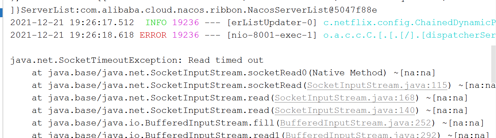

##### 5.5.5.3. 修改超时时间


#### 5.5.6. 日志问题

##### 5.5.6.1. 问题描述

```properties
当我们使用OpenFeign调用提供者微服务时，控制台没有任何打印，虽然说OpenFeign做了负载均衡 但是由于我们调用的是接口中的方法 所以看不到到底有没有做负载均衡  很显然不够优雅
```

##### 5.5.6.2. 官网说明 

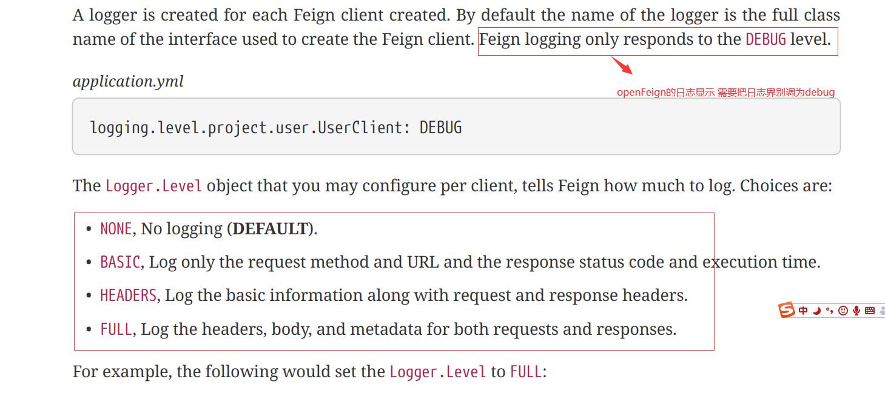

##### 5.5.6.3. 消费者修改


##### 5.5.6.4. 测试

略

#### 5.5.7. 优化之请求压缩

##### 5.5.7.1. 问题说明

```properties
用户在网络请求过程中，如果网络不佳、传输数据过大，会造成体验差的问题，我们需要将传输数据压缩提升体验。SpringCloud OpenFeign支持对请求和响应进行GZIP压缩，以减少通信过程中的性能损耗。
```

##### 5.5.7.1.相关配置 

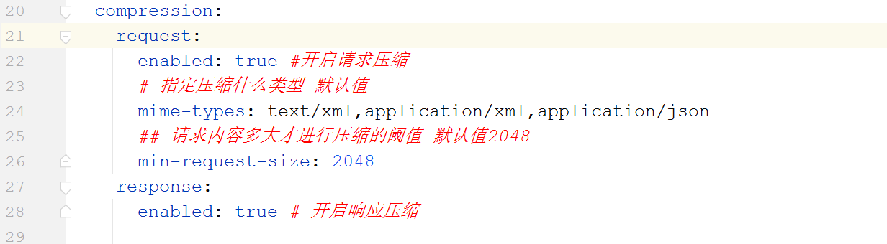

#### 5.5.8. 优化之OKHttp

##### 5.5.8.1. 问题说明

```properties
OpenFeign底层用的是Ribbon，Ribbon默认使用的是HttpClient作为底层连接，并且OpenFeign在配置中给了默认配置

如果我们在项目中使用了请求压缩Gzip时  此时我们建议把底层连接换成OKHttp 因为OkHttp 不仅提供了请求缓存 
还有效减少Gzip压缩传输的数据大小 
```


##### 5.5.8.2. 接口工程添加依赖

```xml
     <dependency>
            <groupId>io.github.openfeign</groupId>
            <artifactId>feign-okhttp</artifactId>
        </dependency>
```

##### 5.5.8.3. 接口工程添加配置


##### 5.5.8.4. 消费者开启配置


##### 5.5.8.5. 测试

略

#### 5.5.9. OpenFeign拦截器 

````properties
我们现在服务之间的调用，使用Openfeign接口调用方法的方式，让开发者远程调用变得简单，但是底层调用过度封装，有些时候我们拓展时比较困难  比如 如果在使用OpenFeign调用的时候 想要加一个token的头部此时怎么办呢？
````

##### 5.5.9.1. 定义拦截器


##### 5.5.9.2. 消费者配置拦截器


##### 5.5.9.3. 测试


#### 5.5.10. 多FeignClient问题 

##### 5.5.10.1. 提供者编写


##### 5.5.10.2. 接口工程添加 


##### 5.5.10.3. 消费者调用


##### 5.5.10.4. 报错展示


##### 5.5.10.5. 问题解决 

````properties
## 问题出现的原因 
	现在2个OpenFeign接口 同时指定了同一个服务  

## 解决方式
	spring: 
		main:
   		  allow-bean-definition-overriding: true
````

#### 5.5.11. ResponseEntity问题 

```properties
1: 提供者controller返回 ResponseEntity<T> 但是OpenFeign接口返回的是ResponseEntity 不指定泛型时  
2: 消费者调用接口方法时 会出现问题  
	有的版本是： 报错 
	有的版本是： 浏览器无响应
 总之获取不到数据 
```


## 6. 熔断降级相关 

### 6.1. 雪崩效应概述 

#### 6.1.1. 雪崩效益的原因

```properties
## 雪崩效应产生的原因
		雪崩效应产生的原因主要是服务依赖  即服务的返回依赖于其他一个或者多个服务  
```

#### 6.1.2. 雪崩效应的条件

```properties
1: 服务提供者不可用
	1.1: 硬件故障
			硬件故障可能为硬件损坏造成的服务器主机宕机, 网络硬件故障造成的服务提供者的不可访问. 
			
	1.2: 程序Bug
			程序出现bug 一直无法响应
	
	1.3: 缓存击穿
			 缓存击穿一般发生在缓存应用重启, 所有缓存被清空时，以及短时间内大量缓存失效时。大量的缓存不 			 命中,，使请求直击后端,造成服务提供者超负荷运行,引起服务不可用
			
	1.4: 用户大量请求
			在秒杀和大促开始前,如果准备不充分，用户发起大量请求也会造成服务提供者的不可用.

2: 重试加大流量
	2.1: 用户重试
			在服务提供者不可用后, 用户由于忍受不了界面上长时间的等待，而不断刷新页面甚至提交表单
			
	2.2: 代码逻辑重试
			服务消费端的会存在大量服务异常后的重试逻辑。这些重试都会进一步加大请求流量。

3: 服务调用者不可用
	3.1: 同步等待造成的资源耗尽
			当服务消费者使用同步调用时，会产生大量的等待线程占用系统资源。一旦线程资源被耗尽，服务调用 			  者提供的服务也将处于不可用状态，于是服务雪崩效应产生了。	
```

#### 6.1.3. 雪崩效益的场景 

```properties
	场景一：
	比如现在有三个微服务节点：A，B和C，B为A的消费者，C为B的消费者。假如由于网络波动或者A服务自身故障，导致B调用A服务的线程被挂起进入长时间的等待。在高并发的情况下可能导致B的资源被耗竭随之崩溃，从而导致C服务也不可用。这种情况下 就是雪崩效应
	
	场景二： 
	比如现在有三个微服务节点：A，B和C, A是消费者 B和C是A的提供者，A如果想要完成一个功能 必须同时成功调用B和C  如果B和C 有一个出现问题 则A也会导致挂起，高并发的情况下  A的资源也会耗尽 最终崩溃 
```

### 6.2. 报错演示

#### 6.2.1. 关闭提供者 


#### 6.2.2. Ribbon或者Feign调用


#### 6.2.3. 访问报错


### 6.3. 雪崩的解决方案 

#### 6.3.1. 异常处理 

```properties
通过控制台我们可以看到当访问到不可用的服务时 实际抛出的是异常 此时我们可以通过异常处理返回json
让前端可能解析我们的数据 并且不会显示500错误页面
```


#### 6.3.2. 熔断器 

```properties
##1: 熔断器相关概念 
 	熔断器也叫作断路器，在生活中很常见，比如整个宿舍楼 都在看片，当看到最后激情时刻，准备高潮了 由于电	  压过高导致保险丝断了或者跳闸，这就是熔断器，熔断器实际上是一个保护作用，不过软件系统中的熔断器和实		 际中的保险丝还不同 保险丝断了 需要人为修复，而软件系统中的断路器如果打开了，可以根据情况自动关闭，

## 2：熔断器的说明
    比如： 外部应用依赖服务API  但是服务API不能用，这个应用一直超时或者重试，从而导致整个应用整体无法	提供服务 如果这个时候如果我们有一个熔断器 让客户端多次调用失败之后 不再让客户重试 不让继续访问，则	  	 可以保证项目的其他的服务正常运行
	  
## 3：熔断器的三种状态
	  Closed  
		关闭状态(熔断器关闭)  默认状态 这种状态下所有请求正常访问 熔断器内部维护一个计数器记录失败的次		  数 在设置的时间内 当访问的次数达到指定的阈值之后  就会从Closed状态转成Open状态
	  Open 
		 打开状态(熔断器打开) 操作不会执行，而是立即失败，熔断器内部维护一个计时器 当时间达到指定的阈值
		 就会从Open状态HalfOpen状态:
	  HalfOpen 
			半打开状态  表示再放部分请求 如果有一个操作失败 则直接进入Open状态，如果没有失败的 都成功
			当成功的次数到达指定的阈值时 会把状态变成Closed状态
```

#### 6.3.3. 服务降级 

```properties
## 1: 基本概念
	 表示一组服务，优先保证核心服务，或者正常的服务调用的同时，对不可用或者弱可用的服务，直接返回一个结	   果，不让线程进行等待

## 2：相关理解 
	比如一： 支付场景 正常的流程 是从用户账户扣款 然后去完成商品的交易，但是这个过程比较消耗服务器的资	源和时间，如果在高并发的情况下，请求数量会很大，超过了服务器的承载范围 此时如果让请求等待，势必会挤	  压请求导致服务器崩溃 并且用户长时间得不到结果 反而会失去耐性 说你的程序垃圾，此时我们可以不让用户进	 入支付 而是返回一个静态页面(提示) 这样资源和用户等待时间就会小很多  并且不仅保护了系统 还快速给用户	  响应服务器忙 让客户稍后重试
	 
	 比如二：在实际中 比如电商项目中 商品详情页会有评论或者一些其他广告，而评论和广告并不是购物所必须要	展示的 在秒杀抢购场景下 电商平台可能就因为系统繁忙而不再展示这些没有必要的内容 保证核心商品正常服务	
```

#### 6.3.4. 限流

```properties
## 相关理解 
限流在日常生活中很常见，景点限流、早晚高峰限流等。在软件系统中  很多时候服务器不可用是由于高并发阻塞
导致服务器资源殆尽 导致服务不可用，此时我们可以通过限流的手段 让服务器承载的流量是我们服务器可以承担	   的这就是限流	
	
比如： 秒杀100件商品  但是有5万人参与秒杀抢购，此时我们没有必要让服务器接收5万个请求，而是只需要放入
前100-300人左右即可 让服务器承担100-300的压力 而不是承担5万的压力  剩下的直接快速响应 已卖完即可 
```

### 6.4. 自定义熔断器

#### 6.4.1. 新建枚举

```java
public enum BreakerState {
    //关闭状态
    CLOSED,
    //打开状态
    OPEN,
    //半开状态
    HALFOPEN;
}
```

#### 6.4.2. 新建计数器

```java
@Data
public class BreakerCounter {
    private final int failureCount = 3;

    //当前请求失败的次数
    private int currentFailureCount;

    //指定的失败次数的时间窗口
    private long failureInternalTime = 3000;

    //第一次（上次） 失败的时间
    private long lastFailureTime;

    //打开状态的时间
    private long lastOpenTime;

    //定义间隔多久进入halfOpen的时间窗
    public final long toHalfOpenTime = 4000;

    //统计半开状态成功的次数
    private long halfSuccessCount;
    //自定义这个次数的阈值
    private final long customerSuccessCount = 3;

    /**
     * 失败的次数加一
     */

    public void addCurrentFailureCount() {
        if (System.currentTimeMillis() - this.lastFailureTime > this.failureInternalTime) {
            this.currentFailureCount = 0;
            this.lastFailureTime = System.currentTimeMillis();
        } else {
            this.currentFailureCount++;
        }
    }


    /**
     * 修改访问成功的次数
     */

    public void addHalfSuccessCount() {
        this.halfSuccessCount++;
    }

    /**
     * 判断是否到达关闭的状态
     */

    public boolean isActiveClosed() {
        return this.halfSuccessCount >= this.customerSuccessCount;
    }


    /**
     * 判断失败的次数 是否达到了指定的次数
     */

    public boolean isActiveOpen() {
        return this.currentFailureCount > this.failureCount;
    }

    /**
     * 判断是否到达进入半开的状态
     */

    public boolean isActiveHalfOpen() {
        return System.currentTimeMillis() - getLastOpenTime() > this.toHalfOpenTime;
    }

    public void reset() {
        this.halfSuccessCount = 0;
        this.currentFailureCount = 0;
    }
}
```

#### 6.4.3. 新建熔断器 

```java
public class CircuitBreaker {

    private BreakerState breakerState;
    private BreakerCounter breakerCounter;
    public CircuitBreaker(BreakerCounter breakerCounter) {
        this.breakerCounter = breakerCounter;
        this.breakerState = BreakerState.CLOSED;
    }

    public <T> T execute(Supplier<T> supplier, Function<Throwable, T> function) {
        try {
            if (this.breakerState == BreakerState.CLOSED) {
                //关闭状态正常执行
                T t = supplier.get();
                return t;
            }
            if (this.breakerState == BreakerState.OPEN) {
                //判断是否满足条件进入半开状态  如果满足进入半开状态 不满足直接失败
                if (breakerCounter.isActiveHalfOpen()) {
                    this.halfOpen();
                    return this.executeHalf(supplier, function);
                }
                return function.apply(new RuntimeException("xxxx"));
            }
        } catch (Exception e) {
            //出异常： 表示请求失败  记录一次失败
            breakerCounter.addCurrentFailureCount();
            if (breakerCounter.isActiveOpen()) {
                this.open();
            }
            return function.apply(e);
        }
        return null;
    }


    public <T> T executeHalf(Supplier<T> supplier, Function<Throwable, T> function) {
        //半开状态 去请求 如果一次失败 则直接进入打开状态  如果请求成功的值 到达指定的值 则直接关闭状态
        try {
            T t = supplier.get();
            breakerCounter.addHalfSuccessCount();
            if (breakerCounter.isActiveClosed()) {
                close();
            }
            return t;
        } catch (Exception e) {
            open();
            return function.apply(e);
        }
    }

    /**
     * 设置关闭状态
     */

    public void close() {
        this.breakerState = BreakerState.CLOSED;
        breakerCounter.reset();
    }

    /**
     * 设置打开状态
     */
    public void open() {
        this.breakerState = BreakerState.OPEN;
        //设置打开的时间
        this.breakerCounter.setLastOpenTime(System.currentTimeMillis());
    }

    /**
     * 设置半开状态
     */
    public void halfOpen() {
        this.breakerState = BreakerState.HALFOPEN;
    }

}
```

#### 6.4.4. 测试


### 6.5. 熔断器之Hystrix

#### 6.5.1. Hystrix是什么

```properties
Hystrix中文名字是豪猪  豪猪的特点 背上长满了刺 主要的目的自我保护  所以Hystrix的作用就是在一些场景下保护微服务。

Hystrix是netFlix在2012年的时候对外开源的一款熔断降级工具，用于解决分布式系统的延迟和容错问题， 不过在2018年NetFlix对外发布 Hystrix不会再进行开发 进入维护模式
```

#### 6.5.2. Hystrix的运行流程图


```properties
1: 选择执行业务逻辑的Command  HystrixCommand或者HystrixObservableCommand 
2: 使用不同的Command 调用不同的方法 
3: 操作之前 判断缓存池是否有缓存 如果有缓存 则直接返回缓存信息 如果没有缓存 则直接向下执行  
4: 判断熔断器是否是打开状态  如果打开 直接走降级方法，如果熔断器关闭状态 继续向下执行 
5: 根据信号量或者线程池的当前状态判断是否拒绝当前请求 如果拒绝 直接走降级方法 如果不拒绝执行业务方法
6: 执行业务方法 如果出异常或者超时则直接走降级方法 没有问题则直接响应正确的值 
7: 每次执行业务方法 都要重新计算线程池和信号量的消耗情况 
```

#### 6.5.2. 普通编码方式

##### 6.5.2.1. 自定义类


##### 6.5.2.2. 控制器中添加


##### 6.5.2.3. 测试


##### 6.5.2.4. 提供者添加延迟  


##### 6.5.2.5. 再次测试


##### 6.5.2.6. 修改默认时间


##### 6.5.2.7. 熔断器问题 


##### 6.5.2.8. 熔断器触发条件


##### 6.5.2.9. 熔断器开关过程


#### 6.5.3. 注解的方式

##### 6.5.3.1. 添加注解 


##### 6.5.3.2. 修改控制器


 ##### 6.5.3.3. 测试


##### 6.5.3. 配置整个控制器

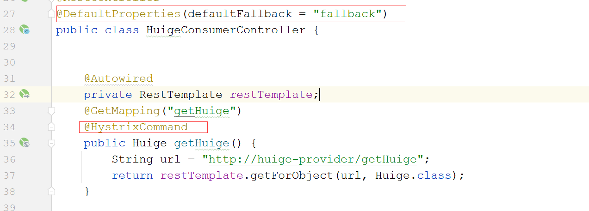

#### 6.5.4. 整合OpenFeign

##### 6.5.4.1.  接口工程添加


##### 6.5.4.2. 修改接口 


##### 6.5.4.3. 修改消费者配置


##### 6.5.4.4.  消费者接口调用


##### 6.5.4.5. Hystrix的相关配置


#### 6.5.5. 遗憾的事情


### 6.6. 熔断器之Sentinel

#### 6.6.1. 什么是sentinel 

```properties
随着微服务的流行，服务和服务之间的稳定性变得越来越重要。Sentinel 是面向分布式服务架构的流量控制组件，主要以流量为切入点，从限流、流量整形、熔断降级、系统负载保护、热点防护等多个维度来帮助开发者保障微服务的稳定性。
```

#### 6.6.2. sentinel的特性 

```properties
1: 丰富的应用场景
	Sentinel 承接了阿里巴巴近 10 年的双十一大促流量的核心场景，例如秒杀（即突发流量控制在系统容量可以承	受的范围）、消息削峰填谷、集群流量控制、实时熔断下游不可用应用等。
	
2: 完备的实时监控
	Sentinel 同时提供实时的监控功能。您可以在控制台中看到接入应用的单台机器秒级数据，甚至 500 台以下规	模的集群的汇总运行情况	
	
3: 广泛的开源生态
	Sentinel 提供开箱即用的与其它开源框架/库的整合模块，例如与 Spring Cloud、Dubbo、gRPC 的整合。您只	 需要引入相应的依赖并进行简单的配置即可快速地接入 Sentinel。
	
4: 完善的 SPI 扩展点
	Sentinel 提供简单易用、完善的 SPI 扩展接口。您可以通过实现扩展接口来快速地定制逻辑。例如定制规则管	理、适配动态数据源等。
```

#### 6.6.3. sentinel的组成 

```properties
核心库（Java 客户端）：不依赖任何框架/库，能够运行于 Java 7 及以上的版本的运行时环境
					可以结合springcloud一起使用 
					
控制台（Dashboard）：控制台主要负责管理推送规则、监控、集群限流分配管理等
```

#### 6.6.4. sentinel的核心概念 

```properties
## 1：资源	
		在sentinel的世界里 资源可以是一个url路径 可以是一个方法名甚至一个接口名  是限流或者熔断的对象
## 2：规则
		针对某个资源对应的策略，比如限流QPS  限流并发线程数 根据平均响应时间熔断 这些都是限流或者熔断的			规则
## 3：数据源
	    默认的数据都是在内存中 当重启时 规则将会丢失，我们要把规则数据放到数据源，这个数据源可以是本地文		件  配置中心 甚至Redis
```

#### 6.6.5. sentinel的核心功能  

```properties
## 1: 流量控制 
	 任何时候到来的请求往往都是随机不可控的，而系统的处理能力也是有限的，sentinel可以根据资源的配置对流量进行控制 

## 2：熔断降级
	当检测到链路调用某个资源出现不稳定时 例如平均响应时间过长，异常比例高等问题时 则对这个资源的调用做出
	想用的限制 让请求快速失败，避免影响到其他资源，进而导致级联故障

## 3：系统负载保护 
   当系统负载较高的时候，如果还持续进入请求，可能会导致系统崩溃，无法响应 系统负载保护可以提供系统维度的自适应保护能力 从而防止雪崩。
```


#### 6.6.6 sentinel的基本API 

##### 6.6.6.1. 限流算法介绍

```properties
## 1: 计数器算法 
 计数器算法是一种比较简单的限流实现的算法，表示在指定的周期内限制访问的上限，比如1分钟进入100个请求 
 如果一分钟之内请求次数达到100之后 剩下的请求将会被限流  进入下一分钟 次数清零  
 
 好处： 实现简单 只需要一个计数的变量即可   
 缺点： 存在临界问题 比如1分钟请求100次请求  第一分钟的30秒到60秒 这30秒进入100个请求  下一分钟的0秒到		 30秒 进入100个请求  那么在这1分钟的时间断中 进入了200个请求 这就是临界问题  
 
 
## 2： 滑动窗口算法 
	  滑动窗口算法 这种算法在TCP的滑动窗口协议中有体现，可以这么说 tcp就是通过滑动窗口解决网络阻塞的问题  我们使用的sentinel就是滑动窗口算法 实现的限流 并且可以解决计数器的临界问题  
	  
	  理解： 1分钟进入100个请求  把1分钟 分成10小段  一小段占6秒  平均下来一小段6秒允许10个请求  
	  		然后定义一个窗口 比如说窗口时间是12秒 就是包含2段  也就是说在这个窗口的内的请求最大是20
	  		并且随着时间的推移  窗口往前滑动 到达下一个时间段的时候 第一个时间段不参与统计  统计的值
             永远在这个窗口内统计
             
       
## 3： 令牌桶算法 
		 系统以一个固定的速度往一个容器中（桶中）生产令牌（tokens）  请求想要请求成功 必须先从桶中获取到令牌 才能正常访问，如果没有令牌 请求将会被限流   
		 
	令牌桶算法 会出现如下3种情况 
		1： 系统生成的速度高于请求的速度， 桶中的tokens用不完  此时并发量不高 都能正常访问 
		2： 系统生成的速度等价于请求速度  此时系统基本请求稳定   
		3： 系统生产的速度小于请求的速度  此时会有请求被限流 
		
## 4: 漏桶限流算法 
		一个容器（桶），以一个恒定的速度向外流出，但是不管这个桶的流入多大  流出都是一个固定的速度  
		当流入的速度高于流出的速度时  容器（桶）会溢出 溢出的部分就是被限流的请求 
	  
```

##### 6.6.6.2. 限流的简单Demo

```java
public class SentinelDemo {

    public static void main(String[] args) {
        initFlowRules();
        while (true){
            // 1.5.0 版本开始可以直接利用 try-with-resources 特性，自动 exit entry
            try (Entry entry = SphU.entry("HelloWorld")) {
                // 被保护的逻辑
                System.out.println("hello world");
                // 处理被流控的逻辑 限流的异常是FlowException
                System.out.println(ex.getClass().getName());
            }
        }
    }
    private static void initFlowRules(){
        List<FlowRule> rules = new ArrayList<>();
        //限流规则
        FlowRule rule = new FlowRule();
        //设置资源名称
        rule.setResource("HelloWorld");
        //设置限流策略  QPS 表示1秒中最大运行请求几次
        rule.setGrade(RuleConstant.FLOW_GRADE_QPS);
        // 设置阈值
        rule.setCount(10);
        rules.add(rule);
        FlowRuleManager.loadRules(rules);
    }
}
```

##### 6.6.6.3. 熔断降级API

```java
public class SentinelDemo {
    public static void main(String[] args) {
        initDegradeRule();
        while (true) {
            // 1.5.0 版本开始可以直接利用 try-with-resources 特性，自动 exit entry
            try (Entry entry = SphU.entry("path")) {
                // 被保护的逻辑
                System.out.println("xxx");
            } catch (BlockException ex) {
                // 处理被流控的逻辑
                System.out.println("blocked!");
            }
        }
    }

    private static void initDegradeRule() {
        List<DegradeRule> rules = new ArrayList<>();
        DegradeRule rule = new DegradeRule();
        rule.setResource("path");
        rule.setGrade(RuleConstant.DEGRADE_GRADE_RT);
        // set threshold RT, 10 ms
        rule.setCount(0);
        rule.setTimeWindow(10);
        rules.add(rule);
        DegradeRuleManager.loadRules(rules);
    }
}
```

#### 6.6.7.sentinel的基本使用

##### 6.6.7.1. 新建项目


##### 6.6.7.2. 添加依赖 

```xml
    <dependencies>
        <dependency>
            <groupId>com.alibaba.cloud</groupId>
            <artifactId>spring-cloud-starter-alibaba-sentinel</artifactId>
        </dependency>

        <dependency>
            <groupId>org.springframework.boot</groupId>
            <artifactId>spring-boot-starter-web</artifactId>
        </dependency>
    </dependencies>
```

##### 6.6.7.3. 编写主配置类 


##### 6.6.7.4. 编写配置文件


##### 6.6.7.5. 编写controller


##### 6.6.7.6. 测试 


##### 6.6.7.7. 启动控制台


##### 6.6.7.8. 登录控制台


##### 6.6.7.9. 项目接入控制台


##### 6.6.7.10. 正常编写控制器


##### 6.6.7.11. 启动访问


#### 6.6.8. 控制台的使用 

##### 6.6.8.1. QPS直接快速失败

* **controller添加**

  

* **启动测试**

  

* **设置规则**

  

* **限流测试**

  

##### 6.6.8.2. 线程数直接失败

* **controller添加**

  

* **启动访问**

  

* **设置规则**

  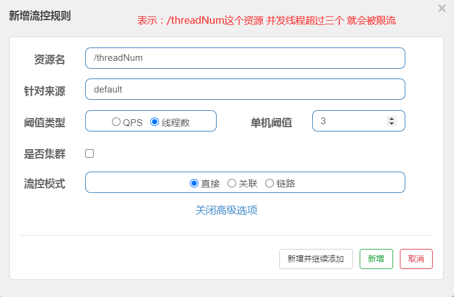

* **测试规则**

  

##### 6.6.8.3. 关联失败 

* **controller编写**

  

* **重启访问**

  

* **设置规则**

  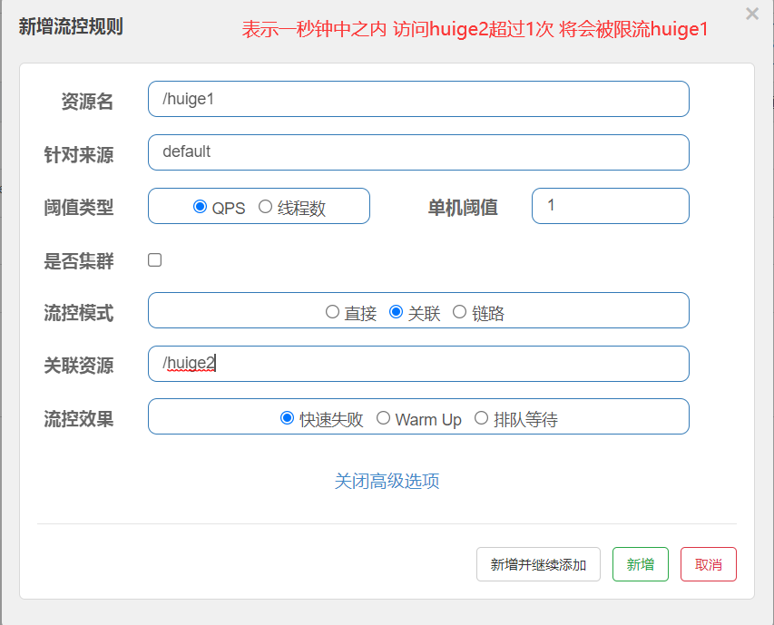

* **测试规则**

  

##### 6.6.8.4. 链路失败 

* **编写service**

  

* **编写controller**

  

* **重启访问**

  

* **错误说明**

  

* **官方说明**

  [官方Issue](https://github.com/alibaba/Sentinel/issues/1213)

* **添加依赖**

  ```xml
          <!-- https://mvnrepository.com/artifact/com.alibaba.csp/sentinel-web-servlet -->
          <dependency>
              <groupId>com.alibaba.csp</groupId>
              <artifactId>sentinel-web-servlet</artifactId>
              <version>1.8.1</version>
          </dependency>
  ```

* **添加Filter**

  ```java
      @Bean
      public FilterRegistrationBean sentinelFilterRegistration() {
          FilterRegistrationBean registration = new FilterRegistrationBean();
          registration.setFilter(new CommonFilter());
          registration.addUrlPatterns("/*");
          // 入口资源关闭聚合
          registration.addInitParameter(CommonFilter.WEB_CONTEXT_UNIFY, "false");
          registration.setName("sentinelFilter");
          registration.setOrder(1);
          return registration;
      }
  ```

* **测试**

  

* **设置规则**

  

* **测试**

  

##### 6.6.8.5. 冷启动 

* **controller**、

  

* **启动访问**

  

* **添加规则**

  

##### 6.6.8.6. 排队等待

* **controller**

  

* **启动访问**

  

* **设置规则**

  

##### 6.6.8.7. 平均响应时间降级 

* **controller**

  

* **启动访问**

  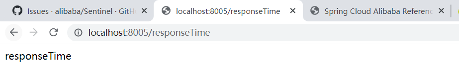

* **设置规则**

  

* **测试**

  

##### 6.6.8.8. 异常比例降级 

* **controller**

  

* **启动测试**

  

* **设置规则**

  

* **测试规则**

  


##### 6.6.8.9. 异常数降级 

* **controller**

  

* **启动访问**

  

* **设置规则**

  

* **测试规则**

  

##### 6.6.8.10. 热点限流

* **controller**

  

* **启动测试**

  

* **定义规则**

  

* **测试规则**

  

  ​

* **其他规则**

  

* **测试**

  

#### 6.6.9. 限流后的处理 

##### 6.6.9.1. URL限流后处理一 


##### 6.6.9.2. URL限流后处理二 


##### 6.6.9.3. URL限流处理三


##### 6.6.9.4. URL限流处理四

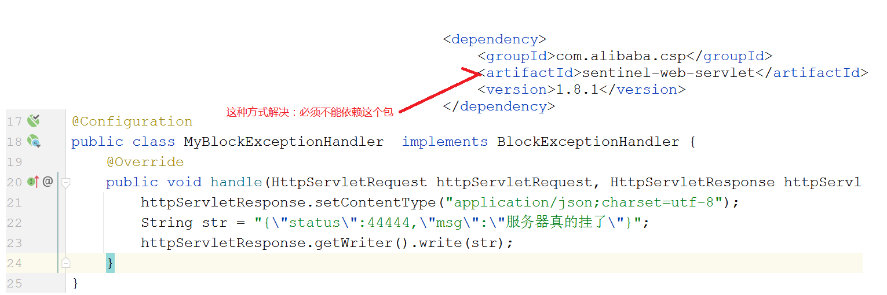

##### 6.6.9.5. sentinel资源处理一


##### 6.6.9.6. sentinel资源处理二


#### 6.6.10. 和Ribbon整合 

##### 6.6.10.1. 消费者添加依赖 


##### 6.6.10.2. 添加注解  


##### 6.6.10.3. 开启配置  


##### 6.6.10.4. 修改controller


##### 6.6.10.5. 启动访问


##### 6.6.10.5. 定义规则


##### 6.6.10.6. 限流处理 


##### 6.6.10.7. 测试 


#### 6.6.11. 和OpenFeign整合

##### 6.6.11.1.消费者添加依赖 


##### 6.6.11.2. 修改主配置类  

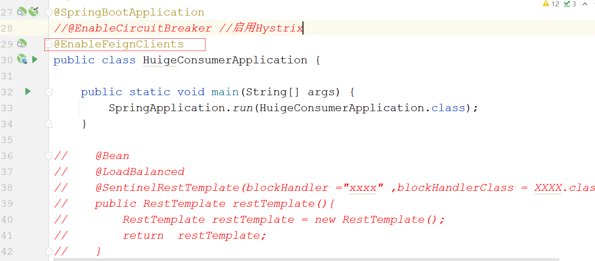

##### 6.6.11.3. 修改配置 


##### 6.6.11.4. 修改控制器 


##### 6.6.11.5. 添加规则


##### 6.6.11.6. 限流处理 


##### 6.6.11.7. 测试 


#### 6.6.12. 规则数据持久化

##### 6.6.12.1. 问题的说明

```properties
使用手动编码的方式给资源设置规则的话  是硬编码 并且修改规则需要修改源代码  
使用控制台给资源设置规则的话 虽然可以动态修改，但是这些规则都是在内存中的  重启项目之后规则将会丢失 
所以我们需要把规则保存在一个位置  然后动态加载这些规则  

而保存规则的这个位置 可以是文件 可以是eureka consul  nacos zookpeer  Apollo  甚至redis 
```


##### 6.6.12.2. nacos整合方式一

* **nacos添加规则**

  

  ```json
  [
      {
          "resource":"GET:http://huige-provider/getHuige",
          "limitApp":"default",
          "grade":1,
          "count":1,
          "strategy":0,
          "controlBehavior":0,
          "clusterMode":false
      }
     
  ]
  ```

* **添加依赖**

  ```xml
    <dependency>
              <groupId>com.alibaba.csp</groupId>
              <artifactId>sentinel-datasource-nacos</artifactId>
    </dependency>
  ```

* **定义加载配置的类**

  

* **定义文件加载类**

  

* **启动测试**

  

* **sentinel控制台**

  


##### 6.6.12.3. nacos整合方式二

- **nacos添加规则**

  

  ```json
  [
      {
          "resource":"GET:http://huige-provider/getHuige",
          "limitApp":"default",
          "grade":1,
          "count":1,
          "strategy":0,
          "controlBehavior":0,
          "clusterMode":false
      }
     
  ]
  ```

- **添加依赖**

  ```xml
    <dependency>
              <groupId>com.alibaba.csp</groupId>
              <artifactId>sentinel-datasource-nacos</artifactId>
    </dependency>
  ```

- **工程添加配置**

  

- **启动测试**

  

- **sentinel控制台**

  

##### 6.6.12.4. 数据双向同步

* **下载解压源码**

  

* **导入idea**

  


* **修改nacos依赖的范围**

  

* **把测试包中的nacos复制到源码中**

  

* **修改nacos信息**

  

* **修改nacos信息**

  

* **指定nacos**

  

* **修改页面**

  

* **直接启动访问**

  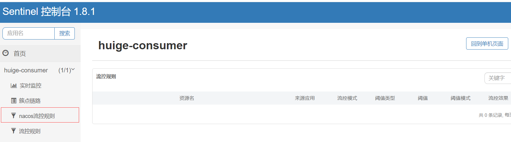

* **修改项目配置**

  


### 6.7. 熔断器之Resilience4J


### 3.8. 熔断器的区别 

| 功能              | Sentinel                                               | Hystrix                 | resilience4j                     |
| ----------------- | ------------------------------------------------------ | ----------------------- | -------------------------------- |
| 隔离策略          | 信号量隔离（并发控制）                                 | 线程池隔离/信号量隔离   | 信号量隔离                       |
| 熔断降级策略      | 基于慢调用比例、异常比例、异常数                       | 基于异常比例            | 基于异常比例、响应时间           |
| 实时统计实现      | 滑动窗口（LeapArray）                                  | 滑动窗口（基于 RxJava） | Ring Bit Buffer                  |
| 动态规则配置      | 支持近十种动态数据源                                   | 支持多种数据源          | 有限支持                         |
| 扩展性            | 多个扩展点                                             | 插件的形式              | 接口的形式                       |
| 基于注解的支持    | 支持                                                   | 支持                    | 支持                             |
| 单机限流          | 基于 QPS，支持基于调用关系的限流                       | 有限的支持              | Rate Limiter                     |
| 集群流控          | 支持                                                   | 不支持                  | 不支持                           |
| 流量整形          | 支持预热模式与匀速排队控制效果                         | 不支持                  | 简单的 Rate Limiter 模式         |
| 系统自适应保护    | 支持                                                   | 不支持                  | 不支持                           |
| 热点识别/防护     | 支持                                                   | 不支持                  | 不支持                           |
| 多语言支持        | Java/Go/C++                                            | Java                    | Java                             |
| Service Mesh 支持 | 支持 Envoy/Istio                                       | 不支持                  | 不支持                           |
| 控制台            | 提供开箱即用的控制台，可配置规则、实时监控、机器发现等 | 简单的监控查看          | 不提供控制台，可对接其它监控系统 |

## 7. 网关相关 

### 7.1. 网关相关概述

#### 7.7.1. 面临的问题 

```properties
现在我们的微服务变多了，一个大的系统，分为了一个一个的小的微服务，对外暴露接口，此时我们的登录验证，权限控制，怎么办呢? 难道我们在每一个微服务中间都写一套权限验证？  很明显这不够优雅
```

#### 7.1.2. 什么是网关

```properties
网关是外部网络和内部服务之间的一个关卡，就像我们常见的路由器一样，我们上网要先经过路由器  而外部的请求
想要到达我们的项目需要先经过网关
```

#### 7.1.3. 网关的作用  

```properties
网关可以把后端很多服务进行整合，然后提供唯一的统一的业务接口，客户端只需要调用这个接口即可完成数据的获取和展示，网关内部其实消费了后端的服务，把多个服务整合给前端一个唯一的响应，并且我们可以针对这一特性做到如下功能  

* 统一鉴权 
* 限流 熔断 
* 日志 
* 同一错误码处理 
* 请求转发
* 灰度发布（了解 灰度发布和全量发布）
```

#### 7.1.4. 网关的架构图

```properties
1：客户端访问服务时 先访问网关 
2：这个时候网关有2调用方式 
	第一种：直接调用发布的服务本身 获得返回内容 再返回给客户端
	第二种：调用服务器(注册中心) 再通过注册中心拉取服务列表 进行匹配访问 最后返回结果
```


### 7.2. 网关相关之Zuul 

#### 7.2.1. Zuul基本使用 

##### 7.2.1.1. 新建工程 


##### 7.2.1.2. 添加依赖 


##### 7.2.1.3. 编写主配置类 


##### 7.2.1.4. 编写配置

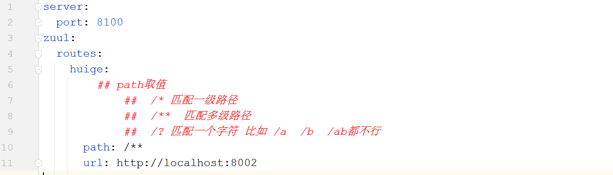

##### 7.2.1.5. 测试 


##### 7.2.1.6. 问题说明

```properties
当访问的路径 符合路径拦截规则时 确实转发到对应的微服务当中，我们也看到了结果，正常访问，正常返回，但是不够优雅  
	不优雅一： 路径写死了 微服务修改一下端口 导致整体都要修改 
	不优雅二： 不支持负载均衡（如果部署多个服务 就很尴尬）
```

#### 7.2.2. 整合注册中心 

##### 7.2.2.1. 添加依赖 


##### 7.2.2.2. 添加配置  


##### 7.2.2.3.测试


##### 7.2.2.4. 路由优化一 


##### 7.2.2.5. 路由优化二


#### 7.2.3. 超时问题 

##### 7.2.3.1. 提供者休眠


##### 7.2.3.2. 启动测试 


##### 7.2.3.3. 添加配置 


#### 7.2.4. Zuul过滤器  

##### 7.2.4.1.过滤器流程图


##### 7.2.4.2. 过滤器的分类

```properties
这4种过滤器处于不同的生命周期，所以其职责也各不相同：
pre: pre过滤器用于将请求路径与配置的路由规则进行匹配，以找到需要转发的目标地址，并做一些前置加             工，比如请求的校验等；

routing: routing过滤器用于将外部请求转发到具体服务实例上去；

post: post过滤器用于将微服务的响应信息返回到客户端，这个过程种可以对返回数据进行加工处理；

error: 上述的过程发生异常后将调用error过滤器。error过滤器捕获到异常后需要将异常信息返回给客户端，所以最终还是会调用post过滤器。
```

##### 7.2.4.3.自带的过滤器


##### 7.2.4.4. 过滤器和优先级

```properties
其中优先级数字越小，优先级越高。
```

| 生命周期 | 优先级 | 过滤器                  | 功能描述                   |
| -------- | ------ | ----------------------- | -------------------------- |
| pre      | -3     | ServletDetectionFilter  | 标记处理Servlet的类型      |
| pre      | -2     | Servlet30WrapperFilter  | 包装HttpServletRequest请求 |
| pre      | -1     | FormBodyWrapperFilter   | 包装请求体                 |
| route    | 1      | DebugFilter             | 标记调试标志               |
| route    | 5      | PreDecorationFilter     | 处理请求上下文供后续使用   |
| route    | 10     | RibbonRoutingFilter     | serviceId请求转发          |
| route    | 100    | SimpleHostRoutingFilter | url请求转发                |
| route    | 500    | SendForwardFilter       | forward请求转发            |
| post     | 0      | SendErrorFilter         | 处理有错误的请求响应       |
| post     | 1000   | SendResponseFilter      | 处理正常的请求响应         |

##### 7.2.4.5. 自定义过滤器

```properties
自定义过滤器 完成访问携带token的问题  没有携带token 则直接告知请登录 
```

```java
@Component
public class TokenFilter extends ZuulFilter {
    //过滤器的类型
    @Override
    public String filterType() {
        return FilterConstants.PRE_TYPE;
    }

    //过滤器的执行顺序 数值越小越先执行
    @Override
    public int filterOrder() {
        return 0;
    }

    //是否过滤 当前请求如果是登录 获取验证码等请求时不需要过滤
    //因为登录 或者 验证码请求 还没有token
    // 这个方法返回true表示过滤 返回false表示不过滤
    @Override
    public boolean shouldFilter() {
        HttpServletRequest request = RequestContext.getCurrentContext().getRequest();
        return !request.getRequestURI().equalsIgnoreCase("/doLogin")
                && !request.getRequestURI().equalsIgnoreCase("/getCode");
    }

    @Override
    public Object run() throws ZuulException {
        RequestContext currentContext = RequestContext.getCurrentContext();
        HttpServletRequest request = currentContext.getRequest();

        String authentication = request.getHeader("Authentication");
        //满足条件放行
        if (!StringUtils.isEmpty(authentication) && authentication.startsWith("Bearer ")) {
            return null;
        }
        //不满足条件返回json
        HttpServletResponse response =currentContext.getResponse();
        response.setContentType(MediaType.APPLICATION_JSON_UTF8_VALUE);
        String result ="{\"status\":33333,\"msg\":\"请去登录\"}";
        currentContext.setResponseBody(result);
        //阻止代码向下执行
        currentContext.setSendZuulResponse(false);
        return null;
    }
}

```

#### 7.2.5. zuul限流一

##### 7.2.5.1. 添加依赖 

```xml
        <dependency>
            <groupId>com.marcosbarbero.cloud</groupId>
            <artifactId>spring-cloud-zuul-ratelimit</artifactId>
            <version>2.4.2.RELEASE</version>
        </dependency>
        <dependency>
            <groupId>org.springframework.boot</groupId>
            <artifactId>spring-boot-starter-data-redis</artifactId>
        </dependency>
```

##### 7.2.5.2. 添加配置


##### 7.2.5.3. 测试 


#### 7.2.6.Zuul限流二 


### 7.3.  网关相关之Gateway 

#### 7.3.1. gateway的基本使用

##### 7.3.1.1. 创建工程 

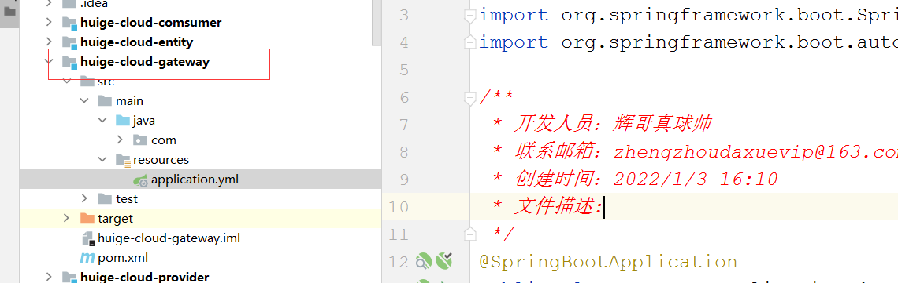

##### 7.3.1.2. 添加依赖 


##### 7.3.1.3. 创建主配置类 


##### 7.3.1.4. 编写配置 


##### 7.3.1.5.测试  


##### 7.3.1.6. 问题描述

```properties
和zuul一样：	
	问题一： url写死了 修改微服务端口或者域名时，网关工程要全部修改 不优雅
	问题二： url写死了  没有负载均衡 不优雅 
```

#### 7.3.2. 整合注册中心

##### 7.3.2.1. 添加依赖 


##### 7.3.2.2. 修改配置 

````yaml
server:
  port: 8111

spring:
  cloud:
    gateway:
      routes:
        - id: xxxxx
          uri: lb://huige-provider
          predicates:
           ## - Path=/**
            - Path=/huige-provider/**
          filters:
            - StripPrefix=1
    nacos:
      discovery:
        server-addr: localhost:8848
  application:
    name: huige-gateway
````

##### 7.3.2.3. 测试


#### 7.3.3. 断言工厂 

````properties
断言工厂的功能就是匹配路由的 即 满足什么样的条件 请求转发到哪个路由， 基类是RoutePredicateFactory
````


##### 7.3.3.1. 时间断言工厂 

```properties
- BeforeRoutePredicateFactory : 表示在哪个时间之前访问 符合路由规则
- AfterRoutePredicateFactory:  表示在哪个时间之后访问 符合路由规则
- BetweenRoutePredicateFactory: 表示在哪个时间段访问 符合路由规则

取值：带时区的UTC时间
```


##### 7.3.3.2. cookie断言工厂 


##### 7.3.3.3. Header断言工厂  


##### 7.3.3.4. Host断言工厂 


##### 7.3.3.5. Method断言工厂 


##### 7.3.3.6. Path断言工厂 


##### 7.3.3.7. Query断言工厂 


#### 7.3.4. Gateway自带过滤器 

````properties
## 1. 过滤器的作用
Gateway的断言主要的功能就是匹配路由的  而Gateway的过滤器是匹配路由之后 把请求转发到源服务器之前或者之后 
对http请求和响应的拦截 以便对请求或者响应做出响应的修改 比如修改请求头 响应头等

## 2. 过滤器的分类
从执行时间上划分 
		前置过滤器（pre）: 执行时间 是在路由转发之前执行
		后置过滤器(post):  执行时间：路由转发之后 执行完目标方法 返回结果之前执行   

从作用域上划分 
		 局部过滤器（gatewayFilter） : 针对某一个路由有效  实现的是GatewayFilter接口
		 全局过滤器（globalFilter）:  对所有的路由都有效   实现的是GlobalFilter接口
		 
## 3. 内置的过滤器
 和断言工厂一样，Gateway也内置一些过滤器工厂 基类是GatewayFilterFactory 提供了多种功能，便于我们进行开发，这些过滤器大体分为 请求头 响应头 跳转 参数处理 响应状态 Hystrix熔断以及限流 
````


##### 7.3.4.1. StripPrefix过滤工厂 


##### 7.3.4.2. AddRequestHeader


##### 7.3.4.3. AddRequestParam


##### 7.3.4.4. AddResponseHead


##### 7.3.4.5. Hystrix（高版本已经淘汰）


##### 7.3.4.6. CircuitBreaker


##### 7.3.4.7. RewritePath


#### 7.3.5.自定义过滤器

##### 7.3.5.1. 自定义局部过滤器一 

* **定义过滤器**

  

* **设置过滤器**

  

* **测试**

  

##### 7.3.5.2. 自定义局部过滤器二 

* **定义过滤器**

  

* **定义过滤器工厂**

  

* **编写配置**

  

* **测试**

  


##### 7.3.5.3. 自定义全局过滤器 


#### 7.3.6. Gateway限流  

##### 7.3.6.1. RequestRateLimit 

* **添加依赖**

  ```xml
         <dependency>
              <groupId>org.springframework.boot</groupId>
              <artifactId>spring-boot-starter-data-redis-reactive</artifactId>
          </dependency>
  ```

* **定义key**

  

* **添加配置**、

  

* **测试**

  


##### 7.3.6.2. Resiliencce4J限流 


##### 7.3.6.3. Sentinel限流 

* **添加依赖**

  ```xml
        <dependency>
              <groupId>com.alibaba.cloud</groupId>
              <artifactId>spring-cloud-starter-alibaba-sentinel</artifactId>
          </dependency>

          <dependency>
              <groupId>com.alibaba.cloud</groupId>
              <artifactId>spring-cloud-alibaba-sentinel-gateway</artifactId>
          </dependency>
  ```

* **填写配置**

  

* **启动sentinel控制台**

  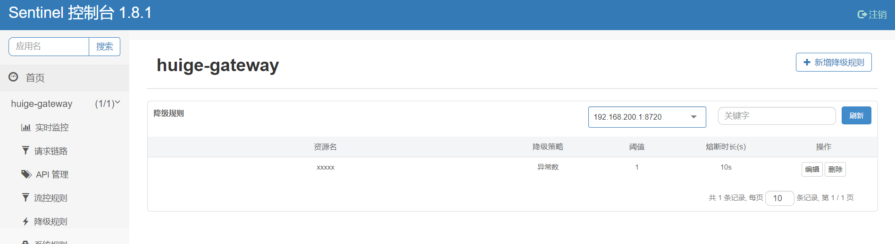

* **限制路由流控规则**

  

* **测试**

  

* **限流处理**

  

* **测试**

  


#### 7.3.7 路由简写


## 8. 全局配置相关 

### 8.1. 全局配置相关说明 

```properties
SpringBoot的配置文件是和应用绑定的，配置文件会和源代码一样被打入到jar包 和应用一起部署到服务器中，
所以会面临如下的问题：  
	1： 配置数据会存在安全泄露问题 只要进入服务器/容器 就可以查看所有的配置 配置的数据库信息 直接暴露
	2： 配置在应用启动后 无法动态更新，只能手动更新后再重启应用 
	3： 一个应用部署多个实例 维护多个配置 容器导致数据不一致
	4： 配置没有管理方式。如更新配置出错，无法及时回退 只能再次手动改回老的配置重新部署
```

### 8.2. 解决思路

```properties
上诉问题的解决思路：配置中心  配置中心要满足的条件如下： 

1：项目的配置信息在配置中心中 不和项目绑定到一起发布，进入服务器也无法获取真实的配置信息
2：应用从配置中心中获取配置信息，配置中心配置修改后，能够动态修改应用中的信息 
3：配置中心需要有简单的配置的版本管理 当出现问题时 可以立即回滚上个版本
```

### 8.3. 全局配置之Config

#### 8.3.1. Config的相关概述 

```properties
springcloudConfig是一个支持微服务和分布式集中化提供配置的开源项目，springCloudConfig是c/s架构 
分为客户端和服务器端  

服务器端： 可以称为集中化配置中心，它是一个独立的服务，当然也可以将它注册到注册中心，服务器端主要的功能就是从某个数据仓库读取对应的配置，然后把配置提供给客户端，这个数据仓库 可以是git 本地文件 svn redis 甚至数据库  （springCloudConfig把数据仓库抽象了一个接口EnvironmentRepository）


客户端：客户端就是我们具体的服务  就是我们的项目 我们的项目需要从config的服务器端获取对应的配置
```


#### 8.3.2. Config服务器搭建 

##### 8.3.2.1. 新建git仓库 


##### 8.3.2.2. 上传配置文件 


##### 8.3.2.3. 新建项目  


##### 8.3.2.4. 添加依赖 

```xml
    <dependencies>
        <dependency>
            <groupId>org.springframework.cloud</groupId>
            <artifactId>spring-cloud-config-server</artifactId>
        </dependency>
    </dependencies>
```

##### 8.3.2.5. 编写主配置类 


##### 8.3.2.6. 编写配置文件 


##### 8.3.2.7. 访问测试 

```properties
springCloudConfig 项目在启动时 会有个EnvironmentController 这个controller中指定了访问的路径  

访问路径的规则 大概有如下几种 
	{name}/{profiles}
	{name}/{profiles}/{label}
	{name}-{profiles}.properties
	{name}-{profiles}.json
	{label}/{name}-{profiles}.properties
	
label：代表分支名称 
name： 代表配置文件名-的前半部分 
profiles： 表示配置文件名称-后半部分	
```

#### 8.3.3. config的客户端搭建

##### 8.3.3.1. 新建项目 


##### 8.3.3.2. 添加依赖


##### 8.3.3.3. 编写主配置类


##### 8.3.3.4. 编写controller


##### 8.3.3.4. 编写bootstrap.yml


##### 8.3.3.5. 启动测试 


#### 8.3.4. 数据库维护配置数据

##### 8.3.4.1. 建库建表

```sql
CREATE TABLE `t_config` (
  `id` int NOT NULL AUTO_INCREMENT,
  `property_name` varchar(255) COLLATE utf8mb4_unicode_ci DEFAULT NULL,
  `property_value` varchar(255) COLLATE utf8mb4_unicode_ci NOT NULL,
  `application_name` varchar(255) COLLATE utf8mb4_unicode_ci DEFAULT NULL,
  `label` varchar(255) COLLATE utf8mb4_unicode_ci DEFAULT NULL,
  `profile` varchar(255) COLLATE utf8mb4_unicode_ci DEFAULT NULL,
  PRIMARY KEY (`id`)
) ENGINE=InnoDB AUTO_INCREMENT=5 DEFAULT CHARSET=utf8mb4 COLLATE=utf8mb4_unicode_ci;
```


##### 8.3.4.2. 服务器端添加依赖


##### 8.3.4.3. 服务器端添加配置


##### 8.3.4.4. 客户端配置 


##### 8.3.4.5. 测试 


#### 8.3.5. 和注册中心整合 

##### 8.3.5.1. 服务器端注册


##### 8.3.5.2. 客户端注册


##### 8.3.5.3. nacos控制台


##### 8.3.5.4. 测试


#### 8.3.6. 动态刷新配置 

##### 8.3.6.1. 添加监控依赖 

```xml
       <dependency>
            <groupId>org.springframework.boot</groupId>
            <artifactId>spring-boot-starter-actuator</artifactId>
        </dependency>
```

##### 8.3.6.2. 暴露站点 


##### 8.3.6.3.重启访问


##### 8.3.6.4. 修改配置信息


##### 8.3.6.5. 刷新配置 

```properties
http://localhost:8300/actuator/refresh
```


##### 8.3.6.6. 测试是否生效

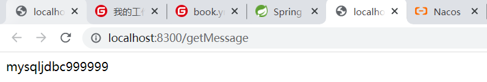

### 8.4. 全局配置之Nacos

#### 8.4.1. 基本搭建使用

##### 8.4.1.1. nacos创建配置


##### 8.4.1.2. 新建工程 


##### 8.4.1.3. 添加依赖

```xml
    <dependencies>
        <dependency>
            <groupId>com.alibaba.cloud</groupId>
            <artifactId>spring-cloud-starter-alibaba-nacos-config</artifactId>
        </dependency>

        <dependency>
            <groupId>org.springframework.boot</groupId>
            <artifactId>spring-boot-starter-web</artifactId>
        </dependency>
    </dependencies>
```

##### 8.4.1.4. 编写主配置类


##### 8.4.1.5. bootstrap.yml 


##### 8.4.1.6. 编写controller


##### 8.4.1.7. 测试


##### 8.4.1.8. 自动刷新 

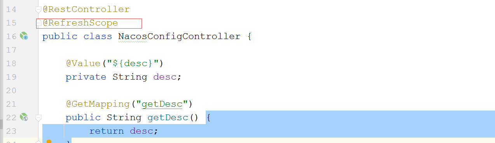


